# Apache Kafka — Comprehensive Tutorial & Interview Guide
---

# PART 1: COMPREHENSIVE TOPIC-WISE LEARNING

---

## Table of Contents

1. [Kafka Fundamentals & Architecture](#1-kafka-fundamentals--architecture)
2. [Topics, Partitions & Logs](#2-topics-partitions--logs)
3. [Producers Deep Dive](#3-producers-deep-dive)
4. [Consumers & Consumer Groups](#4-consumers--consumer-groups)
5. [Kafka Broker Internals](#5-kafka-broker-internals)
6. [Replication & ISR](#6-replication--isr)
7. [Kafka Storage Architecture](#7-kafka-storage-architecture)
8. [Kafka Controller & Metadata](#8-kafka-controller--metadata)
9. [Kafka Connect](#9-kafka-connect)
10. [Kafka Streams](#10-kafka-streams)
11. [Schema Registry & SerDes](#11-schema-registry--serdes)
12. [Kafka Security](#12-kafka-security)
13. [Kafka Monitoring & Operations](#13-kafka-monitoring--operations)
14. [Kafka Performance Tuning](#14-kafka-performance-tuning)
15. [Kafka with Spring Boot](#15-kafka-with-spring-boot)
16. [Kafka Cluster & Multi-Datacenter](#16-kafka-cluster--multi-datacenter)
17. [Exactly-Once Semantics & Transactions](#17-exactly-once-semantics--transactions)
18. [Kafka Idempotent Producer](#18-kafka-idempotent-producer)
19. [Kafka Compaction & Retention](#19-kafka-compaction--retention)
20. [Kafka Dead Letter Queues & Error Handling](#20-kafka-dead-letter-queues--error-handling)

---

## 1. Kafka Fundamentals & Architecture

### 1.1 What is Apache Kafka?

Apache Kafka is a distributed event streaming platform used for high-performance data pipelines, streaming analytics and data integration for applications. Kafka is a Distributed Streaming Publish-Subscribe messaging platform capable of handling millions of messages per minute.

At its core, Kafka is designed as a **distributed, partitioned, replicated commit log**. This is not just terminology — each of these words carries deep architectural significance. 
**Distributed** means it runs as a cluster of servers that can scale horizontally. 
**Partitioned** means topics are split across multiple servers for parallel processing. 
**Replicated** means data is copied across multiple servers for fault tolerance. 
**Commit log** means it provides an immutable, append-only sequence of records ordered by time, which is fundamental to Kafka's durability and replay capabilities.

Kafka serves three primary capabilities:

1. **Publish and Subscribe** to streams of records (similar to a message queue or enterprise messaging system)
2. **Store** streams of records in a fault-tolerant, durable way
3. **Process** streams of records as they occur (via Kafka Streams or consumer applications)

Unlike traditional message brokers like RabbitMQ or ActiveMQ, Kafka does not deliver messages to individual consumers on a per-message basis. Instead, it maintains a persistent log that consumers read at their own pace. This fundamental difference enables Kafka to achieve throughput orders of magnitude higher than traditional messaging systems — often millions of messages per second in production deployments.

### 1.2 Kafka Ecosystem Overview

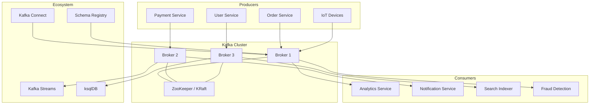

### 1.3 Core Components Deep Dive

**Broker:** A Kafka broker is a single Kafka server that stores data and serves client requests. Each broker hosts a set of topic partitions. Brokers are identified by a unique integer ID. A Kafka cluster typically consists of multiple brokers (3-5 is common for production). Brokers handle read/write requests from producers and consumers, manage partition replication, and coordinate with the cluster controller. When a broker starts, it registers itself with ZooKeeper (or in newer versions, with the KRaft metadata quorum) and advertises its endpoints so clients can discover it.
1. Kafka cluster is composed of multiple brokers. Broker is nothing but a server.
2. Every Broker is identified by an ID.(broker.id)
3. Once we connect to a broker, we get connected to whole Kafka cluster. Brokers hold the topic and the partitions.
4. Kafka brokers are also known as Bootstrap brokers because connection with any one broker means connection with the entire cluster. Although a broker does not contain whole data, but each broker in the cluster knows about all other brokers, partitions as well as topics.

**Controller:** one broker elected as controller; manages partition leader election, topic/partition changes, broker membership. 
**ZooKeeper (classic) or KRaft (Kafka Raft metadata mode in newer versions):** manages metadata and leader election (KRaft is the new default path).

**Topic:** A topic is a category or feed/common name used to store and publish a particular stream of data.
1. Topics in Kafka are always multi-producer and multi-consumer — any number of producers can write to a topic, and any number of consumers can read from it. 
2. Topics are split into partitions for scalability and parallelism. Each topic has a configurable number of partitions and a replication factor.
3. Basically, topics in Kafka are similar to tables in the database, but not containing all constraints. 
4. In Kafka, we can create n number of topics as we want.
5. Topics in Kafka are always multi-subscriber; i.e., a topic can have zero, one or many consumers that subscribe to the topic.
6. Data in topics are kept for a specific time i.e TTL(Time to Live). One can configure the TTL according to need.

**Partition:** A partition is an ordered, immutable sequence of records that is continually appended to — a commit log. A topic is split into several parts which are known as the partitions of the topic.
1. Each record in a partition is assigned a sequential ID called an offset, which uniquely identifies each record within the partition. The offset is a 64-bit integer that starts from 0 and increments by 1 for each new record. 
2. Partitions are the fundamental unit of parallelism in Kafka — they allow topics to be distributed across multiple brokers and consumed by multiple consumers concurrently.
3. These partitions are separated in an order. The data content gets stored in the partitions within the topic. 
Each partition is ordered. Order is guaranteed only within a partition. (not across partitions)
4. Therefore, while creating a topic, we need to specify the number of partitions(can be changed later).
5. The data once written to a partition can never be changed. It is immutable. Therefore offset value always remains in an incremental state, it never goes back to an empty space. Also, the data is kept in a partition for a limited time only.

**Offset:** An offset is a unique identifier (a monotonically increasing integer) assigned to each record within a partition. Offsets are critical to Kafka's design because they provide ordering within a partition and enable consumers to track their position.
1. Each message gets stored into partitions with an incremental id known as its Offset value. 
2. The order of the offset value is guaranteed within the partition only and not across the partition. 
3. The offsets for a partition are infinite.
4. The purpose of offset is to keep a track of which message is already being consumed by the consumer
5. Consumers commit offsets to Kafka (or previously to ZooKeeper) to record their progress. This means consumers can stop and restart without losing their place in the stream. Offsets are not global across partitions — they are only meaningful within a single partition.

**Consumer Group:** A consumer group is a set of consumers that cooperate to consume a topic. 
1. Each consumer in a group is assigned a subset of partitions from the topic, ensuring that each partition is consumed by exactly one consumer within the group. This is how Kafka achieves horizontal scalability for consumption. 
2. Different consumer groups can read from the same topic independently, each maintaining its own offset positions. This enables fan-out messaging patterns where multiple applications can process the same data independently.

**Notes:**
1. Kafka achieves high fault tolerance through distributed architecture, data replication. Every partition of a topic is replicated across multiple brokers.
2. Even if multiple brokers die, as long as one ISR survives with acks=all, our data is safe.
3. When we push JSON message into Kafka. It saves this JSON as a byte[].
4. 1 million+ messages per second per broker
5. ~7ms end-to-end latency in typical deployments
6. Retention for days or weeks — replay any event from history
7. No message loss — data is written to disk, not held in memory

### 1.4 Kafka Architecture Diagram

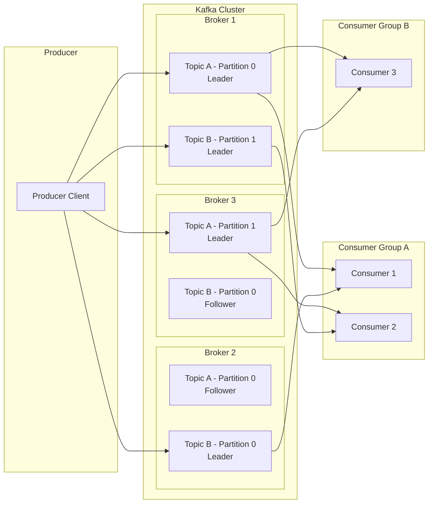

### 1.5 Kafka vs Traditional Message Brokers

| Feature | Kafka | RabbitMQ / ActiveMQ |
|---------|-------|---------------------|
| Message Model | Pull-based | Push-based |
| Message Retention | Persistent log (configurable retention) | Delete after ack |
| Ordering | Per-partition ordering | Per-queue ordering |
| Consumer Model | Consumer groups with offset tracking | Individual consumer ack |
| Throughput | Millions/sec | Tens of thousands/sec |
| Replay | Yes (by resetting offset) | No (after ack) |
| Backpressure | Consumer-controlled (pull) | Broker-controlled (push) |
| Partitioning | Built-in, first-class concept | Limited or absent |
| Scaling | Horizontal (add partitions/brokers) | Vertical primarily |
| Message Priority | Not supported | Supported |

Kafka's pull-based model is a deliberate architectural choice. In push-based systems, the broker must manage the rate of delivery to each consumer, which becomes complex when consumers have different processing capacities. In Kafka, consumers pull data at their own pace, naturally handling backpressure. If a consumer falls behind, it simply reads from an older offset. The trade-off is increased latency compared to push-based systems, but this is acceptable for most streaming use cases.

### 1.6 Kafka Use Cases in Enterprise Java

1. **Event-Driven Architecture (EDA):** Decouple microservices by using Kafka as the central event bus. Services publish domain events to Kafka topics, and other services subscribe to those events reactively. This enables loose coupling and independent deployability — core tenets of microservice architecture.

2. **Log Aggregation:** Collect logs from hundreds of services and ship them to Kafka. A stream processor (Kafka Streams, Flink, or Spark) can aggregate, filter, and route these logs to Elasticsearch or S3 for analysis.

3. **Real-Time Analytics:** Process clickstream data, IoT sensor readings, or financial transactions in real-time using Kafka Streams or ksqlDB. Compute rolling averages, detect anomalies, and trigger alerts with sub-second latency.

4. **Audit Trail & Compliance:** Store every state change as an immutable event in Kafka. This creates a complete audit trail for compliance (GDPR, SOX, HIPAA). Compacted topics can maintain the latest state while preserving the full history.

5. **Saga Pattern for Distributed Transactions:** Use Kafka to coordinate sagas across microservices. Each service publishes events when it completes its local transaction, and compensating events handle failures. This replaces traditional two-phase commits with an eventually consistent model.

6. **Change Data Capture (CDC):** Use Kafka Connect with Debezium to capture row-level changes from databases (MySQL, PostgreSQL, Oracle) and stream them to Kafka. Downstream consumers can materialize views, update search indexes, or synchronize data across systems in near real-time.

---

## 2. Topics, Partitions & Logs

### 2.1 Topic Design Principles

A Kafka topic represents a stream of records of a particular type. Proper topic design is critical for system performance, maintainability, and evolution. In enterprise environments, topic naming conventions and governance are essential.

**Topic Naming Convention:** A well-adopted pattern is `<domain>.<entity>.<event-type>`. For example:
- `orders.order.created`
- `payments.transaction.completed`
- `inventory.stock.depleted`

This convention provides clarity, enables wildcard subscriptions in Kafka Streams, and aligns with domain-driven design principles.

**Topic Configuration Hierarchy:** Kafka has a three-level configuration hierarchy:
1. **Broker-level defaults** — apply to all topics unless overridden
2. **Topic-level overrides** — specific to a topic
3. **Dynamic configurations** — can be changed without broker restart

Key topic configurations include:

| Config | Default | Description |
|--------|---------|-------------|
| `num.partitions` | 1 | Number of partitions |
| `replication.factor` | 1 | Number of replicas per partition |
| `retention.ms` | 604800000 (7 days) | Max time to retain data |
| `retention.bytes` | -1 (unlimited) | Max size per partition |
| `cleanup.policy` | delete | delete or compact |
| `min.insync.replicas` | 1 | Min replicas for ack=all |
| `max.message.bytes` | 1048588 (1MB) | Max record batch size |

### 2.2 Partition Strategy — The Architect's Decision

Choosing the number of partitions is one of the most important architectural decisions in Kafka. The number of partitions determines:

1. **Maximum parallelism** for consumers within a group
2. **Maximum throughput** (each partition is processed by a single broker)
3. **Ordering guarantee** (ordering is only within a partition)

**Guidelines for Partition Count:**

```
Partitions ≥ Target Throughput / Partition Throughput

Example:
- Target: 100 MB/s write throughput
- Single partition throughput: ~10 MB/s (varies by hardware)
- Recommended partitions: at least 10
```

However, more partitions are not always better. Each partition consumes memory on brokers (for log segment buffers and replication buffers), increases leader election time during failures, and adds overhead to the controller for metadata management. In practice, stay below 2,000 partitions per broker and 200,000 partitions per cluster as a general guideline (though these limits have improved significantly in recent Kafka versions with KIP-595/KRaft).

**Partition Key Strategy:** The partition key determines which partition a record is assigned to. Kafka uses a hash-based partitioner by default:

```java
partition = hash(key) % num_partitions
```

This means all records with the same key always go to the same partition, preserving order for that key. This is critical for use cases like "all events for user X must be processed in order."

Common key strategies:
- **Entity ID** (e.g., user_id, order_id) — ensures ordering per entity
- **Composite Key** (e.g., `tenant_id:user_id`) — enables multi-tenancy with ordering per tenant-user
- **Null key with round-robin** — when ordering doesn't matter and you want even distribution
- **Custom Partitioner** — for domain-specific routing (e.g., "hot" keys to dedicated partitions)

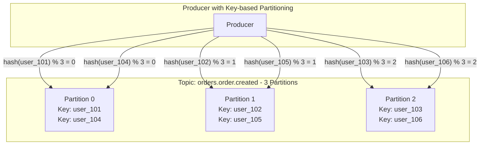

### 2.3 Partition Reassignment

When you add brokers to a cluster or need to rebalance data, you must reassign partitions. Kafka provides the `kafka-reassign-partitions.sh` tool for this. The process:

1. **Generate** a reassignment plan (or create one manually)
2. **Execute** the reassignment — Kafka creates new replicas and begins replicating data
3. **Monitor** progress until replication completes
4. **Optionally** remove old replicas

**Important considerations during reassignment:**
- Reassignment increases network traffic and broker load significantly
- Use throttling (`kafka-configs.sh --alter --add-config leader.imbalance.per.broker.percentage`) to limit impact
- Reassignment does not change the partition count — it only moves existing partitions between brokers
- During reassignment, the ISR may shrink, affecting availability
- Plan reassignments during low-traffic periods

### 2.4 Log Segments — How Data is Stored on Disk

Each partition is stored as a directory on the broker's filesystem, and within that directory, the data is divided into **log segments**. Understanding log segments is crucial for understanding Kafka's performance characteristics.

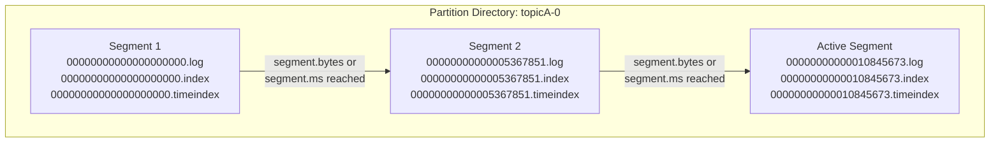

Each segment consists of three files:

1. **`.log` file** — The actual data file containing the record batches. Records are written sequentially (append-only), which is why Kafka can achieve disk write speeds comparable to memory — it leverages the operating system's page cache and sequential I/O optimization. Each record batch contains a header (base offset, batch length, partition leader epoch, CRC, attributes, and last offset delta) followed by individual records.

2. **`.index` file** — A sparse index mapping logical offsets to physical positions in the `.log` file. The index is memory-mapped (mmap), enabling fast binary search for offset lookups. "Sparse" means it doesn't index every offset — by default, an entry is added every 4,096 bytes (`index.interval.bytes`). This keeps the index small enough to fit in memory while providing O(log n) lookup performance.

3. **`.timeindex` file** — A sparse index mapping timestamps to offsets. This enables time-based lookups (e.g., "find the first offset with timestamp >= T"). Like the offset index, it uses memory-mapped files for fast access. Each entry maps a timestamp to the offset of the first record in the corresponding log segment with that timestamp or later.

**Why Kafka is Fast — The Page Cache Strategy:**

Kafka's performance is not primarily about clever algorithms — it's about leveraging the OS page cache. Instead of maintaining its own in-memory cache (like many databases), Kafka writes directly to the page cache using sequential I/O. The OS asynchronously flushes dirty pages to disk. This means:

- Writes are as fast as memory writes (when the page cache has capacity)
- Reads from warm cache are also memory-speed
- The OS handles eviction intelligently based on available memory
- Multiple consumers can read from the same page cache without additional I/O
- No GC pressure from maintaining a heap-based cache

This design choice is why Kafka can handle millions of messages per second with sub-millisecond latencies on modest hardware, and it's why you should never allocate more than 6GB of heap to the Kafka JVM — leave the rest of the machine's RAM for the page cache.

---

## 3. Producers Deep Dive

### 3.1 Producer Architecture Internals

Producer is an application which writes data to topics. The Kafka producer is a sophisticated client with multiple layers of optimization. Understanding its internals is essential for building high-throughput, reliable data pipelines.

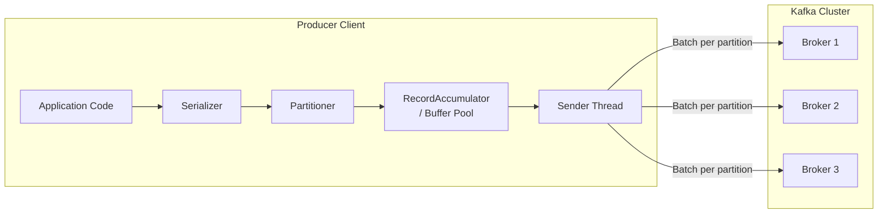

**Producer Flow Step-by-Step:**

1. **Serialization:** The producer's `send()` method first serializes the key and value using the configured serializers (e.g., StringSerializer, JsonSerializer, AvroSerializer). Custom serializers can be implemented by extending the `Serializer<T>` interface.

2. **Partitioning:** After serialization, the producer determines which partition the record should go to. The partitioning logic is:
   - If a partition is specified in the record, use it directly
   - If no partition but a key is present, hash the key and modulo by the number of partitions
   - If no partition and no key, use the sticky partitioner (Kafka 2.4+) or round-robin (older versions)

3. **Record Accumulator:** The producer does not send each record individually. Instead, it appends the record to a batch in the RecordAccumulator — a buffer that groups records by topic-partition. The accumulator uses a buffer pool (`buffer.memory`, default 32MB) to manage memory. When a batch is full (`batch.size`, default 16KB) or the timeout expires (`linger.ms`, default 0ms), the batch becomes ready to send.

4. **Sender Thread:** A background sender thread continuously checks the accumulator for ready batches. It groups batches by the broker they need to be sent to (since multiple partitions may share the same leader broker) and sends them as a single request. This batching is crucial for throughput — a single produce request can contain records for multiple partitions.

5. **Acknowledgment:** Based on the `acks` configuration, the producer waits for acknowledgment from the broker before considering the send complete.

**Notes:**
1. If we send the messages without specifying key, the messages would be sent to brokers in round robin. This will ensure equal load on every broker i.e load balancing.But if we send with messages with key, all the messages for that key will be stored in the same partition.load balancing is done when the producer writes data to the Kafka topic without specifying any key,It distributes little-little bit data to each partition.
2. There are two ways to know that the data is sent with or without a key:
	If the value of **key=NULL**, means the data is sent without a key. Thus, it will be distributed in a round-robin manner (i.e., distributed to each partition).
	If the value of the **key!=NULL**, it means the key is attached with the data, and thus all messages will always be delivered to the same partition.
3. **Acknowledgment** In order to write data to the Kafka cluster, the producer has another choice of acknowledgment. 
	It means the producer can get a confirmation of its data writes by receiving the following acknowledgments:
	**acks=0:** means the producer sends the data to the broker but does not wait for the acknowledgement. This leads to possible data loss because without confirming that the data is successfully sent to the broker or may be the broker is down, it sends another one.
	**acks=1:** means  the producer will wait for the leader's acknowledgement. The leader asks the broker whether 
	it successfully received the data, and then returns feedback to the producer. In such case, there is limited data loss only.Only leader will send acknowledgment, it would have limited data loss.
	**acks=all:** Here, the acknowledgment is done by both the leader and its followers. When they successfully acknowledge the data, it means the data is successfully received. In this case, there is no data loss.All the ISR and leader will send acknowledgment, No data loss,slower speed of processing

### 3.2 Producer Configuration — Deep Dive

| Config | Default | Impact | Tuning Advice |
|--------|---------|--------|---------------|
| `acks` | all | Reliability | `all` for durability, `1` for balance, `0` for speed |
| `batch.size` | 16384 | Throughput | Increase to 32K-64K for high-throughput |
| `linger.ms` | 0 | Latency vs Throughput | 5-20ms for better batching without visible latency |
| `buffer.memory` | 33554432 | Memory | 64-128MB for high-throughput producers |
| `max.in.flight.requests.per.connection` | 5 | Ordering | Set to 1 for strict ordering without idempotence |
| `retries` | 2147483647 | Reliability | Keep high; pair with idempotent producer |
| `enable.idempotence` | true | Exactly-once | Always enable in production |
| `compression.type` | none | Network/Disk | `lz4` for speed, `zstd` for ratio, `gzip` for compatibility |
| `delivery.timeout.ms` | 120000 | Total time | Upper bound including retries |
| `request.timeout.ms` | 30000 | Per-request | Increase for congested networks |

### 3.3 Acks Configuration — The Reliability Spectrum

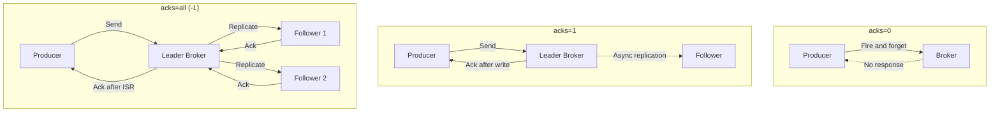

**acks=0 (Fire and Forget):** The producer does not wait for any acknowledgment from the broker. It writes the record to the socket buffer and considers the send successful. This provides the lowest latency but the weakest durability guarantee — data can be lost if the broker crashes before writing to disk, if the network drops the packet, or if the broker's page cache hasn't been flushed. Use this only for telemetry, metrics, or other data where loss is acceptable.

**acks=1 (Leader Acknowledgment):** The producer waits for the leader broker to acknowledge that it has written the record to its log. This provides better durability than acks=0, but data can still be lost if the leader crashes before followers replicate the data. This was the default in older Kafka versions but is now considered insufficient for most production use cases.

**acks=all (-1) (Full ISR Acknowledgment):** The producer waits for the leader and all in-sync replicas (ISR) to acknowledge the record. This is the strongest durability guarantee and is the recommended setting for production. Combined with `min.insync.replicas=2`, this ensures that data is written to at least 2 brokers before being acknowledged. The trade-off is higher latency (waiting for replication) and reduced availability (if the ISR falls below min.insync.replicas, the producer cannot write).

### 3.4 Idempotent Producer

The idempotent producer (enabled by default since Kafka 3.0 with `enable.idempotence=true`) solves the problem of duplicate records caused by producer retries. Here's the problem it solves:

1. Producer sends a batch to the broker
2. Broker writes the batch and sends an acknowledgment
3. The acknowledgment is lost (network issue) or arrives after the producer's request timeout
4. Producer retries and sends the same batch again
5. Broker writes the duplicate batch

The idempotent producer assigns each producer a **Producer ID (PID)** and each batch a **Sequence Number**. The broker tracks the last sequence number for each `<PID, partition>` pair and rejects any batch with a sequence number that is not the expected next value.

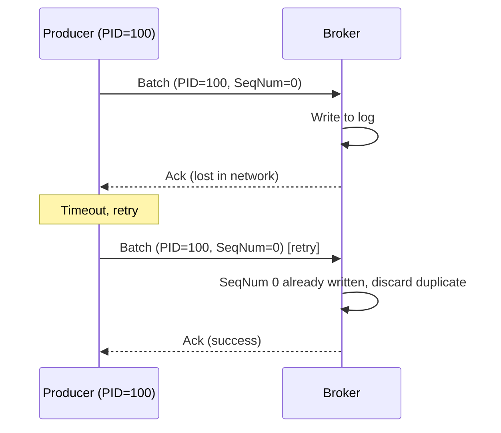

**Important limitations of idempotent producer:**
- It only prevents duplicates within a single producer session (PID changes on producer restart)
- It only prevents duplicates within a single partition
- It does NOT prevent duplicates across partitions (e.g., when a transactional send fails partially)
- For cross-partition deduplication, you need transactions or consumer-side deduplication

**Implementing idempotent behavior** with Kafka is crucial in distributed systems to avoid processing the same message more than once — especially in exactly-once or at-least-once delivery guarantees.

In Kafka context, this typically means:
**Producer Idempotence** 
1. Prevent duplicate messages being written to a Kafka topic.
2. ensures Idempotent writes to Kafka.
3. Duplicate messages (due to retries, network issues) are de-duplicated on Kafka broker.
4. Safe for transactional use, especially in microservices or event-driven systems.
5. Kafka will assign a producerId and sequence number to deduplicate messages.

**Consumer Idempotence** 
1. Prevent processing the same message multiple times (even if it's re-delivered).
2. Kafka does not handle consumer-side idempotence automatically.

Common Consumer Idempotency Strategies:

| Strategy | Description |
|--------|---------|
| `Deduplication store	` | Keep a set of processed message IDs (e.g., UUID, key) in a DB, Redis, etc. |
| `Transactional processing` | Use a DB transaction + Kafka offset commit to ensure only-once behavior |
| `Kafka exactly-once semantics` | Use Kafka transactions to process+produce atomically (more complex) |


| Side | Description | Enabled by |
|--------|---------|--------|
| `Producer Idempotence	` | Avoid writing the same message multiple times to a Kafka topic. | Kafka, config:enable.idempotence=true |
| `Consumer Idempotence` | Ensure the message is only processed once,even if received multiple times logic (e.g., deduplication, storing offsets in DB)| Application |

### 3.5 Custom Partitioner

When the default hash-based partitioner doesn't meet your needs, you can implement a custom partitioner. Common scenarios include:

- **Skewed key distribution:** If 80% of traffic comes from 10% of keys (e.g., a few massive customers), hash partitioning creates hot partitions. A custom partitioner can distribute hot keys across multiple partitions while maintaining some ordering guarantees.
- **Geographic routing:** Route data to partitions based on the data center or region, enabling locality-aware consumption.
- **Priority-based routing:** Route high-priority messages to dedicated partitions for priority consumption.

```java
public class TenantAwarePartitioner implements Partitioner {
    @Override
    public int partition(String topic, Object key, byte[] keyBytes,
                         Object value, byte[] valueBytes, Cluster cluster) {
        List<PartitionInfo> partitions = cluster.partitionsForTopic(topic);
        int numPartitions = partitions.size();

        if (key == null) {
            return ThreadLocalRandom.current().nextInt(numPartitions);
        }

        String keyStr = key.toString();
        String tenantId = keyStr.split(":")[0]; // Format: tenantId:entityId

        // Dedicated partition range per tenant
        int tenantHash = tenantId.hashCode();
        return Math.abs(tenantHash) % numPartitions;
    }

    @Override
    public void configure(Map<String, ?> configs) {}

    @Override
    public void close() {}
}
```

---

## 4. Consumers & Consumer Groups

### 4.1 Consumer Architecture

The Kafka consumer is more complex than the producer because it must coordinate with other consumers in its group, manage offsets, and handle partition rebalances. Understanding the consumer's internal architecture is essential for building robust consumption pipelines.

1. Consumers read data by reading messages from the topics to which they subscribe. 
2. Consumers will belong to a consumer group. Each consumer within a particular consumer group will have responsibility for reading a subset of the partitions of each topic that it is subscribed to.

**Reading records from partitions**
1. Unlike the other pub/sub implementations, Kafka doesn’t push messages to consumers. Instead, consumers have to pull messages off Kafka topic partitions. A consumer connects to a partition in a broker, reads the messages in the order in which they were written.
2. The offset of a message works as a consumer side cursor at this point. The consumer keeps track of which messages it has already consumed by keeping track of the offset of messages. After reading a message, the consumer advances its cursor to the next offset in the partition and continues. Advancing and remembering the last read offset within a partition is the responsibility of the consumer. Kafka has nothing to Do with it.
3. By remembering the offset of the last consumed message for each partition, a consumer can join a partition at the point in time they choose and resume from there. That is particularly useful for a consumer to resume reading after recovering from a crash.
4. A partition can be consumed by one or more consumers, each reading at different offsets.Kafka has the concept of consumer groups where several consumers are grouped to consume a given topic. Consumers in the same consumer group are assigned the same group-id value.The consumer group concept ensures that a message is only ever read by a single consumer in the group.
5. When a consumer group consumes the partitions of a topic, Kafka makes sure that each partition is consumed by exactly one consumer in the group

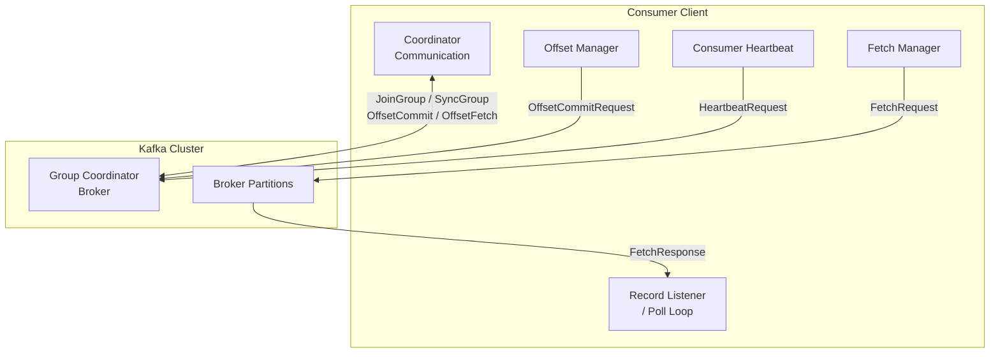

### 4.2 The Poll Loop Model

Kafka consumers use a poll-based model. The consumer must continuously call `poll()` to stay alive and receive records. This is fundamentally different from push-based message consumers.

```java
while (true) {
    ConsumerRecords<String, String> records = consumer.poll(Duration.ofMillis(100));
    for (ConsumerRecord<String, String> record : records) {
        processRecord(record);
    }
    // Commit offsets after processing
    consumer.commitSync();
}
```

**Why poll-based?** The poll loop serves multiple purposes:
1. **Heartbeat:** The consumer sends heartbeats during `poll()` to signal liveness to the group coordinator
2. **Rebalance participation:** The consumer handles rebalance callbacks during `poll()`
3. **Backpressure:** The consumer naturally controls the rate of consumption by the frequency and duration of `poll()` calls
4. **Offset management:** The consumer commits offsets during or after `poll()`

If a consumer does not call `poll()` within `max.poll.interval.ms` (default 5 minutes), the group coordinator considers it dead and triggers a rebalance. This is a common cause of unexpected rebalances — if your record processing takes longer than this interval, you must increase it.

### 4.3 Consumer Group Protocol — The Rebalance

A rebalance occurs when the set of consumers in a group changes (consumer joins, leaves, or is considered dead) or when the partition count of a subscribed topic changes. During a rebalance, partitions are reassigned among the active consumers.

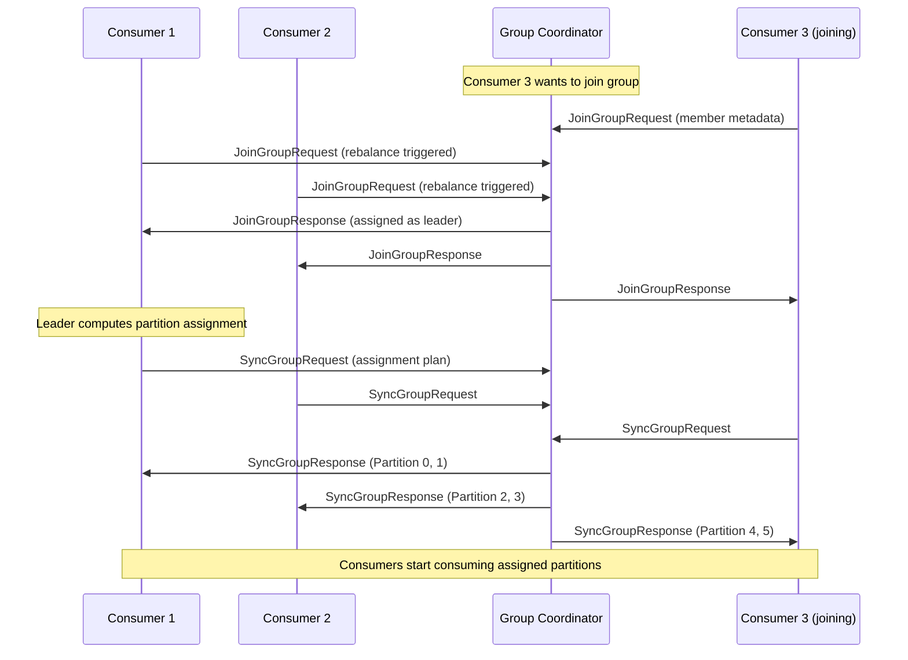

**Rebalance Phases:**

1. **Join Phase:** All consumers send a `JoinGroupRequest` to the group coordinator. One consumer is elected as the **group leader** (typically the first to join). The coordinator collects metadata from all members.

2. **Sync Phase:** The group leader receives the member metadata and computes the partition assignment using the configured `PartitionAssignor` strategy. It sends the assignment plan to the coordinator, which then distributes it to all members via `SyncGroupResponse`.

3. **Assignment Strategies:**
   - **RangeAssignor (default):** Assigns partitions on a per-topic basis. Partitions are divided into ranges and assigned to consumers in order. Can lead to imbalance when consumers subscribe to multiple topics.
   - **RoundRobinAssignor:** Assigns partitions across all topics in a round-robin fashion. Better balance but less predictable.
   - **StickyAssignor:** Attempts to minimize partition movement during rebalances. Partitions that were assigned to a consumer before the rebalance stay with that consumer if possible. Significantly reduces the cost of rebalances.
   - **CooperativeStickyAssignor:** Incremental cooperative rebalancing (Kafka 2.4+). Instead of revoking all partitions and reassigning (the "eager" protocol), it only moves partitions that need to be reassigned. This avoids the "stop-the-world" effect of traditional rebalances.

### 4.4 Offset Management

**Auto-commit vs Manual commit:**

```properties
# Auto-commit (simple but dangerous)
enable.auto.commit=true
auto.commit.interval.ms=5000

# Manual commit (recommended for production)
enable.auto.commit=false
```

**Auto-commit risks:** Auto-commit commits offsets periodically (every 5 seconds by default) after `poll()` returns. This means if your application crashes after processing records but before the next auto-commit, those records will be reprocessed after recovery (at-least-once semantics). Conversely, if auto-commit happens before processing completes and the application crashes, those records are lost (effectively at-most-once for that crash scenario). For this reason, manual commit is strongly recommended for production.

**Sync vs Async commit:**

```java
// Synchronous commit — blocks until commit is confirmed
consumer.commitSync();

// Asynchronous commit — non-blocking, provides a callback
consumer.commitAsync(new OffsetCommitCallback() {
    @Override
    public void onComplete(Map<TopicPartition, OffsetAndMetadata> offsets,
                           Exception exception) {
        if (exception != null) {
            log.error("Commit failed for offsets {}", offsets, exception);
        }
    }
});

// Best practice: async during processing, sync on shutdown
try {
    while (true) {
        ConsumerRecords<K, V> records = consumer.poll(Duration.ofMillis(100));
        process(records);
        consumer.commitAsync(); // Non-blocking during normal operation
    }
} finally {
    consumer.commitSync(); // Blocking commit on shutdown to ensure last offsets are committed
    consumer.close();
}
```

**Commit Specific Offsets:** For fine-grained control, commit offsets per partition:

```java
Map<TopicPartition, OffsetAndMetadata> commitOffsets = new HashMap<>();
for (ConsumerRecord<K, V> record : records) {
    processRecord(record);
    commitOffsets.put(
        new TopicPartition(record.topic(), record.partition()),
        new OffsetAndMetadata(record.offset() + 1) // Commit offset = next to consume
    );
}
consumer.commitSync(commitOffsets);
```

### 4.5 Consumer Lag

Consumer lag is the difference between the latest offset produced to a partition and the last committed offset of the consumer group. It indicates how far behind a consumer is from the head of the stream.

```
Lag = Log End Offset (LEO) - Committed Offset
```

Monitoring lag is critical for operational health. High and growing lag indicates that consumers cannot keep up with the production rate. Common causes include:
- Slow processing logic (database queries, API calls)
- Insufficient consumer instances
- Too few partitions (limiting parallelism)
- Network or broker issues
- Frequent rebalances causing consumers to stop processing

Tools for monitoring lag:
- `kafka-consumer-groups.sh --describe --group <group-id>`
- Burrow (LinkedIn's lag monitoring tool)
- Kafka exporter + Prometheus + Grafana
- Confluent Control Center

---

## 5. Kafka Broker Internals

### 5.1 Broker Architecture

A Kafka broker is a JVM process that runs the Kafka server. Each broker has a unique `broker.id` and manages a set of topic partitions. The broker's primary responsibilities are:

1. **Handle produce requests** from producers (write to log)
2. **Handle fetch requests** from consumers (read from log)
3. **Manage replication** (follow leaders, become leaders)
4. **Coordinate with controller** (for metadata and leadership changes)
5. **Manage consumer group coordination** (if elected as group coordinator)

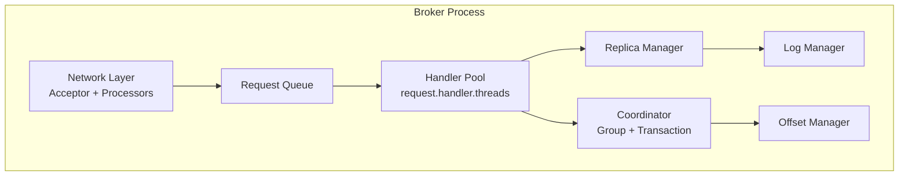

**Network Layer (Reactor Pattern):** Kafka uses a reactor pattern for network I/O:
1. **Acceptor thread** — accepts new connections
2. **Processor threads** (`num.network.threads`, default 3) — handle reading from and writing to sockets using NIO selectors. They manage the request/response channels.
3. **Request queue** — processors place incoming requests on a shared queue
4. **Handler threads** (`num.io.threads`, default 8) — pick requests from the queue, process them, and put responses on the response queue
5. **Processor threads** send responses back to clients

**Key broker configurations:**

| Config | Default | Description |
|--------|---------|-------------|
| `num.network.threads` | 3 | Processor threads for network I/O |
| `num.io.threads` | 8 | Handler threads for request processing |
| `queued.max.requests` | 500 | Max requests queued before backpressure |
| `socket.send.buffer.bytes` | 102400 | Send buffer size |
| `socket.receive.buffer.bytes` | 102400 | Receive buffer size |
| `log.dirs` | /tmp/kafka-logs | Comma-separated list of data directories |
| `num.recovery.threads.per.data.dir` | 1 | Threads for log recovery at startup |
| `log.flush.interval.messages` | Long.MAX | Messages before fsync (let OS handle) |
| `log.flush.interval.ms` | null | Time before fsync (let OS handle) |

### 5.2 Request Processing Pipeline

When a producer request arrives at a broker, it goes through the following pipeline:

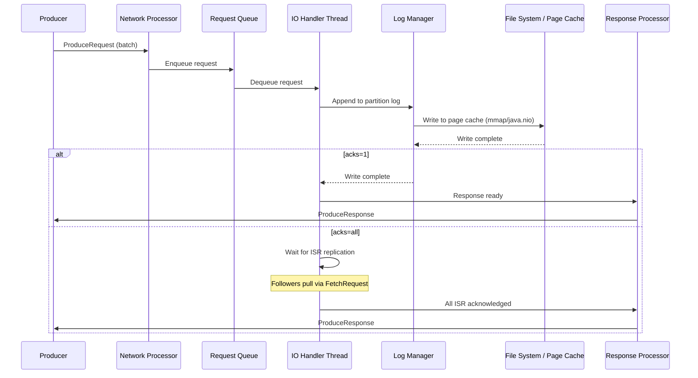

**Important:** Kafka does not call `fsync()` after every write by default. It relies on the OS page cache to flush data to disk asynchronously. This is a deliberate design choice for performance — `fsync()` is extremely slow (milliseconds) and would kill throughput. Instead, Kafka relies on replication for durability: if one broker crashes, the data is still available on its replicas. The `log.flush.interval.messages` and `log.flush.interval.ms` configs exist but are generally left at their defaults (effectively disabled) in production.

### 5.3 Delayed Operation Pairs

Kafka uses a "delayed operation" mechanism for requests that cannot be satisfied immediately:

- **Produce request with acks=all:** The request is delayed until all ISR replicas acknowledge the write
- **Fetch request with min.bytes > 0:** The request is delayed until enough data accumulates to return

This is implemented using a `DelayedOperationPurgatory` — a hash wheel timer that tracks pending operations. When the condition is met (replication completes, data accumulates), the operation is completed and the response is sent. If the timeout expires before the condition is met, the operation is completed with whatever data is available (for fetch) or an error (for produce).

---

## 6. Replication & ISR

### 6.1 Replication Architecture

Replication is Kafka's mechanism for fault tolerance. Each partition has one **leader** replica and zero or more **follower** replicas. The leader handles all read and write requests for the partition, while followers passively replicate the leader's log.

1. Each broker contains some sort of data. But, what if the broker or the machine fails down? The data will be lost. Precautionary, Apache Kafka enables a feature of replication to secure data loss even when a broker fails down. To do so, a replication factor is created for the topics contained in any particular broker. 
2. A replication factor is the number of copies of data over multiple brokers. The replication factor value should be greater than 1 aways (between 2 or 3). This helps to store a replica of the data in another broker from where the user can access it.
3. Replication factor of 3 means, there would be 3 copies of data on 3 different servers.The cluster may get confuse that which broker should serve the client request. To remove such confusion, the following task is done by Kafka:
`1. It chooses one of the broker's partition as a leader, and the rest of them becomes its followers`
`2. The followers(brokers) will be allowed to synchronize the data. But, in the presence of a leader, none of the followers is allowed to serve the client's request. These replicas are known as ISR(in-sync-replica). So, Apache Kafka offers multiple ISR(in-sync-replica) for the data.`
`3. Therefore, only the leader is allowed to serve the client request. The leader handles all the read and writes operations of data for the partitions. The leader and its followers are determined by the zookeeper`
`4. If the broker holding the leader for the partition fails to serve the data due to any failure, one of its respective ISR replicas will takeover the leadership. Afterward, if the previous leader returns back, it tries to acquire its leadership again.`


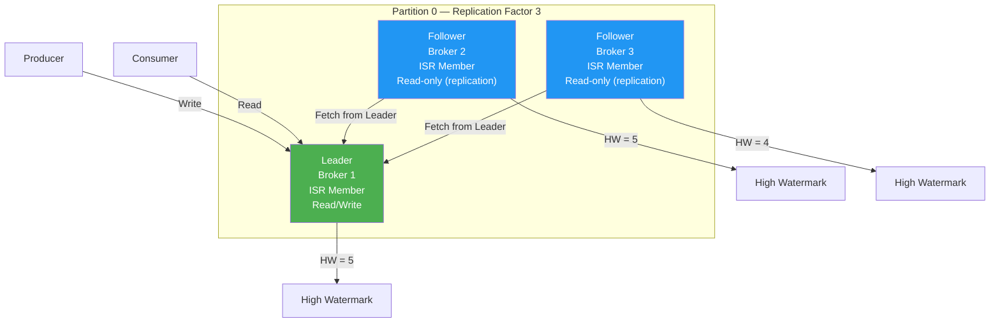

**Leader Epoch:** Each leader change increments a monotonically increasing **leader epoch** for the partition. The leader epoch is used to:
- Prevent "zombie" leaders from serving stale data (split-brain scenarios)
- Enable followers to truncate their logs correctly during leader changes
- Provide a fencing mechanism for producer requests from old leaders

**Follower Replication Process:** Followers replicate data by sending `FetchRequest` to the leader. This is a pull-based model — followers actively fetch data rather than the leader pushing it. The follower includes its last fetched offset in the request, and the leader returns data starting from that offset. The follower writes the data to its log and advances its high watermark.

### 6.2 ISR (In-Sync Replicas)

The ISR is the set of replicas that are fully caught up with the leader. A replica is considered "in sync" if it:
1. Has an active session with the ZooKeeper/KRaft controller (i.e., it's alive)
2. Its fetch offset is within max replica lag time,`replica.lag.time.max.ms` (default 10 seconds) of the leader's log end offset

If a follower falls behind beyond this threshold, it is removed from the ISR and becomes an "out-of-sync" replica. This means it can no longer be considered for `acks=all` writes. When the follower catches up, it is added back to the ISR.

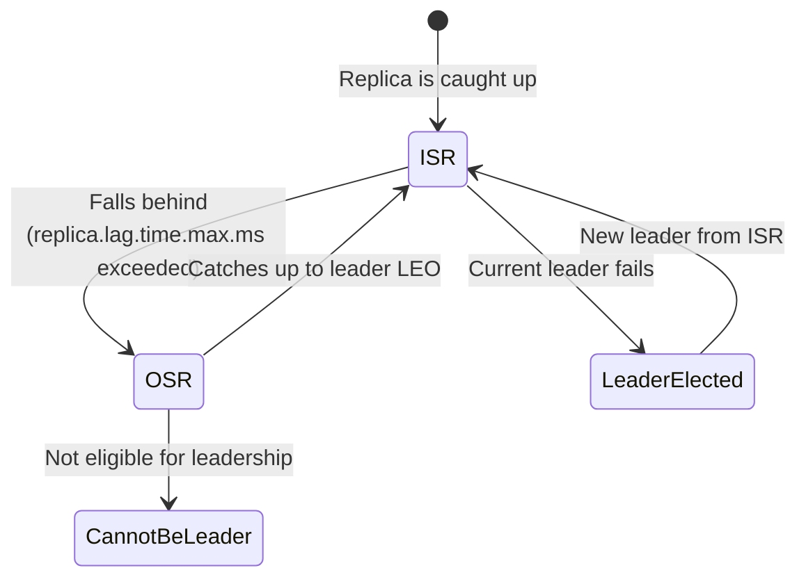

**Why ISR matters for `acks=all`:** When a producer sends with `acks=all`, the leader waits for all ISR members (not all replicas — just the ISR) to acknowledge the write before responding to the producer. This is why `min.insync.replicas` is critical:

- If `replication.factor=3` and `min.insync.replicas=2`, the producer can write as long as at least 2 replicas (including the leader) are in the ISR
- If `min.insync.replicas=1`, `acks=all` degrades to `acks=1` (only the leader needs to acknowledge)
- If the ISR count falls below `min.insync.replicas`, the partition becomes unavailable for writes (produces return `NOT_ENOUGH_REPLICAS`)

**Best practice:** `replication.factor=3`, `min.insync.replicas=2`, `acks=all`. This provides:
- Tolerance for 1 broker failure without data loss
- Tolerance for 2 broker failures with data intact but temporary unavailability
- Write availability as long as 2 of 3 replicas are alive

### 6.3 High Watermark & Leader Epoch

**High Watermark (HW):** The high watermark is the offset of the last record that has been replicated to all ISR members. Consumers can only read up to the HW — records beyond the HW have not been fully replicated and could be lost if the leader fails. The leader advances the HW to the minimum LEO among all ISR members.

**Leader Epoch (LEO):** Each replica maintains its own Log End Offset (LEO) — the offset of the next record to be written. The leader's LEO is always >= any follower's LEO.

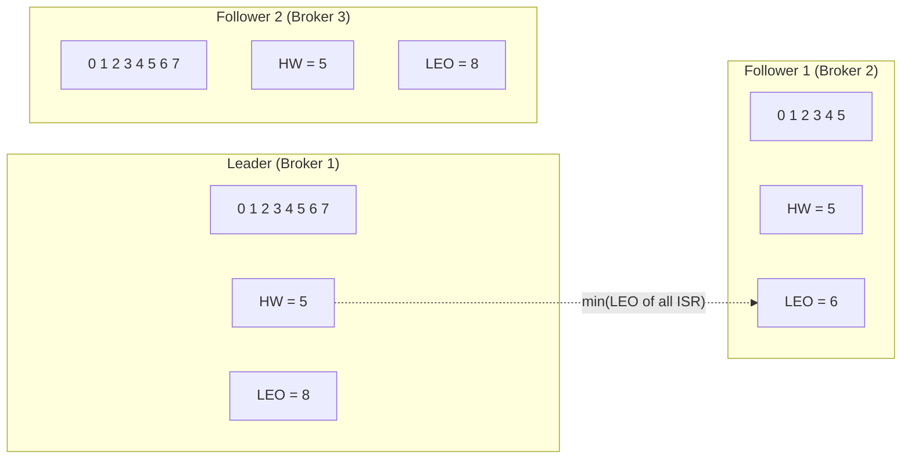

In the above diagram, the HW is 5 because Follower 1's LEO is 6 (the minimum among ISR). Records at offsets 6 and 7 on the leader are not yet safe to consume because Follower 1 hasn't replicated them.

### 6.4 Unclean Leader Election

When the leader fails and no ISR member is available (all ISR members are down), Kafka can either:
1. **Wait** for an ISR member to recover (preferred for data integrity)
2. **Elect** an out-of-sync replica as the new leader (unclean leader election)

`unclean.leader.election.enable` (default: false) controls this behavior. When set to true, an OSR replica can become the leader, but this **guarantees data loss** because the OSR replica is behind the leader and any records it hasn't replicated will be lost. When set to false, the partition remains unavailable until an ISR member recovers.

**The architect's dilemma:** Availability vs Durability. For financial data, set `unclean.leader.election.enable=false` — it's better to be unavailable than to lose data. For telemetry or analytics data where a few missing records are acceptable, `true` might be acceptable.

---

## 7. Kafka Storage Architecture

### 7.1 Disk Layout

Kafka's storage is designed for high-throughput sequential I/O. Each topic partition maps to a directory named `<topic>-<partition>`, and each directory contains the log segment files.

```
/kafka-logs/
├── orders.order.created-0/
│   ├── 00000000000000000000.log       # Segment 1 data
│   ├── 00000000000000000000.index     # Segment 1 offset index
│   ├── 00000000000000000000.timeindex # Segment 1 time index
│   ├── 00000000000005367851.log       # Segment 2 data
│   ├── 00000000000005367851.index     # Segment 2 offset index
│   ├── 00000000000005367851.timeindex # Segment 2 time index
│   └── leader-epoch-checkpoint        # Leader epoch cache
├── orders.order.created-1/
│   └── ...
├── __consumer_offsets-0/              # Internal consumer offset topic
│   └── ...
├── __transaction_state-0/             # Internal transaction topic
│   └── ...
├── recovery-point-offset-checkpoint   # Last flush point per log
└── replication-offset-checkpoint      # High watermark per replica
```

### 7.2 Zero-Copy Transfer

Kafka uses zero-copy (sendfile system call) to transfer data from disk to the network socket, bypassing user space entirely. This is one of the key reasons for Kafka's exceptional throughput.

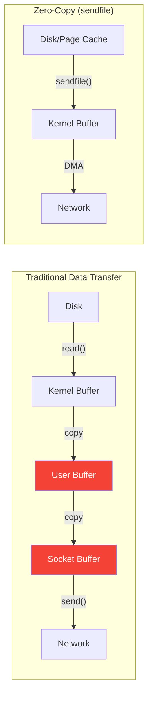

In traditional data transfer, data is copied 4 times (disk → kernel buffer → user buffer → socket buffer → network). With zero-copy, data moves from the page cache directly to the network interface via DMA, with only the metadata (offset, length) passing through the CPU. This reduces CPU usage by approximately 50% and memory bandwidth usage significantly.

**Prerequisite for zero-copy:** The consumer must read from the beginning of a record batch (not in the middle), and the data must be in the page cache (or on disk with no compression transformation needed). When compression is used, Kafka can still use zero-copy for compressed batches because the consumer receives the compressed batch and decompresses it client-side.

### 7.3 Retention Policies
Kafka provides disk-based retention, so no danger of data loss. A topic's retention time can be configured in Kafka. It allows us to set retention policies based on either time or size, so we can specify a maximum amount of data to retain in a topic.

1. Messages sent to Kafka clusters get appended to one of the multiple partition logs. These messages remain in multiple partition logs even after being consumed, for a configurable period of time, or until a configurable size is reached. This configurable amount of time for which the message remains in the log is known as the retention period.
2. The message will be available for the amount of time specified by the retention period. Kafka allows users to configure the retention period for messages on a per-topic basis. The default retention period for a message is 7 days.
log.retention.hours=168
3. Retention by Size and Time : It is performed by examining the last modified time on each log segment file on disk. 
	This is the time that the log segment was closed, and represents the timestamp of the last message in the file.
**log.retention.bytes** Another way to expire messages is based on the total number of bytes of messages retained and it is applied per partition.
	The default is -1, meaning that there is no limit and only a time limit is applied.
4. we can mix the retention in bytes and in hours to ensure the log is never older than a certain amount of time and never larger than a certain size. 

Kafka provides two retention policies:

**Delete (default):** Old log segments are deleted when they exceed the retention threshold. Deletion happens at the segment level, not the record level. When a segment's last modified time exceeds `retention.ms` or the partition's total size exceeds `retention.bytes`, the entire segment is deleted.

**Compact:** Log compaction retains the latest value for each key. Instead of deleting entire segments, compaction removes older records with the same key, keeping only the latest. This transforms the log from a transient message stream into a durable key-value store.

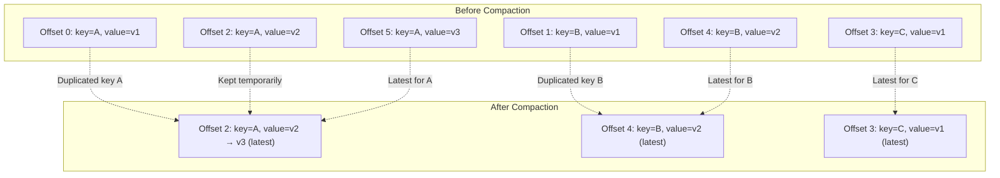

Compaction runs as a background thread that:
1. Selects a log segment for compaction (the "clean" segment)
2. Reads the segment and builds an offset map of the latest offset for each key
3. Rewrites the segment, keeping only the latest record for each key
4. Atomically swaps the old segment with the new one

Key compaction configurations:
- `cleaner.min.cleanable.dirty.ratio` (default 0.5) — the ratio of dirty (non-compacted) records to total records before compaction triggers. Lower values mean more frequent compaction but more overhead.
- `cleaner.max.compaction.lag.ms` — maximum time a record can remain uncompacted
- `min.compaction.lag.ms` — minimum time a record must remain before it can be compacted (prevents compacting very recent data)
- `delete.retention.ms` (default 86400000 / 24 hours) — how long tombstone records (null values) are retained before deletion

---

## 8. Kafka Controller & Metadata

### 8.1 Controller Role

The controller is a special broker in the Kafka cluster responsible for managing partition state and broker failures. Only one broker can be the controller at any time. The controller is elected by creating an ephemeral node in ZooKeeper (or via KRaft quorum in newer versions).

**Controller responsibilities:**
1. **Partition leadership changes:** When a broker fails, the controller detects the failure and elects new leaders for all partitions that had their leader on the failed broker.
2. **ISR changes:** The controller processes ISR change notifications from brokers and updates the metadata.
3. **Topic creation/deletion:** The controller handles requests to create or delete topics, creating or removing partitions accordingly.
4. **Partition reassignment:** The controller orchestrates partition reassignment between brokers.
5. **Preferred replica election:** The controller can move leadership back to the preferred (first) replica to balance load.

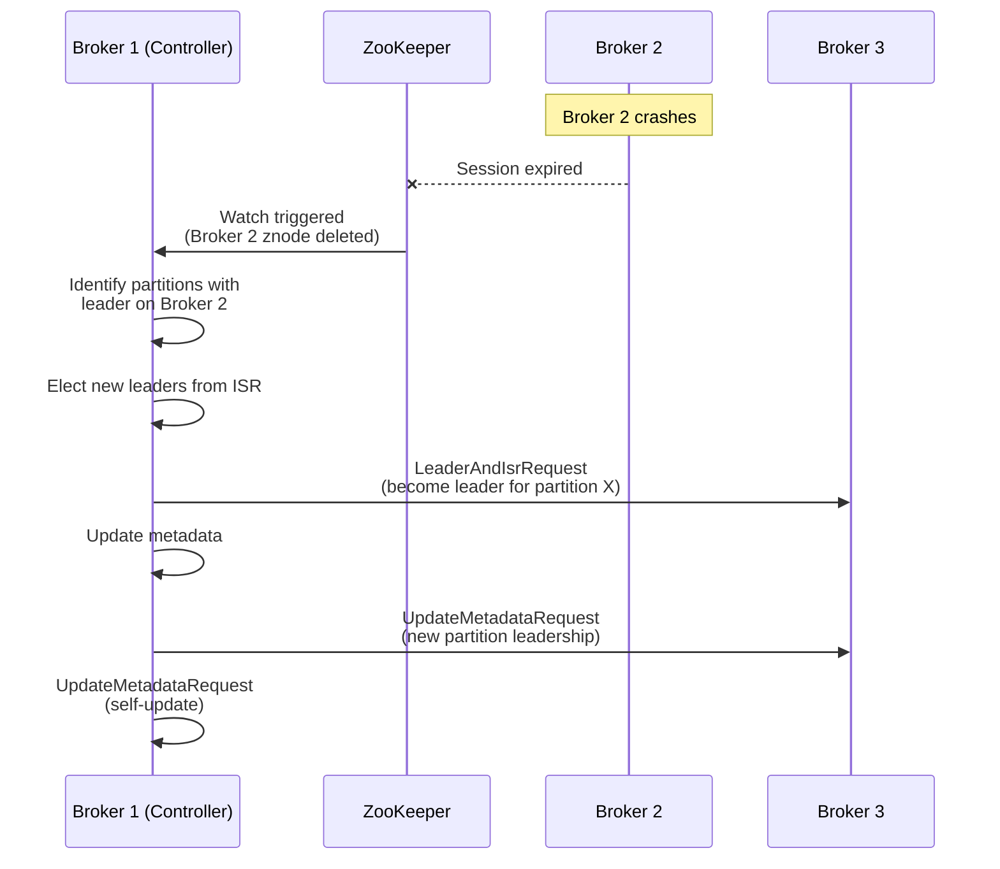

### 8.2 KRaft Mode (Kafka Raft Metadata)

Starting with Kafka 2.8, Kafka can operate without ZooKeeper using the KRaft (Kafka Raft) consensus protocol for metadata management. This was fully production-ready in Kafka 3.3 and is the default in Kafka 4.0+.

**Why remove ZooKeeper?**
- **Scalability:** ZooKeeper limits Kafka to ~200,000 partitions (practically). KRaft supports millions.
- **Operational complexity:** Running and maintaining a ZooKeeper ensemble adds operational overhead.
- **Metadata latency:** Controller must communicate with ZooKeeper for every metadata change, adding latency. KRaft uses a direct metadata log.
- **Rebalance time:** ZooKeeper-based controllers can take minutes to rebalance large clusters. KRaft reduces this to seconds.

**KRaft Architecture:**

```mermaid
graph TD
    subgraph "KRaft Metadata Quorum"
        QC[Controller Quorum<br/>3 or 5 Controllers]
        ML[Metadata Log<br/>(Raft replicated)]
    end

    subgraph "Broker Nodes"
        B1[Broker 1]
        B2[Broker 2]
        B3[Broker 3]
    end

    QC --> ML
    ML -->|"Metadata snapshots<br/>& delta updates"| B1
    ML -->|"Metadata snapshots<br/>& delta updates"| B2
    ML -->|"Metadata snapshots<br/>& delta updates"| B3
```

In KRaft mode, controllers form a Raft quorum that maintains the metadata log. Brokers fetch metadata updates from this log. This eliminates the need for ZooKeeper entirely and provides much faster metadata propagation.

### 8.3 Metadata Request Flow

When a producer or consumer needs to know which broker is the leader for a partition, it uses a `MetadataRequest`. The client caches metadata and refreshes it when:
- A request fails with `NotLeaderOrFollowerException` (stale metadata)
- The metadata TTL expires (`metadata.max.age.ms`, default 5 minutes)
- The client has no metadata for a new topic

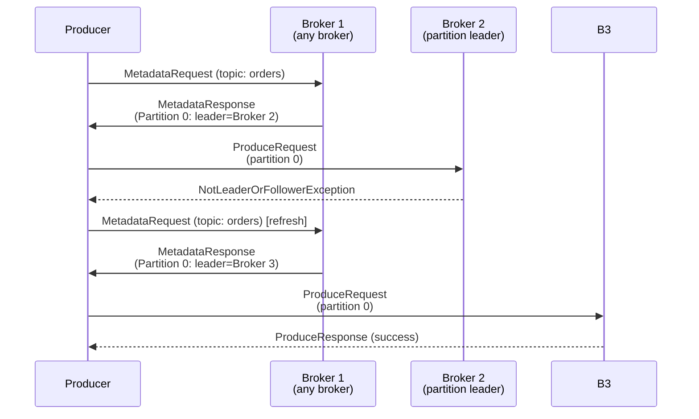

---

## 9. Kafka Connect

### 9.1 Architecture

Kafka Connect is a framework for connecting Kafka with external systems (databases, key-value stores, search indexes, file systems, etc.) in a scalable and reliable way. 

1. Kafka Connectors are ready-to-use components, which can help us to import data from external systems into Kafka topics and export data from Kafka topics into external systems. 
2. It provides a runtime for running **connectors** — plugins that implement the logic for copying data between Kafka and external systems.

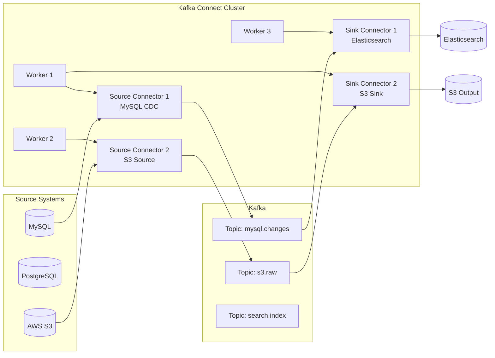

**Key Concepts:**

1. **Connector:** The high-level abstraction that defines where data should be copied. A source connector reads from an external system and writes to Kafka. A sink connector reads from Kafka and writes to an external system. Connectors are configured with JSON properties and are instantiated as tasks.

2. **Task:** The actual data-copying unit. A connector can be split into multiple tasks for parallelism. For example, a JDBC source connector with 10 tables can create 10 tasks, each copying one table. Tasks are the unit of parallelism and fault tolerance — if a worker fails, its tasks are redistributed to surviving workers.

3. **Worker:** The Kafka Connect process that runs connectors and tasks. Workers form a cluster and coordinate using Kafka's internal topics (`connect-configs`, `connect-offsets`, `connect-status`). Workers use a group protocol similar to consumer groups for task distribution.

4. **Converter:** Handles serialization/deserialization of data. Common converters include JSON, Avro, and Protobuf. The converter is configured per connector and determines the format of data in Kafka topics.

5. **Single Message Transform (SMT):** Lightweight transformations applied to each record as it passes through Connect. SMTs can add, remove, or rename fields; convert types; route records to different topics; and more. They are not meant for complex transformations — for those, use Kafka Streams.

### 9.2 Source Connectors — Offset Management

Source connectors must track their position in the external system so they can resume after a restart. Connect stores these offsets in the `connect-offsets` topic. For example:
- A JDBC source connector stores the last queried timestamp or auto-increment ID
- A file source connector stores the byte offset in the file
- A Debezium connector stores the binlog position in MySQL

### 9.3 Sink Connectors — Delivery Guarantees

Sink connectors read from Kafka and write to external systems. The key challenge is ensuring exactly-once delivery to the sink. This depends on the sink system's capabilities:

- **Idempotent writes:** If the sink supports idempotent upserts (e.g., Elasticsearch with document IDs), the connector can safely retry without creating duplicates
- **Transactional writes:** If the sink supports transactions (e.g., JDBC), the connector can commit records and offsets atomically
- **Best-effort:** Without idempotent or transactional support, the connector provides at-least-once delivery, and the consumer must handle duplicates

### 9.4 Debezium CDC — Change Data Capture

Debezium is the most popular Kafka Connect source connector for CDC. It captures row-level changes from databases and publishes them as events to Kafka topics.

**MySQL CDC Architecture:**

```mermaid
sequenceDiagram
    participant APP as Application
    participant DB as MySQL
    participant DZ as Debezium Connector
    participant K as Kafka
    participant CS as Consumer Service

    APP->>DB: INSERT INTO orders (...)
    DB->>DB: Write to binlog

    DZ->>DB: Read binlog entry
    DZ->>K: Publish to dbserver1.orders.orders topic
    K->>CS: Consume change event
```

Debezium events include:
- **Before:** The previous state of the row (for UPDATE and DELETE)
- **After:** The new state of the row (for INSERT and UPDATE)
- **Source:** Metadata about the source system (binlog position, server ID, etc.)
- **Operation:** The type of change (c=create, u=update, d=delete, r=snapshot)

---

## 10. Kafka Streams

### 10.1 Architecture

Kafka Streams is a client library for building applications and microservices that process data stored in Kafka. It provides a simple yet powerful DSL for stream processing with exactly-once semantics.

```mermaid
graph LR
    subgraph "Kafka Streams Application"
        subgraph "Stream Task 0"
            ST0[Source: topic-P0] --> PT0[Process] --> ST0O[Sink: output-P0]
        end
        subgraph "Stream Task 1"
            ST1[Source: topic-P1] --> PT1[Process] --> ST1O[Sink: output-P1]
        end
        subgraph "Stream Task 2"
            ST2[Source: topic-P2] --> PT2[Process] --> ST2O[Sink: output-P2]
        end
    end

    subgraph "Kafka Topics"
        IT[Input Topic<br/>3 Partitions]
        OT[Output Topic<br/>3 Partitions]
    end

    IT --> ST0
    IT --> ST1
    IT --> ST2
    ST0O --> OT
    ST1O --> OT
    ST2O --> OT
```

**Key Concepts:**

1. **Stream:** An unbounded, continuous flow of records. In Kafka Streams, a stream is backed by a Kafka topic.
2. **Table:** A changelog of records that represents the latest state for each key. A table is materialized from a stream and can be backed by a Kafka compacted topic.
3. **Stream-Table Duality:** Streams and tables are two views of the same data. A stream is a changelog (table → stream), and a table is a materialized view of a stream (stream → table). This concept is fundamental to Kafka Streams.

```mermaid
graph TD
    subgraph "Stream → Table (Aggregation)"
        S1["Stream: key=A, val=1"]
        S2["Stream: key=B, val=2"]
        S3["Stream: key=A, val=3"]
        S4["Stream: key=B, val=5"]

        T["Table: A=4, B=7<br/>(running sum)"]
    end

    S1 --> T
    S2 --> T
    S3 --> T
    S4 --> T
```

### 10.2 KStream vs KTable vs GlobalKTable

| Type | Description | Update Semantics | Use Case |
|------|-------------|-------------------|----------|
| **KStream** | Stream of records | Every record is an event | Event logs, clicks, transactions |
| **KTable** | Changelog stream | Only latest value per key | Current state, user profiles, config |
| **GlobalKTable** | Replicated on all instances | Latest value per key, broadcast | Reference data, lookups, dimension tables |

### 10.3 Stateful Processing & State Stores

Kafka Streams supports stateful operations (aggregations, joins, windowing) using **state stores**. State stores are backed by Kafka compacted changelog topics for fault tolerance.

```java
// Aggregation with state store
KStream<String, Order> orders = builder.stream("orders");

KTable<String, Long> orderCounts = orders
    .groupByKey()
    .count(Materialized.as("order-count-store"));

// Windowed aggregation
KTable<Windowed<String>, Long> windowedCounts = orders
    .groupByKey()
    .windowedBy(TimeWindows.of(Duration.ofMinutes(5)))
    .count();
```

**Types of State Stores:**
1. **In-memory:** Fast but limited by memory. Backed by changelog topic for recovery.
2. **Persistent (RocksDB):** Default. Stores data on disk with an in-memory cache. Can handle state much larger than memory.
3. **Custom:** Implement the `StateStore` interface for custom storage backends.

**RocksDB State Store Internals:**
- Each stream task has its own RocksDB instance
- Records are first written to an in-memory buffer
- When the buffer is full, it's flushed to disk as an SSTable
- Reads first check the buffer, then the latest SSTables
- The changelog topic ensures full recovery after a failure — the store is rebuilt by replaying the changelog

### 10.4 Interactive Queries

Kafka Streams supports interactive queries, allowing you to query the state stores of your stream application directly (without going through Kafka). This turns your stream processing application into a queryable data service.

```java
// Query a local state store
ReadOnlyKeyValueStore<String, Long> store =
    streams.store("order-count-store", QueryableStoreTypes.keyValueStore());

Long count = store.get("user-123");
```

For distributed queries across multiple instances, you need to:
1. Discover which instance owns the key (using `KafkaStreams.metadataForKey()`)
2. Forward the query to the correct instance (typically via REST API)
3. Aggregate results if needed

---

## 11. Schema Registry & SerDes

### 11.1 Why Schema Registry?

In a Kafka-based microservices architecture, producers and consumers need to agree on the data format (schema). Without schema management:
- Schema changes break consumers
- No schema evolution strategy
- No compatibility checking
- Debugging is difficult when data format errors occur

The Schema Registry provides:
1. **Centralized schema storage** — all schemas are stored in a dedicated Kafka topic (`_schemas`)
2. **Schema evolution** — with configurable compatibility rules
3. **Serialization optimization** — records contain only a schema ID (4 bytes) instead of the full schema
4. **Compatibility checking** — prevents incompatible schema changes at registration time

### 11.2 Schema Evolution & Compatibility

```mermaid
graph TD
    subgraph "Schema Evolution Types"
        B["BACKWARD:<br/>New schema can read<br/>old data"]
        F["FORWARD:<br/>Old schema can read<br/>new data"]
        BF["FULL:<br/>Both backward and forward"]
        N["NONE:<br/>No compatibility check"]
    end
```

| Compatibility | Use Case | Example |
|---------------|----------|---------|
| BACKWARD | Consumer needs to read old data | Add optional field with default |
| FORWARD | Old consumer can read new data | Remove optional field |
| FULL | Most flexible | Add field with default, then remove default |
| BACKWARD_TRANSITIVE | All previous versions readable | Multi-version consumer |
| NONE | Breaking changes allowed | Major version change |

**Avro Schema Evolution Rules (BACKWARD):**
- ✅ Add a field with a default value
- ✅ Remove a field that has a default value
- ❌ Add a field without a default value
- ❌ Remove a field without a default value
- ❌ Change a field's type (e.g., string → int)
- ❌ Rename a field (use aliases for compatibility)

### 11.3 SerDes with Schema Registry

```java
// Avro SerDes configuration
Properties props = new Properties();
props.put(ProducerConfig.KEY_SERIALIZER_CLASS_CONFIG,
    KafkaAvroSerializer.class.getName());
props.put(ProducerConfig.VALUE_SERIALIZER_CLASS_CONFIG,
    KafkaAvroSerializer.class.getName());
props.put("schema.registry.url", "http://localhost:8081");

// Subject name strategy
props.put("value.subject.name.strategy",
    TopicRecordNameStrategy.class.getName());
```

**Subject Name Strategies:**
1. **TopicNameStrategy (default):** One subject per topic — `topic-value` and `topic-key`
2. **RecordNameStrategy:** One subject per Avro record type — `com.example.Order`
3. **TopicRecordNameStrategy:** One subject per topic-record combination — `topic-com.example.Order`

The choice matters for schema evolution. TopicNameStrategy restricts all records in a topic to the same schema (or compatible variants). RecordNameStrategy allows multiple event types in the same topic with independent schemas.

---

## 12. Kafka Security

### 12.1 Security Layers

Kafka security operates at three layers:

```mermaid
graph TD
    subgraph "Kafka Security Stack"
        A["Authentication<br/>Who are you?"]
        B["Authorization<br/>What can you do?"]
        C["Encryption<br/>Is data protected?"]
    end

    A --> B --> C
```

### 12.2 Authentication Mechanisms

**1. SSL/TLS (mTLS):** Mutual TLS authentication where both the client and server present certificates. This is commonly used in enterprise environments with PKI infrastructure.

- Broker configuration: `ssl.keystore.location`, `ssl.truststore.location`, `ssl.client.auth=required`
- Client configuration: `security.protocol=SSL`, `ssl.keystore.location`, `ssl.truststore.location`
- Pros: Strong authentication, no credential management
- Cons: Certificate lifecycle management, PKI infrastructure required

**2. SASL/PLAIN:** Simple username/password authentication. Credentials are stored in a JAAS configuration file or provided dynamically.

```properties
# Server JAAS configuration
KafkaServer {
  org.apache.kafka.common.security.plain.PlainLoginModule required
  username="admin"
  password="admin-secret"
  user_admin="admin-secret"
  user_producer="producer-secret"
  user_consumer="consumer-secret";
};
```

- Pros: Simple to set up, familiar model
- Cons: Passwords in config files, not ideal for large-scale deployments

**3. SASL/SCRAM (Salted Challenge Response):** An improvement over PLAIN that avoids sending passwords over the wire. Credentials are stored in ZooKeeper (or KRaft metadata).

```bash
# Create SCRAM credentials
kafka-configs.sh --zookeeper localhost:2181 \
  --alter --add-config 'SCRAM-SHA-256=[password=producer-secret],SCRAM-SHA-512=[password=producer-secret]' \
  --entity-type users --entity-name producer1
```

- Pros: No passwords sent over the network, dynamic credential management
- Cons: Credentials stored in ZK (single source of truth)

**4. SASL/OAUTHBEARER:** OAuth 2.0 bearer token authentication. This is the recommended approach for cloud-native deployments.

- Pros: Integrates with identity providers (Keycloak, Okta, AWS IAM), supports token refresh
- Cons: More complex setup, requires OAuth server

**5. SASL/GSSAPI (Kerberos):** Enterprise-grade authentication using Kerberos.

- Pros: SSO integration, strong security, widely used in Hadoop ecosystems
- Cons: Complex setup, requires Kerberos infrastructure

### 12.3 Authorization (ACLs)

Kafka uses Access Control Lists (ACLs) to authorize operations. ACLs define which principals can perform which operations on which resources.

```bash
# Grant producer write access to a topic
kafka-acls.sh --authorizer-properties zookeeper.connect=localhost:2181 \
  --add --allow-principal User:producer1 \
  --operation Write --topic orders.order.created

# Grant consumer read access with host restriction
kafka-acls.sh --authorizer-properties zookeeper.connect=localhost:2181 \
  --add --allow-principal User:consumer1 \
  --allow-host 10.0.0.0/24 \
  --operation Read --topic orders.order.created \
  --operation Read --group order-consumers

# List all ACLs
kafka-acls.sh --authorizer-properties zookeeper.connect=localhost:2181 \
  --list
```

**Resource Types:** Topic, Group, Cluster, TransactionalId, DelegationToken

**Operations:** Read, Write, Create, Delete, Alter, Describe, ClusterAction, DescribeConfigs, AlterConfigs, IdempotentWrite

**Super Users:** Configured via `super.users` broker property. Super users bypass all ACL checks. Use sparingly.

### 12.4 Encryption

**In-Transit Encryption:** Use SSL/TLS for encrypting data between clients and brokers, and between brokers. Configure `security.protocol=SSL` or `SASL_SSL` (SASL for authentication + SSL for encryption).

**At-Rest Encryption:** Kafka does not natively encrypt data at rest. Options:
- Use OS-level disk encryption (LUKS, BitLocker)
- Use cloud provider encryption (AWS EBS encryption, Azure Disk Encryption)
- Implement client-side encryption before producing to Kafka

---

## 13. Kafka Monitoring & Operations

### 13.1 Key Metrics

Kafka exposes metrics via JMX (Java Management Extensions). Key metrics to monitor:

**Broker Metrics:**

| Metric | JMX Bean | Alert Threshold |
|--------|----------|-----------------|
| Under-replicated partitions | `kafka.server:type=ReplicaManager,name=UnderReplicatedPartitions` | > 0 |
| Offline partitions | `kafka.controller:type=KafkaController,name=OfflinePartitionsCount` | > 0 |
| Active controller count | `kafka.controller:type=KafkaController,name=ActiveControllerCount` | != 1 |
| Request handler idle ratio | `kafka.server:type=KafkaRequestHandlerPool,name=RequestHandlerAvgIdlePercent` | < 0.3 |
| Network processor idle ratio | `kafka.network:type=SocketServer,name=NetworkProcessorAvgIdlePercent` | < 0.3 |
| Bytes in/out rate | `kafka.server:type=BrokerTopicMetrics,name=BytesInPerSec` | Trend-based |
| Messages in rate | `kafka.server:type=BrokerTopicMetrics,name=MessagesInPerSec` | Trend-based |
| Log flush latency | `kafka.log:type=LogFlushStats,name=LogFlushRateAndTimeMs` | p99 > 100ms |

**Producer Metrics:**

| Metric | Description | Alert Threshold |
|--------|-------------|-----------------|
| record-send-rate | Records sent per second | Low = bottleneck |
| record-error-rate | Failed sends per second | > 0 |
| request-latency-avg | Average request latency | Trend-based |
| compression-rate | Compression ratio | Monitor for changes |
| buffer-available-bytes | Available buffer memory | < 10% of buffer.memory |
| retries | Number of retries | Spikes indicate issues |

**Consumer Metrics:**

| Metric | Description | Alert Threshold |
|--------|-------------|-----------------|
| records-lag-max | Maximum consumer lag | Growing trend |
| commit-rate | Offset commits per second | Drops = processing issues |
| fetch-rate | Fetch requests per second | Low = stalled consumer |
| records-consumed-rate | Records consumed per second | Compare to production rate |

### 13.2 Operational Procedures

**Graceful Broker Shutdown:**
```bash
# Use Kafka's controlled shutdown API (preferred)
kafka-broker-api-versions.sh --bootstrap-server localhost:9092

# Or set controlled.shutdown.enable=true in broker config
# This ensures:
# 1. Leadership is transferred before shutdown
# 2. No unclean leader elections
# 3. Minimal disruption to clients
```

**Preferred Leader Election:**
```bash
# Trigger preferred replica election to balance leadership
kafka-leader-election.sh --bootstrap-server localhost:9092 \
  --election-type preferred \
  --topic orders.order.created --partition 0
```

**Topic Configuration Changes:**
```bash
# Increase retention for a topic
kafka-configs.sh --bootstrap-server localhost:9092 \
  --entity-type topics --entity-name orders.order.created \
  --alter --add-config retention.ms=259200000

# Verify change
kafka-configs.sh --bootstrap-server localhost:9092 \
  --entity-type topics --entity-name orders.order.created \
  --describe
```

---

## 14. Kafka Performance Tuning

### 14.1 Producer Tuning

```properties
# High-throughput producer configuration
batch.size=65536                    # 64KB batches
linger.ms=20                       # Wait 20ms for batch to fill
buffer.memory=134217728             # 128MB buffer
compression.type=lz4               # Fast compression
acks=all                           # Durability
enable.idempotence=true             # Exactly-once per partition
max.in.flight.requests.per.connection=5  # Allow pipelining with idempotence
delivery.timeout.ms=120000          # 2-minute total delivery timeout
```

### 14.2 Consumer Tuning

```properties
# High-throughput consumer configuration
fetch.min.bytes=1048576            # 1MB minimum fetch
fetch.max.wait.ms=500              # Wait up to 500ms for min bytes
max.partition.fetch.bytes=1048576  # 1MB per partition per fetch
max.poll.records=1000              # Process up to 1000 records per poll
max.poll.interval.ms=300000        # 5 minutes between polls
session.timeout.ms=30000           # 30 seconds session timeout
heartbeat.interval.ms=10000        # Heartbeat every 10 seconds
connections.max.idle.ms=300000     # Close idle connections after 5 minutes
```

### 14.3 Broker Tuning

```properties
# Broker performance tuning
num.network.threads=8              # More network threads for high connections
num.io.threads=16                  # More I/O threads for high throughput
socket.send.buffer.bytes=1048576   # 1MB send buffer
socket.receive.buffer.bytes=1048576 # 1MB receive buffer
num.recovery.threads.per.data.dir=4 # Faster recovery
log.flush.interval.messages=100000  # Let OS handle flushing
log.flush.interval.ms=null          # Let OS handle flushing
```

**JVM Tuning for Kafka Broker:**
```bash
# Recommended JVM settings
export KAFKA_HEAP_OPTS="-Xmx6g -Xms6g"
export KAFKA_JVM_PERFORMANCE_OPTS="-XX:MetaspaceSize=96m -XX:+UseG1GC \
  -XX:MaxGCPauseMillis=20 -XX:InitiatingHeapOccupancyPercent=35 \
  -XX:G1HeapRegionSize=16M -XX:MinMetaspaceFreeRatio=50 \
  -XX:MaxMetaspaceFreeRatio=80"
```

Why G1GC? Kafka's workload involves large, long-lived objects (log segments, page cache references) and short-lived objects (request/response objects). G1GC provides predictable pause times and handles large heaps well. The key settings:
- `MaxGCPauseMillis=20`: Target 20ms pauses (achievable with G1GC)
- `InitiatingHeapOccupancyPercent=35`: Start GC early to avoid full GC
- `G1HeapRegionSize=16M`: Larger regions for large heaps

### 14.4 OS-Level Tuning

```bash
# File descriptor limits
ulimit -n 100000

# Network settings
sysctl -w net.core.rmem_max=16777216
sysctl -w net.core.wmem_max=16777216
sysctl -w net.ipv4.tcp_rmem='4096 87380 16777216'
sysctl -w net.ipv4.tcp_wmem='4096 65536 16777216'

# Swap (disable or minimize)
sysctl -w vm.swappiness=1

# File system: Use XFS or ext4 with noatime
# In /etc/fstab:
# /dev/sdb1 /kafka-logs xfs noatime,nodiratime 0 2
```

---

## 15. Kafka with Spring Boot

### 15.1 Spring Kafka Architecture

Spring Kafka provides a thin abstraction over the native Kafka client, integrating with Spring's programming model. The key components are:

```mermaid
graph TD
    subgraph "Spring Boot Application"
        KC[KafkaAutoConfiguration] --> KTF[KafkaTemplate]
        KC --> KLC[KafkaListenerContainerFactory]
        KTF --> PK[Producer Factory]
        KLC --> CF[Consumer Factory]
    end

    subgraph "Application Code"
        PS[Producer Service<br/>@Autowired KafkaTemplate]
        CH[Consumer Handler<br/>@KafkaListener]
    end

    PS --> KTF
    CH --> KLC
```

### 15.2 Producer Configuration

```java
@Configuration
public class KafkaProducerConfig {

    @Value("${spring.kafka.bootstrap-servers}")
    private String bootstrapServers;

    @Bean
    public ProducerFactory<String, Order> producerFactory() {
        Map<String, Object> config = new HashMap<>();
        config.put(ProducerConfig.BOOTSTRAP_SERVERS_CONFIG, bootstrapServers);
        config.put(ProducerConfig.KEY_SERIALIZER_CLASS_CONFIG, StringSerializer.class);
        config.put(ProducerConfig.VALUE_SERIALIZER_CLASS_CONFIG, JsonSerializer.class);
        config.put(ProducerConfig.ACKS_CONFIG, "all");
        config.put(ProducerConfig.ENABLE_IDEMPOTENCE_CONFIG, true);
        config.put(ProducerConfig.BATCH_SIZE_CONFIG, 32768);
        config.put(ProducerConfig.LINGER_MS_CONFIG, 10);
        config.put(ProducerConfig.COMPRESSION_TYPE_CONFIG, "lz4");
        config.put(ProducerConfig.DELIVERY_TIMEOUT_MS_CONFIG, 120000);
        return new DefaultKafkaProducerFactory<>(config);
    }

    @Bean
    public KafkaTemplate<String, Order> kafkaTemplate() {
        return new KafkaTemplate<>(producerFactory());
    }
}
```

### 15.3 Consumer Configuration

```java
@Configuration
@EnableKafka
public class KafkaConsumerConfig {

    @Value("${spring.kafka.bootstrap-servers}")
    private String bootstrapServers;

    @Bean
    public ConsumerFactory<String, Order> consumerFactory() {
        Map<String, Object> config = new HashMap<>();
        config.put(ConsumerConfig.BOOTSTRAP_SERVERS_CONFIG, bootstrapServers);
        config.put(ConsumerConfig.KEY_DESERIALIZER_CLASS_CONFIG, StringDeserializer.class);
        config.put(ConsumerConfig.VALUE_DESERIALIZER_CLASS_CONFIG, JsonDeserializer.class);
        config.put(ConsumerConfig.GROUP_ID_CONFIG, "order-processing-group");
        config.put(ConsumerConfig.AUTO_OFFSET_RESET_CONFIG, "earliest");
        config.put(ConsumerConfig.ENABLE_AUTO_COMMIT_CONFIG, false);
        config.put(ConsumerConfig.MAX_POLL_RECORDS_CONFIG, 100);
        config.put(ConsumerConfig.MAX_POLL_INTERVAL_MS_CONFIG, 300000);
        config.put(ConsumerConfig.SESSION_TIMEOUT_MS_CONFIG, 30000);
        config.put(JsonDeserializer.TRUSTED_PACKAGES, "com.example.domain");
        config.put(JsonDeserializer.TYPE_MAPPINGS,
            "order:com.example.domain.Order");
        return new DefaultKafkaConsumerFactory<>(config);
    }

    @Bean
    public ConcurrentKafkaListenerContainerFactory<String, Order>
            kafkaListenerContainerFactory() {

        ConcurrentKafkaListenerContainerFactory<String, Order> factory =
            new ConcurrentKafkaListenerContainerFactory<>();
        factory.setConsumerFactory(consumerFactory());
        factory.setConcurrency(3); // 3 consumer threads
        factory.getContainerProperties().setAckMode(
            ContainerProperties.AckMode.MANUAL_IMMEDIATE);
        return factory;
    }
}
```

### 15.4 Producing Messages

```java
@Service
@Slf4j
public class OrderEventProducer {

    private final KafkaTemplate<String, Order> kafkaTemplate;

    public OrderEventProducer(KafkaTemplate<String, Order> kafkaTemplate) {
        this.kafkaTemplate = kafkaTemplate;
    }

    public CompletableFuture<SendResult<String, Order>> publishOrderCreated(
            Order order) {
        String key = order.getOrderId();
        ProducerRecord<String, Order> record = new ProducerRecord<>(
            "orders.order.created",
            key,
            order
        );

        return kafkaTemplate.send(record)
            .whenComplete((result, ex) -> {
                if (ex != null) {
                    log.error("Failed to publish order {}: {}",
                        order.getOrderId(), ex.getMessage(), ex);
                    // Handle failure: retry, DLQ, circuit breaker
                } else {
                    RecordMetadata metadata = result.getRecordMetadata();
                    log.info("Published order {} to partition {} at offset {}",
                        order.getOrderId(),
                        metadata.partition(),
                        metadata.offset());
                }
            });
    }
}
```

### 15.5 Consuming Messages with @KafkaListener

```java
@Service
@Slf4j
public class OrderEventConsumer {

    @KafkaListener(
        topics = "orders.order.created",
        groupId = "order-processing-group",
        containerFactory = "kafkaListenerContainerFactory"
    )
    public void handleOrderCreated(
            ConsumerRecord<String, Order> record,
            Acknowledgment ack) {

        Order order = record.value();
        log.info("Received order {} from partition {} at offset {}",
            order.getOrderId(), record.partition(), record.offset());

        try {
            processOrder(order);
            ack.acknowledge(); // Manual commit after successful processing
        } catch (Exception e) {
            log.error("Failed to process order {}: {}",
                order.getOrderId(), e.getMessage(), e);
            // Don't acknowledge — record will be re-delivered
            // Or send to DLQ after max retries
        }
    }

    @KafkaListener(
        topics = "orders.order.created.DLT",
        groupId = "order-dlt-processor"
    )
    public void handleDeadLetterOrder(ConsumerRecord<String, Order> record) {
        log.warn("DLT: Order {} failed after max retries. Key: {}, Value: {}",
            record.value().getOrderId(), record.key(), record.value());
        // Alert, manual review, compensating action
    }
}
```

### 15.6 Error Handling with Spring Kafka

```java
@Configuration
@EnableKafka
public class KafkaErrorHandlingConfig {

    @Bean
    public ConcurrentKafkaListenerContainerFactory<String, Order>
            kafkaListenerContainerFactory(
                ConsumerFactory<String, Order> consumerFactory,
                KafkaTemplate<String, Order> kafkaTemplate) {

        ConcurrentKafkaListenerContainerFactory<String, Order> factory =
            new ConcurrentKafkaListenerContainerFactory<>();
        factory.setConsumerFactory(consumerFactory);
        factory.setConcurrency(3);

        // Default error handler with retry and DLQ
        DefaultErrorHandler errorHandler = new DefaultErrorHandler(
            new DeadLetterPublishingRecoverer(kafkaTemplate),
            new FixedBackOff(1000L, 3L) // 1 second backoff, 3 retries
        );

        // Don't retry for these exceptions
        errorHandler.addNotRetryableExceptions(
            DeserializationException.class,
            JsonProcessingException.class
        );

        factory.setCommonErrorHandler(errorHandler);
        factory.getContainerProperties().setAckMode(
            ContainerProperties.AckMode.RECORD);

        return factory;
    }
}
```

### 15.7 Spring Kafka Transactions

```java
@Configuration
public class KafkaTransactionConfig {

    @Bean
    public ProducerFactory<String, Order> producerFactory() {
        Map<String, Object> config = new HashMap<>();
        // ... standard config ...
        config.put(ProducerConfig.TRANSACTIONAL_ID_CONFIG, "order-txn-1");
        return new DefaultKafkaProducerFactory<>(config);
    }

    @Bean
    public KafkaTransactionManager<String, Order> kafkaTransactionManager(
            ProducerFactory<String, Order> producerFactory) {
        return new KafkaTransactionManager<>(producerFactory);
    }
}

// Usage with @Transactional
@Service
public class OrderService {

    @Transactional("kafkaTransactionManager")
    public void processAndPublish(Order order) {
        // This ensures both DB and Kafka operations are atomic
        // (with ChainedTransactionManager for DB + Kafka)
        orderRepository.save(order);
        kafkaTemplate.send("orders.order.created", order.getOrderId(), order);
    }
}
```

---

## 16. Kafka Cluster & Multi-Datacenter

### 16.1 Cluster Sizing Guidelines

| Factor | Recommendation |
|--------|---------------|
| Brokers | Start with 5 for production; add based on throughput/capacity |
| Replication Factor | 3 (minimum for production) |
| Min ISR | 2 (ensures data survives 1 broker failure) |
| Partitions per topic | Based on throughput target / per-partition throughput |
| Total partitions | < 2,000 per broker (ZK mode), higher with KRaft |
| Disk | SSD preferred; HDD acceptable for archival workloads |
| Network | 10 Gbps minimum between brokers |

### 16.2 Multi-Datacenter Replication

For disaster recovery and geographic distribution, Kafka provides **MirrorMaker 2** (MM2) for cross-cluster replication.

```mermaid
graph LR
    subgraph "Data Center 1 — Primary"
        K1[Kafka Cluster 1]
        P1[Producers]
    end

    subgraph "Data Center 2 — DR"
        K2[Kafka Cluster 2]
        C2[Consumers]
    end

    subgraph "MirrorMaker 2"
        MM2[MM2 Instance]
    end

    P1 --> K1
    K1 -->|"Replicate"| MM2
    MM2 -->|"Write"| K2
    K2 --> C2
```

**MirrorMaker 2 Features:**
1. **Active-Active replication:** Both clusters can produce and consume independently; changes are replicated bidirectionally
2. **Active-Passive replication:** One cluster is primary; the other is a standby for failover
3. **Topic configuration sync:** Replicates topic configurations along with data
4. **Consumer offset translation:** Translates consumer offsets between clusters so consumers can resume from the correct position after failover
5. **ACL synchronization:** Replicates ACLs between clusters
6. **Checkpoint topics:** Tracks replication progress and offset mapping

**MM2 Configuration:**

```properties
# mm2.properties
clusters = primary, dr
primary.bootstrap.servers = kafka1:9092
dr.bootstrap.servers = kafka2:9092

primary->dr.enabled = true
primary->dr.topics = orders\..*
primary->dr.replication.factor = 3

# Sync topic configurations
sync.topic.configs.enabled = true
sync.topic.acls.enabled = true

# Consumer offset synchronization
emit.checkpoints.enabled = true
emit.checkpoints.interval.seconds = 5
```

### 16.3 Rack-Aware Replication

Kafka supports rack-aware replica assignment to ensure that replicas are distributed across different failure domains (racks, availability zones). When `broker.rack` is configured for each broker, Kafka's replica assignment algorithm ensures that each partition's replicas are placed on brokers in different racks.

```properties
# broker1.properties
broker.id=1
broker.rack=us-east-1a

# broker2.properties
broker.id=2
broker.rack=us-east-1b

# broker3.properties
broker.id=3
broker.rack=us-east-1c
```

This is critical for cloud deployments where an entire availability zone can fail. Without rack awareness, all replicas of a partition could end up in the same AZ, leading to data loss during an AZ failure.

---

## 17. Exactly-Once Semantics & Transactions

### 17.1 Delivery Semantics

Kafka supports three delivery semantics at different levels:

```mermaid
graph TD
    subgraph "At Most Once"
        AMO["Producer sends, no retry<br/>Message may be lost"]
    end

    subgraph "At Least Once"
        ALO["Producer sends with retry<br/>Message may be duplicated"]
    end

    subgraph "Exactly Once"
        EO["Transactional producer<br/>+ Idempotent consumer<br/>Message delivered exactly once"]
    end
```

### 17.2 Kafka Transactions

Kafka transactions allow producers to write to multiple partitions atomically — either all writes succeed or none do. This is essential for consume-transform-produce patterns where a consumer reads from one topic, processes the data, and writes to another topic.

```mermaid
sequenceDiagram
    participant C as Consumer
    participant P as Transactional Producer
    participant TC as Transaction Coordinator
    participant L as Log (Partition)
    participant TT as __transaction_state

    C->>P: Read from input topic
    P->>TC: InitProducerId (transactional.id)

    loop For each transaction
        P->>TC: BeginTransaction
        P->>L: AddPartitionsToTxn (partitions to write)
        P->>L: ProduceRequest (records) with PID, epoch, seqnum
        P->>TC: AddOffsetsToTxn (consumer group offsets)
        P->>TC: TxnOffsetCommit (offsets to commit)
        P->>TC: EndTxn (COMMIT or ABORT)
        TC->>TT: Write COMMIT or ABORT marker
        TC->>L: Write transaction marker to each partition
    end
```

**Transaction Configuration:**

```properties
# Producer
enable.idempotence=true
transactional.id=order-processor-txn-1

# Consumer (for consume-transform-produce)
isolation.level=read_committed  # Only read committed transactions
```

**Spring Boot Transaction Example:**

```java
@Service
public class OrderProcessor {

    private final KafkaTemplate<String, ProcessedOrder> kafkaTemplate;

    @Transactional
    public void processOrder(ConsumerRecord<String, Order> record) {
        Order order = record.value();
        ProcessedOrder processed = transform(order);

        kafkaTemplate.executeInTransaction(kt -> {
            kt.send("orders.processed", order.getOrderId(), processed);
            kt.send("orders.audit", order.getOrderId(),
                new AuditEvent("PROCESSED", order.getOrderId()));
            return true;
        });
    }
}
```

### 17.3 Transaction Internals

The transaction coordinator is a special module running on a broker (similar to the group coordinator). It manages transaction state and writes to the `__transaction_state` internal topic.

**Transaction States:**

```mermaid
stateDiagram-v2
    [*] --> Empty: InitProducerId
    Empty --> Ongoing: BeginTransaction
    Ongoing --> PrepareCommit: EndTxn (COMMIT)
    Ongoing --> PrepareAbort: EndTxn (ABORT)
    PrepareCommit --> CompleteCommit: Markers written
    PrepareAbort --> CompleteAbort: Markers written
    CompleteCommit --> Empty: New transaction
    CompleteAbort --> Empty: New transaction
```

**Key transaction configs:**
- `transactional.id` — Identifies the producer across restarts. The transaction coordinator uses this to fence out zombie producers from previous sessions.
- `transaction.timeout.ms` (default 60000) — Maximum time a transaction can remain open. If exceeded, the coordinator aborts the transaction.
- `transaction.max.timeout.ms` (default 900000) — Broker-side maximum allowed transaction timeout.

**Important: Transactional ID and Fencing**

When a producer with `transactional.id=txn-1` restarts, the transaction coordinator:
1. Looks up the previous PID and epoch for `txn-1`
2. Increments the epoch
3. Returns the new PID+epoch to the producer
4. Any produce request from the old PID+epoch is rejected with `ProducerFencedException`

This fencing mechanism is crucial for exactly-once semantics — it prevents zombie producers from writing stale data.

---

## 18. Kafka Idempotent Producer

### 18.1 How Idempotence Works Internally

The idempotent producer assigns each batch a sequence number. The broker maintains a mapping of `<PID, partition> → lastSequenceNumber`. If a batch arrives with a sequence number that is not the expected next value, it is rejected.

```mermaid
sequenceDiagram
    participant P as Producer (PID=5001)
    participant B as Broker

    Note over P,B: Normal flow
    P->>B: Batch (PID=5001, Seq=0)
    B->>B: Store: (5001, P0) → lastSeq=0
    B-->>P: Ack

    P->>B: Batch (PID=5001, Seq=1)
    B->>B: Store: (5001, P0) → lastSeq=1
    B-->>P: Ack

    Note over P,B: Retry scenario
    P->>B: Batch (PID=5001, Seq=2)
    B->>B: Store: (5001, P0) → lastSeq=2
    B-->>P: Ack (lost in network)

    Note over P: Timeout, retry
    P->>B: Batch (PID=5001, Seq=2) [duplicate]
    B->>B: Seq 2 already stored! Discard.
    B-->>P: Ack (success, no duplicate write)
```

**Sequence Number Tracking:**
- The broker maintains the last 5 sequence numbers per `<PID, partition>` to handle out-of-order delivery
- If `max.in.flight.requests.per.connection > 1`, batches can arrive out of order. The broker handles this by accepting batches that fill gaps in the sequence.
- When `enable.idempotence=true`, Kafka automatically sets:
  - `acks=all`
  - `retries=Integer.MAX_VALUE`
  - `max.in.flight.requests.per.connection <= 5`

### 18.2 Limitations of Idempotent Producer

1. **Single producer session:** The PID changes on producer restart (unless using `transactional.id`). After restart, the broker has no memory of the old PID's sequence numbers, so duplicates from the old session cannot be detected.

2. **Single partition scope:** Idempotence prevents duplicates within a single partition. It does NOT prevent duplicates across partitions. If a producer sends to two partitions and the second send fails, the first partition's write is not rolled back.

3. **No consumer-side effect:** Idempotent producer only prevents duplicate writes to the log. The consumer may still see and process a message multiple times if it crashes after processing but before committing offsets.

For cross-partition atomicity and consumer-side exactly-once, you need full Kafka transactions.

---

## 19. Kafka Compaction & Retention

### 19.1 Log Compaction Deep Dive

Log compaction ensures that Kafka retains at least the last known value for each key within a partition. This is useful for:
- **Change data events:** Maintain the latest state of an entity
- **Configuration data:** Store and retrieve current configuration
- **Lookup tables:** Use Kafka as a materialized view source
- **Offset tracking:** Consumer offset topic (`__consumer_offsets`) uses compaction

**Compaction Process:**

```mermaid
graph TD
    subgraph "Before Compaction"
        B["Segment: A→v1, B→v1, C→v1, A→v2, B→v2, A→v3"]
    end

    subgraph "Compaction Steps"
        S1["1. Build offset map:<br/>A→5, B→4, C→3"]
        S2["2. Scan segment, keep only<br/>latest per key: A→v3, B→v2, C→v1"]
        S3["3. Write compacted segment"]
        S4["4. Atomically swap old ↔ new"]
    end

    B --> S1 --> S2 --> S3 --> S4

    subgraph "After Compaction"
        A["Segment: C→v1, B→v2, A→v3"]
    end

    S4 --> A
```

**Compaction guarantees:**
- Any consumer reading from the start of the log will see at least the last value for every key
- Ordering of records is preserved for records with different keys
- The offset of a record never changes (deleted records create gaps)
- Tombstone records (null values) are retained for `delete.retention.ms` (24 hours) to ensure consumers see the deletion

**Compaction configurations:**
```properties
cleanup.policy=compact
min.cleanable.dirty.ratio=0.5      # Compact when 50% of segment is "dirty"
min.compaction.lag.ms=0             # Minimum time before compaction
max.compaction.lag.ms=9223372036854775807  # Maximum time before compaction
delete.retention.ms=86400000        # 24 hours for tombstones
segment.bytes=1073741824            # 1GB segment size
```

### 19.2 Dual Retention (Delete + Compact)

You can combine both policies: `cleanup.policy=delete,compact`

When both policies are set:
1. Compaction runs first, removing old values for duplicate keys
2. Then delete retention removes entire segments older than `retention.ms`

This is useful for scenarios where you want the latest value per key but don't need to keep data forever.

---

## 20. Kafka Dead Letter Queues & Error Handling

### 20.1 Dead Letter Queue Pattern

A Dead Letter Queue (DLQ) is a topic where failed messages are sent after exhausting retry attempts. This ensures that the main processing pipeline is not blocked by poison pills (messages that consistently fail processing).

```mermaid
graph LR
    subgraph "Normal Flow"
        K[Kafka Topic] --> C[Consumer]
        C --> P[Process]
        P -->|Success| R[Result]
    end

    subgraph "Error Handling"
        P -->|Failure| RT[Retry<br/>Backoff: 1s, 2s, 4s]
        RT -->|Max retries exceeded| DLQ[Dead Letter Topic]
        RT -->|Retryable| C2[Retry Consumer]
    end

    subgraph "DLQ Processing"
        DLQ --> DA[DLQ Analyzer]
        DA --> MI[Manual Investigation]
        DA --> FF[Fix & Replay]
    end
```

### 20.2 Spring Kafka DLQ Configuration

```java
@Configuration
@EnableKafka
public class DLQConfig {

    @Bean
    public ConcurrentKafkaListenerContainerFactory<String, String>
            kafkaListenerContainerFactory(
                ConsumerFactory<String, String> consumerFactory,
                KafkaTemplate<String, String> kafkaTemplate) {

        ConcurrentKafkaListenerContainerFactory<String, String> factory =
            new ConcurrentKafkaListenerContainerFactory<>();
        factory.setConsumerFactory(consumerFactory);

        // Dead Letter Publishing Recoverer
        DeadLetterPublishingRecoverer recoverer =
            new DeadLetterPublishingRecoverer(kafkaTemplate,
                (cr, ex) -> {
                    // Custom DLQ topic naming: original-topic.DLT
                    return new TopicPartition(
                        cr.topic() + ".DLT", cr.partition());
                });

        // Exponential backoff retry
        ExponentialBackOffWithMaxRetries backOff =
            new ExponentialBackOffWithMaxRetries(3);
        backOff.setInitialInterval(1000L);   // 1 second
        backOff.setMultiplier(2.0);          // Double each time
        backOff.setMaxInterval(10000L);      // Max 10 seconds

        DefaultErrorHandler errorHandler =
            new DefaultErrorHandler(recoverer, backOff);

        // Non-retryable exceptions — go straight to DLQ
        errorHandler.addNotRetryableExceptions(
            DeserializationException.class,
            JsonParseException.class,
            MethodArgumentNotValidException.class
        );

        factory.setCommonErrorHandler(errorHandler);
        return factory;
    }
}
```

### 20.3 DLQ Message Enrichment

When sending messages to the DLQ, enrich them with error context for debugging:

```java
public class EnrichingDLQRecoverer extends DeadLetterPublishingRecoverer {

    @Override
    protected ProducerRecord<Object, Object> createProducerRecord(
            ConsumerRecord<?, ?> record, TopicPartition tp,
            Headers headers, byte[] key, byte[] value) {

        // Add error context headers
        headers.add("x-original-topic", record.topic().getBytes());
        headers.add("x-original-partition",
            String.valueOf(record.partition()).getBytes());
        headers.add("x-original-offset",
            String.valueOf(record.offset()).getBytes());
        headers.add("x-exception-class",
            exception.getClass().getName().getBytes());
        headers.add("x-exception-message",
            exception.getMessage().getBytes());
        headers.add("x-timestamp",
            Instant.now().toString().getBytes());

        return super.createProducerRecord(
            record, tp, headers, key, value);
    }
}
```

---

---

# PART 2: INTERVIEW QUESTIONS & ANSWERS BY TOPIC

---

## Topic 1: Kafka Fundamentals & Architecture

### Q1: What is Apache Kafka and how does it differ from a traditional message broker?

**Answer:** Apache Kafka is a distributed event streaming platform that functions as a publish-subscribe messaging system designed for high-throughput, fault-tolerant, and scalable data streaming. 

Unlike traditional message brokers like RabbitMQ or ActiveMQ, Kafka is built around an immutable, append-only commit log model where messages are retained for a configurable period rather than being deleted after consumption. Traditional brokers use a push-based model where the broker delivers messages to consumers and removes them after acknowledgment. Kafka uses a pull-based model where consumers read from the log at their own pace, which naturally handles backpressure and allows multiple consumers to read the same data independently. Kafka also provides built-in partitioning for parallelism, replication for fault tolerance, and retention for data replay — features that traditional brokers lack or implement differently. The key architectural difference is that Kafka treats messaging as a persistent log rather than a transient delivery mechanism.

Unlike traditional queues, Kafka:
* Retains data for long periods and supports replay.
* Scales horizontally via partitions.
* Provides per‑partition ordering.
* Doesn’t delete on consume; it’s a log, not a FIFO queue.

**Kafka:** log‑based, high throughput, persistent, replayable, partitioned, no fancy routing.
**Rabbit:** queue‑oriented, lower throughput typically, richer routing (exchanges, bindings), less replayable.

---

### Q2: Explain the role of ZooKeeper in Kafka and why it's being replaced with KRaft.

**Answer:** ZooKeeper has traditionally served as Kafka's metadata management layer, handling broker registration, controller election, partition leadership information, ACL storage, and cluster configuration. The Kafka controller relies on ZooKeeper watches to detect broker failures and trigger leadership reassignment. However, ZooKeeper introduces several limitations: it creates a scalability ceiling (practical limit of ~200,000 partitions), adds operational complexity (running and maintaining a separate ZK ensemble), increases metadata latency (controller must communicate with ZK for every metadata change), and slows rebalance times for large clusters. 

KRaft (Kafka Raft) replaces ZooKeeper by implementing a Raft-based consensus protocol within Kafka itself. A quorum of controller nodes maintains the metadata log, and brokers fetch metadata updates directly from this log. KRaft eliminates the ZooKeeper dependency, supports millions of partitions, provides faster metadata propagation, and simplifies operations. As of Kafka 3.3, KRaft is production-ready, and Kafka 4.0+ uses KRaft by default with ZooKeeper removed.

---

### Q3 (Tricky): Can a Kafka consumer read messages that were produced before the consumer was created?

**Answer:** Yes, but it depends on the consumer's `auto.offset.reset` configuration. When a consumer starts and has no previously committed offset for a partition (e.g., it's a new consumer group), it uses `auto.offset.reset` to decide where to start reading. 

If set to `earliest`, the consumer starts from the beginning of the log and reads all available messages, including those produced before the consumer was created. 

If set to `latest`, it starts from the end of the log and only reads new messages. 

If set to `none`, the consumer throws an exception if no offset is found. 

The caveat is that Kafka only retains messages for the configured retention period (default 7 days). If messages were produced before the retention window, they have already been deleted and cannot be read regardless of `auto.offset.reset`. So the correct answer is: yes, a consumer can read previously produced messages, but only if those messages are still within the retention period of the topic.

`auto.offset.reset=earliest/latest/none`
---

### Q4 (Scenario): You have a microservices architecture with 20 services. Service A produces an event that Services B, C, and D need to react to, each at different speeds. Service B processes in 10ms, Service C in 500ms, and Service D in 5 seconds. How would you design this with Kafka?

**Answer:** I would design this using a single Kafka topic (e.g., `domain.event.type`) with three separate consumer groups — one for each consuming service. Each consumer group maintains its own offset, so they can process at their own pace without affecting each other. Service B's consumer group would process quickly and stay near real-time, Service C would have moderate lag, and Service D would have the most lag. This is Kafka's natural fan-out pattern — the pull-based model inherently handles different consumption speeds. 

For the topic, I'd configure enough partitions to allow parallel consumption (e.g., 12 partitions, allowing each service to scale up to 12 consumer instances). The key design decision is the partition key — I'd use an entity-level key (e.g., `orderId`) to ensure ordering per entity across all consumers. I would NOT use separate topics per consumer service, as that would require the producer to write the same message to three topics, increasing network traffic and risking inconsistency. If Service D's 5-second processing time causes concern about lag growing indefinitely, I'd scale Service D's consumers horizontally (add more instances up to the partition count) or optimize its processing logic.

---

### Q5 (Real-Time): Your Kafka cluster has 5 brokers, and suddenly broker 3 goes down. Walk me through what happens internally.

**Answer:** When broker 3 goes down, the following sequence of events occurs:

1. **ZooKeeper/KRaft detects the failure:** The controller broker (which holds a watch on broker 3's ephemeral znode in ZooKeeper or monitors the KRaft metadata log) detects that broker 3's session has expired. This happens within the ZooKeeper session timeout (default 18 seconds with `zookeeper.session.timeout.ms=18000`).

2. **Controller initiates leadership changes:** The controller identifies all partitions where broker 3 was the leader. For each such partition, it selects a new leader from the current ISR (In-Sync Replicas). The controller sends `LeaderAndIsrRequest` to the new leader broker with the updated ISR (removing broker 3).

3. **Metadata propagation:** The controller sends `UpdateMetadataRequest` to all alive brokers, informing them of the new partition leadership. This ensures that future produce and fetch requests are directed to the correct leaders.

4. **Clients refresh metadata:** Producers and consumers that were interacting with broker 3 will receive `NotLeaderOrFollowerException` on their next request. This triggers a metadata refresh, after which they discover the new leaders and redirect their requests.

5. **Rebalancing:** Consumer groups that had partitions assigned to consumers connected to broker 3 may experience a rebalance. The group coordinator (if it was on broker 3) also fails over to another broker.

6. **Replication adjustment:** Partitions that had broker 3 as a follower now have a reduced ISR. If the ISR count drops below `min.insync.replicas`, those partitions become unavailable for writes (with `acks=all`).

7. **Recovery when broker 3 returns:** When broker 3 restarts, it recovers its logs from disk, registers with ZooKeeper/KRaft, and begins catching up by fetching missing records from the current leaders. Once caught up within `replica.lag.time.max.ms`, it's added back to the ISR. If it was the preferred leader, a preferred replica election can move leadership back.

---

## Topic 2: Topics, Partitions & Logs

### Q6: How do you decide the number of partitions for a topic?

**Answer:** The number of partitions should be determined by three factors: 
throughput requirements, consumer parallelism needs, and operational limits. 

First, calculate the required throughput: if you need 100 MB/s write throughput and a single partition can handle ~10 MB/s, you need at least 10 partitions. 

Second, the number of partitions determines the maximum parallelism for consumers within a group — if you need 20 consumers processing in parallel, you need at least 20 partitions. 

Third, consider operational limits: each partition consumes memory on brokers (for replication buffers and log segment indexes), increases controller overhead for metadata management, and increases leader election time during failures. 

A practical guideline is to stay below 2,000 partitions per broker and 200,000 per cluster in ZooKeeper mode (higher with KRaft). You should also plan for growth — adding partitions later is possible but doesn't automatically redistribute existing data, and changing the partition count can affect consumers that rely on partition-based key ordering. I recommend starting with a calculated minimum and adding a 30-50% buffer for growth, while ensuring the number doesn't exceed operational limits.

---

### Q7 (Tricky): What happens to message ordering when you increase the partition count of an existing topic?

**Answer:** Increasing partitions does NOT break ordering within existing partitions — messages in partition 0 before the change remain ordered in partition 0 after the change. However, the hash-based partitioner's behavior changes because `hash(key) % numPartitions` produces different results with a different `numPartitions`. This means new messages for a given key may be assigned to a different partition than they were before. 

For example, if `hash("user_123") % 3 = 2` but `hash("user_123") % 5 = 3`, messages for `user_123` will now go to partition 3 instead of partition 2. This splits the ordering guarantee for that key — there are now two partitions containing ordered messages for the same key, and a consumer must coordinate across these partitions to reconstruct total ordering. This is why it's critical to choose the partition count carefully at topic creation time. If you must change partitions, consumers that rely on per-key ordering need to handle this explicitly — for example, by using a state store to track the last processed offset per key across partitions.

---

### Q8 (Scenario): You have a topic with 3 partitions and a consumer group with 5 consumers. What happens?

**Answer:** With 3 partitions and 5 consumers in the same consumer group, only 3 consumers will be actively assigned partitions — one partition per consumer. The remaining 2 consumers will be idle (assigned zero partitions). Kafka's consumer group protocol ensures that each partition is consumed by exactly one consumer within the group. This is a common anti-pattern that wastes resources. The correct approach is to ensure the number of consumers does not exceed the number of partitions. If you need more consumers for horizontal scaling, you must first increase the partition count. 

Alternatively, if you have 5 consumers and cannot change the partition count, you could split the consumers into multiple consumer groups, but this would mean each group processes all partitions independently (potentially duplicating work). The best practice is to match the consumer count to the partition count or have fewer consumers than partitions (e.g., 2 consumers for 3 partitions — one gets 2 partitions, the other gets 1).

---

### Q9 (Real-Time): Your application uses a key-based partitioner, and you notice that some consumers are handling significantly more load than others. How do you diagnose and fix this?

**Answer:** This is a classic "hot partition" problem caused by skewed key distribution. I would diagnose it in several steps:

1. **Check partition sizes:** Use `kafka-log-dirs.sh --describe` to see the size of each partition. If one partition is significantly larger, it's a hot partition.
2. **Analyze key distribution:** Use `kafka-run-class.sh kafka.tools.GetOffsetShell` to compare partition offsets, or write a simple consumer that counts records per partition.
3. **Identify hot keys:** If possible, sample messages and analyze key frequency. Common causes include a few high-volume customers, a dominant geographic region, or a default/null key that hashes to one partition.

Fixes depend on the root cause:

- **Custom partitioner:** If a few keys dominate, implement a custom partitioner that distributes hot keys across multiple partitions. For example, append a random suffix to hot keys (e.g., `customer_123_batch_0`, `customer_123_batch_1`) to spread them across partitions while maintaining some ordering within each suffix.
- **Increase partitions:** More partitions reduce the impact of skew (hot keys are spread across more buckets), but this doesn't fundamentally solve the problem if a single key dominates.
- **Application-level sharding:** If a single entity (e.g., a massive customer) generates most of the traffic, consider splitting that entity's data into a separate topic with dedicated partitions.
- **Consumer-side balancing:** Use a shared state store where all consumers can process any record, regardless of which partition it came from. This moves the burden from Kafka's partition assignment to application-level work distribution.

---

## Topic 3: Producers Deep Dive

### Q10: What is the impact of `linger.ms` and `batch.size` on producer performance?

**Answer:** These two configurations work together to control batching behavior. `batch.size` (default 16KB) defines the maximum size of a batch per partition. When a batch reaches this size, it's immediately sent, regardless of `linger.ms`. `linger.ms` (default 0) defines the maximum time the producer will wait before sending a batch, even if it's not full. With `linger.ms=0`, the producer sends batches as soon as any record is available (no intentional delay). This minimizes latency but results in smaller batches and lower throughput. With `linger.ms=5`, the producer waits up to 5ms for more records to arrive before sending, which allows the batch to accumulate more records. This increases throughput (fewer, larger requests) at the cost of slightly higher latency (up to 5ms of additional delay). The optimal settings depend on your use case: for low-latency applications (e.g., real-time trading), use `linger.ms=0` or a very small value. For high-throughput batch processing (e.g., log aggregation), use `linger.ms=10-20` and `batch.size=32768-65536`. The interaction is important: if `batch.size` is small and `linger.ms` is 0, you get low latency but poor throughput. If `batch.size` is large and `linger.ms` is high, you get high throughput but higher latency.

---

### Q11 (Tricky): What happens if `max.in.flight.requests.per.connection > 1` and `retries > 0` without enabling idempotence?

**Answer:** This combination can cause **out-of-order records** in the partition. Here's why: with `max.in.flight.requests.per.connection=5`, the producer can have up to 5 unacknowledged batches in flight simultaneously. If batch 1 fails and is retried while batches 2-5 succeed, the retry of batch 1 may arrive at the broker after batches 2-5, resulting in records being written out of order. This violates Kafka's per-partition ordering guarantee. For example, if batch 1 contains "CREATE order" and batch 2 contains "CANCEL order", the retry could result in the CANCEL being processed before the CREATE. To prevent this, either set `max.in.flight.requests.per.connection=1` (which serializes sends and hurts throughput) or enable idempotent production (`enable.idempotence=true`), which allows multiple in-flight requests while maintaining ordering through sequence numbers. With idempotence enabled, the broker tracks sequence numbers and rejects out-of-order batches, and the producer ensures correct ordering during retries.

---

### Q12 (Scenario): Your producer needs to send messages to 10 different topics. Should you use one producer instance or 10 separate producer instances?

**Answer:** Use a single producer instance for all 10 topics. The Kafka producer is designed to be thread-safe and highly efficient for multi-topic production. A single producer shares the same RecordAccumulator, sender thread, and network connections across all topics. This provides several benefits: (1) better batching — the sender thread can combine records for different topics going to the same broker into a single produce request, (2) fewer network connections — one set of connections to each broker instead of 10, (3) lower memory usage — one buffer pool instead of 10 separate `buffer.memory` allocations, and (4) simpler resource management — one producer to close instead of 10. The only reason to use multiple producer instances would be if they need fundamentally different configurations (e.g., one uses `acks=0` for telemetry while another uses `acks=all` for transactional data) or different security contexts. In that case, group topics with similar configuration requirements under shared producer instances.

---

### Q13 (Real-Time): Your producer is getting `TimeoutException` when sending messages. How do you troubleshoot?

**Answer:** `TimeoutException` indicates that the producer couldn't deliver the message within the configured `delivery.timeout.ms` (default 2 minutes). I would troubleshoot in this order:

1. **Check broker availability:** Are the brokers up and reachable? Use `kafka-broker-api-versions.sh` to verify connectivity. If brokers are down or unreachable, that's the root cause.

2. **Check request queue saturation:** If `buffer.memory` is full, the producer blocks on `send()` until space is available. If the total time waiting for buffer space + send time exceeds `delivery.timeout.ms`, you get a timeout. Monitor `buffer-available-bytes` and `bufferpool-wait-time-ns-total` metrics.

3. **Check broker load:** If brokers are overwhelmed, produce requests may take too long. Check broker metrics for `RequestHandlerAvgIdlePercent` — if it's below 30%, brokers are CPU-bound. Also check `BytesInPerSec` to see if you're hitting bandwidth limits.

4. **Check network issues:** High network latency or packet loss between producer and broker can cause timeouts. Use `ping` and `traceroute` to diagnose.

5. **Check `max.block.ms`:** If the producer blocks for longer than `max.block.ms` (default 60 seconds) waiting for metadata or buffer space, it throws `TimeoutException`. This is different from `delivery.timeout.ms`.

6. **Review configuration:** If `delivery.timeout.ms` is too low relative to `request.timeout.ms * retries`, increase it. Also ensure `retries` is high enough to handle transient failures.

The fix depends on the root cause: increase buffer memory, add brokers, optimize consumer/producer balance, or adjust timeout configurations.

---

## Topic 4: Consumers & Consumer Groups

### Q14: Explain the consumer rebalance protocol and its impact on application performance.

**Answer:** A consumer rebalance occurs when consumers join or leave a group, or when partition counts change. The rebalance protocol has two phases: Join (all consumers send `JoinGroupRequest` to the coordinator) and Sync (the group leader computes the partition assignment and distributes it). During a rebalance, **all consumers stop processing** — they revoke their currently assigned partitions, commit offsets, and wait for new assignments. This "stop-the-world" effect means no records are processed during the rebalance, which can take seconds to minutes depending on the group size and partition count. Frequent rebalances are a major performance problem in Kafka applications. They can be caused by: consumers taking too long to process records (exceeding `max.poll.interval.ms`), consumer crashes, network issues causing session timeouts, or consumers being restarted frequently (e.g., during deployments). To mitigate rebalance impact: (1) use the CooperativeStickyAssignor to avoid revoking partitions that don't need to move, (2) increase `max.poll.interval.ms` if processing is slow, (3) use `session.timeout.ms` and `heartbeat.interval.ms` appropriately, (4) implement graceful shutdown to avoid unnecessary rebalances during deployments, and (5) ensure consumers are healthy and process records within the expected time.

---

### Q15 (Tricky): What happens if a consumer commits an offset for a record it hasn't fully processed yet, and then crashes?

**Answer:** This results in **data loss** (at-most-once semantics). When the consumer restarts, it resumes from the committed offset, which is past the unprocessed record. That record will never be processed. This is why auto-commit is dangerous — it commits offsets periodically regardless of whether the records have been fully processed. For example, if auto-commit fires every 5 seconds and the consumer processes a batch, commits the offset, then crashes before persisting the processing result, that data is lost. To prevent this, disable auto-commit (`enable.auto.commit=false`) and commit offsets manually only after successful processing. The safest approach is to commit the offset of the last successfully processed record after the processing result has been durably stored (e.g., written to a database). This provides at-least-once semantics — if the consumer crashes before committing, the record will be reprocessed after recovery, but at least no data is lost.

---

### Q16 (Scenario): You have a consumer that reads from a topic, transforms the data, and writes to a database. How do you ensure exactly-once processing?

**Answer:** Achieving exactly-once processing in a consume-transform-write-to-DB pattern is one of the hardest problems in distributed systems. There are several approaches, each with trade-offs:

1. **Database transaction + offset commit:** If the database supports transactions, commit the offset and the processing result in the same database transaction. Store the offset in a dedicated table alongside the business data. When the consumer restarts, it reads the last committed offset from this table. This provides exactly-once semantics because the offset and data are committed atomically. Spring Kafka supports this pattern with `ChainedTransactionManager` or `KafkaTransactionManager`.

2. **Idempotent writes:** Design the database operations to be idempotent — writing the same record twice produces the same result. Use a unique key (e.g., `<topic>-<partition>-<offset>`) as a deduplication constraint in the database. If a duplicate write is attempted, the database rejects it due to the unique constraint. This is simpler than distributed transactions but requires careful schema design.

3. **Kafka transactions (consume-transform-produce):** If the output is another Kafka topic rather than a database, use Kafka's transaction API. The consumer reads with `isolation.level=read_committed`, processes, and writes to the output topic atomically. The offset commit is part of the same transaction. However, this only provides exactly-once within Kafka — the database write is outside the transaction boundary.

4. **Two-phase commit (not recommended):** While theoretically possible, 2PC between Kafka and a database is extremely complex, fragile, and has severe performance implications. Avoid this approach.

For most production systems, I recommend approach 2 (idempotent writes) as the most practical and robust solution.

---

### Q17 (Real-Time): Your consumer group has 10 consumers, and you notice that rebalances are happening every few minutes, causing significant processing delays. How do you diagnose and fix this?

**Answer:** Frequent rebalances are usually caused by consumers being incorrectly deemed dead by the group coordinator. I would diagnose in this order:

1. **Check `max.poll.interval.ms`:** If consumers take longer than this (default 5 minutes) between `poll()` calls, they're considered dead. Look at consumer logs for `CommitFailedException` or `RebalanceInProgressException`. If processing is slow, increase `max.poll.interval.ms`.

2. **Check `session.timeout.ms`:** If consumers don't send heartbeats within this period (default 10 seconds with KIP-62, which separates heartbeats from polling), they're considered dead. If the consumer's heartbeat thread is starved (e.g., due to GC pauses or CPU contention), increase `session.timeout.ms`. But don't set it too high, or real failures won't be detected promptly.

3. **Check GC pauses:** Long GC pauses (especially full GC) can prevent the heartbeat thread from sending heartbeats. Enable GC logging and look for pauses longer than `session.timeout.ms`. Switch to G1GC with low pause targets.

4. **Check consumer health:** Are consumers throwing unhandled exceptions that cause them to leave the group? Check application logs.

5. **Check `heartbeat.interval.ms`:** Should be less than `session.timeout.ms` (typically 1/3). If too close, minor delays can cause timeouts.

6. **Check network issues:** Between consumers and the group coordinator broker.

Fixes:
- Increase `max.poll.interval.ms` and `session.timeout.ms` appropriately
- Reduce `max.poll.records` to process fewer records per poll cycle
- Use the CooperativeStickyAssignor to minimize partition movement during rebalances
- Implement a graceful shutdown handler that calls `consumer.wakeup()` and `consumer.close()`
- Optimize processing logic to reduce per-record latency
- Add more consumers to handle the load faster

---

## Topic 5: Kafka Broker Internals

### Q18: How does Kafka achieve high throughput despite writing to disk?

**Answer:** Kafka achieves high throughput through several key design decisions that work together:

1. **Sequential I/O:** Kafka always appends to the end of the log (append-only). Sequential disk writes on modern hardware are as fast as random memory writes — typically 600MB/s for sequential vs 100KB/s for random access on SSDs, and similar ratios on HDDs. By avoiding random I/O, Kafka eliminates the primary bottleneck of disk-based systems.

2. **Page Cache:** Kafka does not maintain objects in the JVM heap. Instead, it writes directly to the OS page cache using Java NIO. The OS manages caching, eviction, and flushing to disk. This avoids JVM GC overhead and allows the OS to use all available RAM for caching. When a consumer reads recently written data, it's served from the page cache (memory speed), not from disk.

3. **Zero-Copy Transfer:** When serving consumer fetch requests, Kafka uses the `sendfile()` system call (via Java's `FileChannel.transferTo()`). This bypasses user space entirely — data moves from the page cache directly to the network socket via DMA, without being copied into the JVM. This reduces CPU usage by approximately 50% compared to traditional read-write cycles.

4. **Batching:** Kafka batches records at multiple levels — producers batch records into produce requests, the broker writes batches to disk, and the broker returns batches in fetch responses. Batching amortizes the overhead of network round trips, disk seeks, and system calls across many records.

5. **Compression:** Producers can compress batches (LZ4, ZSTD, GZIP, Snappy), reducing network bandwidth and disk usage. Compression operates on entire batches, not individual records, achieving much better compression ratios.

6. **Reactor Pattern:** The broker uses a reactor pattern with non-blocking NIO — a small number of network threads handle thousands of connections efficiently, and a separate pool of I/O threads processes requests without blocking network threads.

---

### Q19 (Tricky): Why does Kafka not call fsync() after every write? Isn't that dangerous?

**Answer:** Kafka deliberately avoids calling `fsync()` (or `FileDescriptor.sync()` in Java) after every write because it's extremely expensive — typically 2-5 milliseconds per call, which would limit throughput to hundreds of writes per second instead of millions. Instead, Kafka relies on two things for durability: (1) the OS page cache, which eventually flushes dirty pages to disk (controlled by kernel parameters like `vm.dirty_ratio`), and (2) **replication**. The primary durability mechanism in Kafka is not disk persistence but replication across multiple brokers. When `acks=all` is configured, a record is considered committed only after all in-sync replicas have acknowledged the write. If the leader crashes, any one of the replicas can serve as the new leader with all committed data intact. The risk without `fsync()` is that if all replicas of a partition crash simultaneously (e.g., power failure in a data center) and their page caches haven't been flushed, committed data could be lost. However, this is an extreme scenario, and the practical mitigation is to ensure replicas are in different racks/availability zones (using `broker.rack` configuration). The trade-off between `fsync()` after every write (extremely slow, guaranteed local durability) and relying on replication (fast, probabilistic durability) is a deliberate design choice that favors throughput while maintaining strong durability through redundancy.

---

### Q20 (Scenario): Your Kafka broker is consuming 95% CPU. How do you identify the bottleneck?

**Answer:** I would approach this systematically:

1. **Check request handler threads:** Monitor `kafka.server:type=KafkaRequestHandlerPool,name=RequestHandlerAvgIdlePercent`. If this is below 30%, the I/O thread pool is saturated — the broker can't process requests fast enough. Increase `num.io.threads` (up to the number of CPU cores) or add more brokers.

2. **Check network threads:** Monitor `kafka.network:type=SocketServer,name=NetworkProcessorAvgIdlePercent`. If low, the network layer is saturated. Increase `num.network.threads`.

3. **Profile the JVM:** Use async-profiler or Java Flight Recorder to identify where CPU time is spent. Common hotspots include:
   - Compression/decompression (consider using LZ4 instead of GZIP)
   - Checksum computation (CRC32 is hardware-accelerated on modern CPUs)
   - Log segment rolling (increase `segment.bytes`)
   - ACL evaluation (if using complex ACL rules)

4. **Check garbage collection:** Use GC logs to identify long GC pauses. If the JVM is spending significant time in GC, tune the heap size and GC algorithm. A 6GB heap with G1GC is the standard recommendation.

5. **Check produce/fetch ratio:** If the broker is primarily serving fetch requests from many consumers, it may be CPU-bound on data serialization and network I/O. Consider adding more consumers with smaller `fetch.min.bytes` to reduce per-request overhead, or use follower fetching to distribute read load.

6. **Check partition count:** A high number of partitions increases controller overhead, log manager overhead, and network handler overhead. If the broker has >2,000 partitions, consider spreading partitions across more brokers.

---

## Topic 6: Replication & ISR

### Q21: Explain the difference between ISR and OSR. What happens when a replica transitions between them?

**Answer:** ISR (In-Sync Replicas) are replicas that are fully caught up with the leader — their log end offset is within `replica.lag.time.max.ms` (default 10 seconds) of the leader's. OSR (Out-of-Sync Replicas) are replicas that have fallen behind beyond this threshold. The ISR is dynamically maintained: when a follower falls behind, the leader removes it from the ISR; when it catches up, the leader adds it back.

When a replica transitions from ISR to OSR:
- The leader updates the ISR metadata in ZooKeeper/KRaft
- The controller is notified and propagates the new ISR to all brokers
- If the ISR count drops below `min.insync.replicas`, the partition becomes unavailable for `acks=all` writes (returns `NOT_ENOUGH_REPLICAS`)
- The follower continues fetching from the leader (it doesn't stop replicating)

When a replica transitions from OSR to ISR:
- The leader detects that the follower's LEO has caught up
- The leader expands the ISR and updates metadata
- If the ISR count was below `min.insync.replicas`, the partition becomes available again

This dynamic ISR management is a key part of Kafka's self-healing capability. It balances between availability (accepting writes with fewer replicas) and durability (requiring writes to be replicated to all in-sync replicas).

---

### Q22 (Tricky): Can a follower that is not in the ISR become a leader?

**Answer:** Yes, but only if `unclean.leader.election.enable=true` (default is false). This is called an **unclean leader election** because the out-of-sync replica may not have all committed records. When all ISR members are unavailable (e.g., they're all on a crashed broker), the controller has two choices: (1) wait for an ISR member to recover (preserving data but making the partition unavailable), or (2) elect an OSR member as the new leader (making the partition available but potentially losing data). The `unclean.leader.election.enable` configuration controls this choice. In most production environments, it's set to `false` because data loss is worse than temporary unavailability. However, for use cases where availability is more important than data integrity (e.g., real-time telemetry, metrics), it may be set to `true`. The important thing to understand is that if an OSR replica becomes the leader, any records that were committed on the old leader but not yet replicated to the new leader are lost. The new leader truncates its log to match its last HW, and the unreplicated records are gone.

---

### Q23 (Scenario): You have `replication.factor=3` and `min.insync.replicas=2`. One broker goes down. Can you still produce and consume? What if two brokers go down?

**Answer:** With one broker down, you can still produce (with `acks=all`) because the ISR count is at least 2 (the leader + at least one follower). You can also consume, as long as the consumer can connect to the partition leaders (which may have moved to the surviving brokers). The system is degraded but fully functional. With two brokers down, the situation depends on which partitions had their leaders and replicas on the failed brokers. If a partition's leader and both followers were on the three failed brokers (impossible since only two are down — but consider the scenario where the remaining ISR has only the leader), then: if only 1 replica is in the ISR (the leader, which is still alive), the ISR count is 1, which is below `min.insync.replicas=2`. This means `acks=all` writes will fail with `NOT_ENOUGH_REPLICAS`. The partition is still readable by consumers (the leader is alive), but not writable. If you absolutely need write availability, you could temporarily reduce `min.insync.replicas` to 1, but this trades durability for availability. The recommended approach is to fix the failed brokers as quickly as possible. In cloud environments, auto-recovery of broker instances typically resolves this within minutes.

---

## Topic 7: Kafka Storage Architecture

### Q24: How does Kafka's offset index work, and why is it sparse?

**Answer:** Kafka's offset index is a memory-mapped file that maps logical offsets to physical byte positions in the `.log` file. Each entry in the index is 8 bytes: 4 bytes for the relative offset (offset - base offset of the segment) and 4 bytes for the physical position. When a consumer requests data starting from offset X, the broker performs a binary search on the index to find the nearest offset <= X, then scans the log file from that position to find the exact starting point.

The index is **sparse** — it doesn't contain an entry for every offset. By default, an entry is added every `index.interval.bytes=4096` bytes of log data. This means the index is approximately 1/4096th the size of the log, keeping it small enough to fit in the OS page cache for fast lookups. The trade-off is that after the binary search, a small sequential scan of the log file is needed to find the exact offset. This scan is very fast because it's reading from the page cache and the number of records to scan is bounded by `index.interval.bytes / average_record_size`.

If the index were dense (one entry per offset), lookups would be O(1) but the index would be enormous — for a 1GB log segment with 1KB records, the dense index would be approximately 1 million entries * 8 bytes = 8MB per segment. With millions of partitions, this would consume significant memory. The sparse approach provides O(log n) lookup with a much smaller memory footprint.

---

### Q25 (Tricky): What happens if the broker crashes while writing to an active log segment?

**Answer:** Kafka records are written in batches (RecordBatch), and each batch has a CRC32 checksum in its header. When the broker restarts after a crash, it performs **log recovery** on each partition:

1. **Read the active segment:** The broker reads the last segment from the last known recovery point (stored in `recovery-point-offset-checkpoint`).
2. **Validate batches:** It reads each batch and verifies the CRC32 checksum. If a checksum doesn't match (indicating a partial write due to the crash), the broker truncates the log at that point — all data after the last valid batch is discarded.
3. **Update the recovery point:** The broker updates the checkpoint file to the new recovery point.

This means records that were in the process of being written when the crash occurred may be lost (the partial batch is discarded). However, records that were fully written and had their CRC validated before the crash are preserved. For records that were acknowledged to the producer (with `acks=all`), they should have been replicated to followers, so even if the leader's log is truncated, the data is available on replicas and will be re-replicated during follower catch-up.

The key insight is that Kafka uses CRC32 checksums as a write integrity mechanism, and the recovery process is designed to favor correctness over completeness — it's better to lose a few records than to serve corrupted data.

---

## Topic 8: Kafka Controller & Metadata

### Q26: What happens when the controller broker itself fails?

**Answer:** When the controller broker fails, a new controller is elected. In ZooKeeper mode, the election works through ZooKeeper's ephemeral node mechanism. The first broker to successfully create the `/controller` ephemeral node becomes the new controller. If the current controller's ZooKeeper session expires (due to the broker crash), the ephemeral node is deleted, and all brokers watching this node are notified. The first broker to create the node wins the election. In KRaft mode, the controller quorum uses the Raft protocol to elect a new active controller automatically.

After the new controller is elected, it:
1. **Reads the full cluster state** from ZooKeeper/KRaft metadata (all topics, partitions, ISR lists, broker registrations)
2. **Identifies partitions that need new leaders** — partitions whose leader was on the failed controller
3. **Elects new leaders** for those partitions from their ISR
4. **Sends `LeaderAndIsrRequest`** to the new leaders and `UpdateMetadataRequest` to all brokers
5. **Resumes controller duties** — handling new topic creation, partition reassignment, etc.

The controller failover typically takes a few seconds, during which metadata operations (topic creation, partition leadership changes) cannot be performed. Data plane operations (producing and consuming) continue as long as partition leaders are available — only partitions led by the failed controller are temporarily unavailable until the new controller reassigns their leadership.

---

### Q27 (Scenario): You need to add 3 new brokers to your 5-broker cluster. How do you rebalance data without downtime?

**Answer:** Adding brokers without rebalancing doesn't move any data — the new brokers have no partitions. To rebalance:

1. **Generate a reassignment plan:** Use `kafka-reassign-partitions.sh --generate` to create a candidate assignment, or use tools like Cruise Control for intelligent placement.

2. **Execute the reassignment:**
```bash
kafka-reassign-partitions.sh --execute \
  --reassignment-json-file reassignment.json \
  --throttle 50000000  # 50MB/s throttle
```

3. **Monitor progress:**
```bash
kafka-reassign-partitions.sh --verify \
  --reassignment-json-file reassignment.json
```

4. **Remove the throttle** after completion:
```bash
kafka-configs.sh --alter --entity-type brokers \
  --entity-name 1 --delete-config leader.replication.throttled.rate
```

Key considerations:
- **Throttle the reassignment** to avoid overwhelming the network and impacting production traffic
- **Monitor broker disk usage** — the new brokers should have enough capacity
- **Reassign in batches** — don't reassign all partitions at once; group them by topic or broker
- **Use Cruise Control** for production clusters — it considers disk usage, network utilization, CPU, and replica distribution for optimal placement
- **Verify after each batch** — ensure replication is healthy before proceeding to the next batch
- **Plan for increased traffic** — reassignment doubles the network traffic (original write + replication to new replica)

---

## Topic 9: Kafka Connect

### Q28: What is the difference between standalone and distributed mode in Kafka Connect?

**Answer:** In **standalone mode**, a single Connect worker process runs all connectors and tasks. Configuration is provided via command-line properties files. There's no fault tolerance — if the worker dies, all connectors stop. This mode is suitable for development, testing, or simple one-off data movement tasks where fault tolerance isn't required.

In **distributed mode**, multiple Connect workers form a cluster. Connector configurations, offsets, and status are stored in Kafka internal topics (`connect-configs`, `connect-offsets`, `connect-status`). Workers coordinate through these topics and a group protocol similar to consumer groups. If a worker fails, its connectors and tasks are automatically redistributed to surviving workers. This mode provides horizontal scalability (add more workers for more connectors/tasks