# SKILL.md Based Automation: The Complete Guide

> A comprehensive guide to understanding, building, and deploying SKILL.md-based automation for AI agents — covering the open standard, progressive disclosure, prompt integration, real-world use-cases with Python code, and best practices.

**Reference**: [https://agentskills.io](https://agentskills.io) | [Anthropic Skills Repository](https://github.com/anthropics/skills)

---

## Table of Contents

1. [Part 1: What is SKILL.md Based Automation?](#part-1-what-is-skillmd-based-automation)
2. [Part 2: The Anatomy of a SKILL.md File](#part-2-the-anatomy-of-a-skillmd-file)
3. [Part 3: Progressive Disclosure — How Skills Load](#part-3-progressive-disclosure--how-skills-load)
4. [Part 4: How SKILL.md Works with Prompts](#part-4-how-skillmd-works-with-prompts)
5. [Part 5: What is NOT Allowed in SKILL.md](#part-5-what-is-not-allowed-in-skillmd)
6. [Part 6: Building Skills — Step by Step](#part-6-building-skills--step-by-step)
7. [Part 7: Real-World Use-Cases with Python Code](#part-7-real-world-use-cases-with-python-code)
8. [Part 8: Advanced Patterns and Best Practices](#part-8-advanced-patterns-and-best-practices)
9. [Part 9: Ecosystem, Clients, and Compatibility](#part-9-ecosystem-clients-and-compatibility)

---

# Part 1: What is SKILL.md Based Automation?

## 1.1 The Problem: Agents Lack Domain Context

Modern AI agents like Claude, GPT, and others are remarkably capable. They can reason, write code, analyze documents, and hold complex conversations. However, when it comes to performing real-world work inside organizations, they face a critical gap: **they lack the procedural knowledge and organizational context that humans acquire through onboarding, documentation, and experience**.

Consider a new employee joining a company. They do not just rely on their general intelligence — they receive onboarding documents, brand guidelines, code review checklists, deployment procedures, and communication templates. These resources transform a generalist into a specialist. Without them, even the smartest person would struggle to follow company-specific workflows.

AI agents face the same challenge. A general-purpose LLM can write code, but it does not know your team's code review standards. It can create documents, but it does not know your company's brand guidelines. It can process data, but it does not know your organization's specific analysis pipeline. This gap between general capability and domain-specific expertise is the core problem that SKILL.md-based automation solves.

## 1.2 The Solution: Skills as Portable Agent Capabilities

**Agent Skills** are a lightweight, open format for extending AI agent capabilities with specialized knowledge and workflows. At its core, a skill is simply a folder containing a `SKILL.md` file. This file includes metadata (at minimum, a `name` and `description`) and detailed instructions that tell an agent how to perform a specific task. Skills can also bundle scripts, reference materials, templates, and other resources alongside the SKILL.md file.

The SKILL.md format was originally developed by Anthropic and released as an open standard in December 2025. It has since been adopted by a growing number of agent products and platforms, making it a cross-platform, portable way to equip any compatible agent with new capabilities.

### Why "SKILL.md"?

The name draws an analogy to human skills. Just as a person can learn a new skill (like "how to create professional presentations" or "how to review legal contracts"), an AI agent can be given a skill that teaches it how to perform a specialized task. The `.md` extension reflects the fact that skills are written in Markdown — a human-readable, version-controllable format that both humans and AI agents can easily understand and edit.

## 1.3 Core Design Principles

The SKILL.md approach is built on three foundational principles that distinguish it from other agent customization methods:

**1. File-Based, Not API-Based**: Skills are just files and folders. There is no proprietary API, no special runtime, and no vendor lock-in. You create skills the same way you create any other project — with a text editor and a file system. This makes skills easy to version control, review in pull requests, share across teams, and deploy anywhere.

**2. Progressive Disclosure**: Skills load information in stages, not all at once. An agent first sees only the skill's name and description. If the task matches, it loads the full instructions. If specific sub-procedures are needed, it loads referenced files on demand. This design keeps the agent's context window lean while making virtually unlimited knowledge available.

**3. Composability and Portability**: Build a skill once, use it across any skills-compatible agent. Skills are self-contained, portable folders that can be shared via Git repositories, registries, or simple file transfers. They compose naturally — an agent can have dozens of skills installed and activate only the relevant ones for each task.

## 1.4 High-Level Architecture

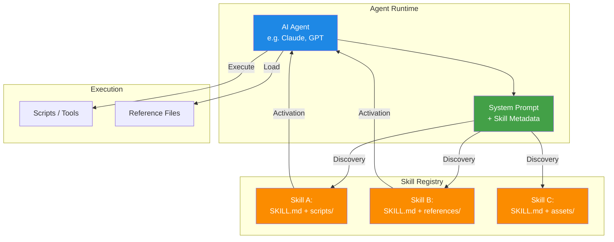

## 1.5 How Skills Differ from Other Approaches

| Approach | Description | Limitations |
|----------|-------------|-------------|
| **System Prompts** | Hard-code instructions into the agent's system prompt | Not portable, bloats context, hard to maintain across many domains |
| **Fine-Tuning** | Train a custom model on domain-specific data | Expensive, requires ML expertise, slow to update, not portable |
| **RAG / Vector DB** | Retrieve relevant documents from a knowledge base | No procedural instructions, no code execution, retrieval can miss context |
| **Custom Plugins** | Build proprietary extensions for specific platforms | Vendor lock-in, complex development, not portable |
| **SKILL.md** | Portable, progressive-disclosure skill folders | Requires skills-compatible agent (growing ecosystem) |

---

# Part 2: The Anatomy of a SKILL.md File

## 2.1 Directory Structure

A skill is a self-contained directory. The only required file is `SKILL.md` at the root. Everything else — scripts, references, assets — is optional and organized at the skill author's discretion.

```
my-skill/
├── SKILL.md              # Required: metadata + instructions
├── scripts/              # Optional: executable code
│   ├── analyze.py
│   └── transform.sh
├── references/           # Optional: documentation & reference material
│   ├── api-spec.md
│   └── glossary.md
├── assets/               # Optional: templates, resources, config
│   ├── template.docx
│   └── config.json
└── examples/             # Optional: sample inputs/outputs
    ├── sample-input.txt
    └── sample-output.txt
```

### What Goes in Each Directory

| Directory | Purpose | Examples |
|-----------|---------|---------|
| `/` (root) | SKILL.md and any top-level files | SKILL.md, LICENSE.txt |
| `scripts/` | Executable code that the agent can run | Python scripts, shell scripts, Node.js files |
| `references/` | Documentation the agent can load on demand | API specs, style guides, process documents |
| `assets/` | Templates, configuration, and static resources | Document templates, JSON configs, images |
| `examples/` | Sample inputs and outputs for few-shot guidance | Input/output pairs, test cases |

## 2.2 SKILL.md File Structure

Every SKILL.md file consists of two parts:

1. **YAML Frontmatter** (required): Contains metadata that the agent loads during the Discovery phase
2. **Markdown Body** (required): Contains the detailed instructions the agent loads during the Activation phase

### Minimal SKILL.md

```markdown
---
name: my-skill-name
description: A clear description of what this skill does and when to use it.
---

# My Skill Name

Instructions for the agent go here. Be specific, procedural, and actionable.
```

### Complete SKILL.md with All Sections

```markdown
---
name: data-pipeline-validator
description: Validates data pipeline configurations by checking schema conformity, testing connections, and verifying data quality thresholds. Use this skill when the user needs to validate, test, or troubleshoot a data pipeline configuration.
---

# Data Pipeline Validator

## Overview

This skill validates data pipeline configurations to ensure they meet schema requirements, connection tests pass, and data quality thresholds are maintained. It provides a systematic approach to pipeline validation that catches common configuration errors before deployment.

## When to Use

- User asks to validate a pipeline configuration
- User reports a pipeline error or failure
- User wants to test pipeline connectivity
- User needs to verify data quality metrics

## Instructions

### Step 1: Load the Configuration

1. Read the pipeline configuration file from the specified path
2. Validate the file format (YAML/JSON)
3. Check that all required fields are present

### Step 2: Schema Validation

Run the schema validation script:
```bash
python scripts/validate_schema.py --config <config_path>
```

### Step 3: Connection Testing

For each data source defined in the configuration:
1. Attempt to establish a connection
2. Verify authentication credentials
3. Test a sample query

### Step 4: Data Quality Check

Verify that data quality thresholds are met by running:
```bash
python scripts/quality_check.py --config <config_path> --sample-size 1000
```

### Step 5: Report Results

Generate a validation report summarizing:
- Schema validation results
- Connection test outcomes
- Data quality metrics
- Recommended fixes for any issues

## Examples

### Example 1: Validate a YAML Pipeline Config
**User**: "Validate my pipeline at configs/etl_pipeline.yaml"
**Agent**: Loads the config, runs schema validation, tests connections, performs quality check, and generates a report.

### Example 2: Troubleshoot a Failing Pipeline
**User**: "My pipeline is failing with connection errors"
**Agent**: Focuses on Step 3 (Connection Testing), checks credentials, and identifies the misconfigured endpoint.

## Reference Files

- `references/schema_spec.md` — Full pipeline schema specification
- `references/error_codes.md` — Error code reference guide

## Scripts

- `scripts/validate_schema.py` — Validates configuration against schema
- `scripts/quality_check.py` — Runs data quality threshold checks

## Guidelines

- Always start with schema validation before connection testing
- Report all issues found, not just the first one
- Include specific remediation steps for each issue
- Never modify the user's configuration without explicit permission
```

## 2.3 YAML Frontmatter Fields

### Required Fields

| Field | Type | Description | Example |
|-------|------|-------------|---------|
| `name` | string | Unique identifier for the skill. Use lowercase with hyphens. | `data-pipeline-validator` |
| `description` | string | Complete description of what the skill does and when to use it. This is what the agent sees during Discovery, so it must be specific enough for the agent to determine relevance. | `Validates data pipeline configurations by checking schema conformity, testing connections, and verifying data quality thresholds.` |

### Optional Fields

| Field | Type | Description | Example |
|-------|------|-------------|---------|
| `version` | string | Semantic version of the skill | `1.2.0` |
| `author` | string | Skill author or organization | `Acme Data Team` |
| `license` | string | License identifier or reference | `Apache-2.0` or `Complete terms in LICENSE.txt` |
| `tags` | list | Categorization tags | `[data, pipeline, validation, devops]` |
| `requires` | list | Dependencies or prerequisites | `[python>=3.9, pandas]` |

### Frontmatter Best Practices

- **Name**: Use kebab-case (lowercase with hyphens). Make it descriptive and unique. Avoid generic names like `helper` or `tool`.
- **Description**: This is the most critical field. It determines when your skill gets activated. Write it as if you are explaining to a colleague when they should use this specific procedure. Include keywords that a user might naturally use when requesting this kind of task. A vague description like "Helps with data" will cause the skill to be activated incorrectly or missed entirely.
- **Version**: Include a version if you plan to iterate on the skill. This helps users track which version they have installed.

## 2.4 Markdown Body Sections

The body of SKILL.md contains the procedural instructions the agent follows when the skill is activated. While there is no mandatory structure, the following sections are recommended as a standard pattern:

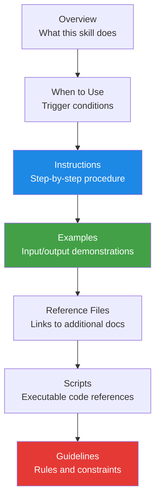

### Section Guidelines

**Overview**: Provide a concise summary of the skill's purpose and capabilities. This helps the agent understand the skill's scope before diving into details. Aim for 2-4 sentences that clearly define what the skill enables the agent to do.

**When to Use**: Explicitly list the conditions under which this skill should be activated. This acts as a secondary filter — even if the description matches, the agent can use this section to confirm relevance. Use bullet points with clear, specific conditions.

**Instructions**: This is the core of the skill. Write step-by-step, numbered procedures that the agent can follow sequentially. Each step should be actionable — tell the agent exactly what to do, not just what to achieve. Include specific commands, file paths, decision trees, and expected outcomes.

**Examples**: Provide 2-3 concrete examples showing how the skill handles different scenarios. Each example should include the user's request and the agent's expected behavior. Examples serve as few-shot demonstrations that help the agent understand the intended pattern.

**Reference Files**: List any additional files in the skill directory that the agent should load when needed. This enables the third level of progressive disclosure — the agent only reads these files when the specific situation requires them.

**Scripts**: Document any executable scripts bundled with the skill. For each script, explain what it does, what arguments it accepts, and what it returns. This helps the agent decide when and how to invoke each script.

**Guidelines**: State the rules, constraints, and guardrails the agent must follow. This includes safety constraints (what not to do), quality standards (what the output must meet), and behavioral preferences (how the agent should interact with the user).

---

# Part 3: Progressive Disclosure — How Skills Load

## 3.1 The Three Stages of Skill Loading

Progressive disclosure is the core design principle that makes Agent Skills scalable. It mirrors how humans consult reference material — you first check the table of contents, then read the relevant chapter, and finally look up specific details in the appendix. Skills load information in three stages, each triggered only when needed:

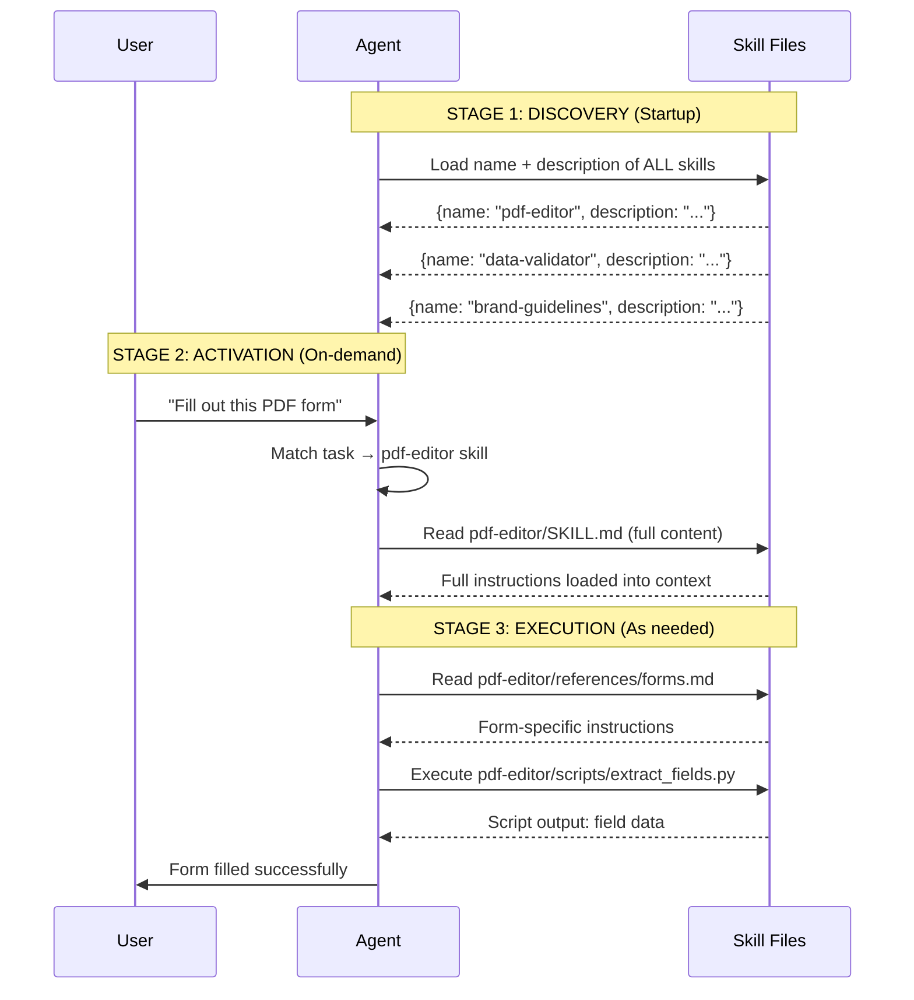

### Stage 1: Discovery

At startup, the agent loads only the `name` and `description` from the YAML frontmatter of every installed skill. This metadata is injected into the agent's system prompt, giving it awareness of all available skills without consuming significant context. If you have 50 skills installed, each with a 2-line description, that is only about 100 lines of context — a tiny fraction of the typical context window.

The discovery stage is like a library catalog: it tells the agent what skills exist and what they are about, but it does not provide the detailed instructions. This is sufficient for the agent to determine which skill might be relevant when a user makes a request.

### Stage 2: Activation

When the agent determines that a task matches a skill's description, it reads the full SKILL.md file into its context window. This loads all the instructions, examples, guidelines, and references to additional files. The agent now has the complete procedural knowledge needed to perform the task.

Activation is like pulling a book off the shelf and reading the relevant chapter. The agent invests context window space only when the skill is actually needed, keeping the context lean for tasks that do not require that particular skill.

### Stage 3: Execution

During execution, the agent may need to access additional files referenced in SKILL.md — such as reference documents, scripts, or templates. These files are loaded on demand, only when the specific situation requires them. The agent can also execute scripts bundled with the skill, using its code execution tools.

Execution is like consulting the appendix or running a referenced tool. The agent loads only the specific sub-resources needed for the current step, keeping the main context focused on the task at hand.

## 3.2 Progressive Disclosure and Context Windows

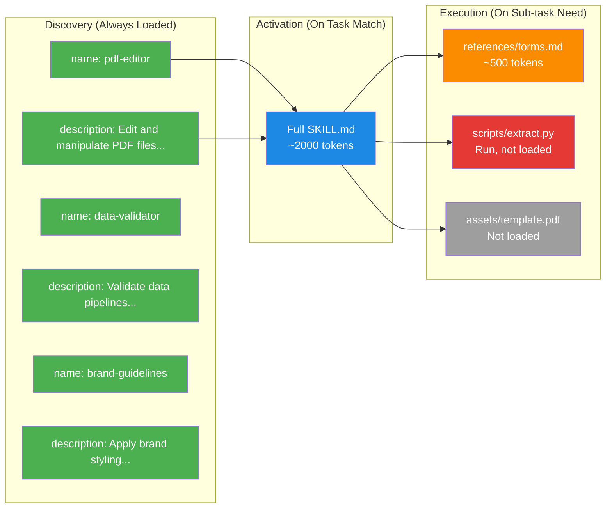

### Token Budget at Each Stage

| Stage | What's Loaded | Approximate Tokens | When |
|-------|--------------|-------------------|------|
| Discovery | Name + description of all skills | ~50-100 per skill | Agent startup |
| Activation | Full SKILL.md of matched skill | ~1,000-5,000 | Task matches description |
| Execution | Referenced files, script outputs | ~500-3,000 per file | Sub-task requires detail |

The key insight is that a skill can bundle virtually unlimited knowledge (hundreds of reference files, large scripts, extensive documentation) while only consuming a small, fixed amount of context at startup. The agent loads resources on demand, so a skill with 50 reference files still costs only ~100 tokens at discovery if the descriptions are concise.

## 3.3 Context Window Flow Diagram

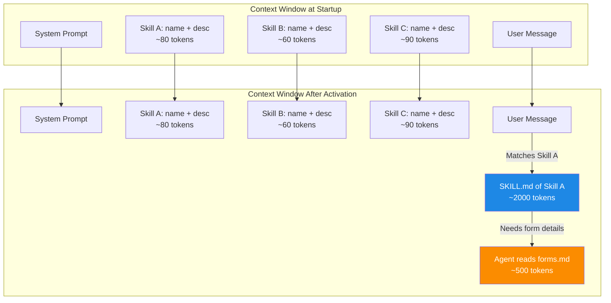

---

# Part 4: How SKILL.md Works with Prompts

## 4.1 The Prompt Integration Pipeline

SKILL.md integrates with the agent's prompt system at multiple levels. Understanding this integration is essential for writing effective skills and designing agent architectures that use them correctly.

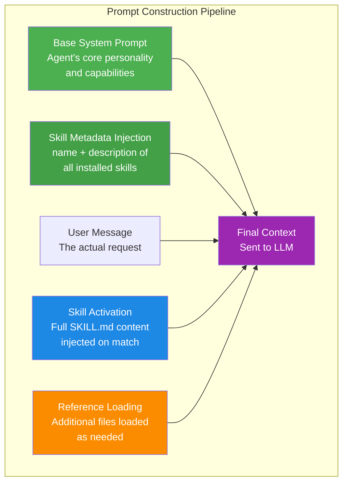

## 4.2 Discovery: Skill Metadata in the System Prompt

At agent startup, the metadata from all installed skills is injected into the system prompt. This typically looks like:

```
You are a helpful AI assistant with access to the following skills:

- pdf-editor: Edit and manipulate PDF files, extract text, fill forms, and merge documents.
- data-validator: Validate data pipeline configurations by checking schema conformity and testing connections.
- brand-guidelines: Apply Anthropic's official brand colors and typography to documents and designs.
- code-reviewer: Review code changes following the team's code review standards and checklist.

When a user's request matches a skill's description, read the skill's SKILL.md file for detailed instructions.
```

The agent now knows what skills are available and can decide which one to activate based on the user's message. This is a very compact representation — even with 20 skills, the metadata might only consume 1,000-2,000 tokens.

## 4.3 Activation: Loading Full Instructions

When the agent determines that a user's request matches a skill, it uses its file system tools to read the full SKILL.md file. This is not a special API call — it is simply the agent using its standard tool (typically a file read tool like `cat` or `read_file`) to load the SKILL.md content into its context.

The activation sequence looks like this:

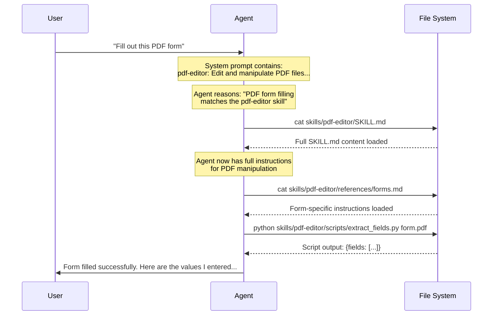

## 4.4 How the Agent Decides to Activate a Skill

The agent uses its LLM reasoning capabilities to match user requests to skills. There is no rigid keyword matching — the agent understands natural language and can infer relevance from context. However, the quality of this matching depends heavily on the skill's `description` field.

### Good vs. Bad Descriptions

```markdown
# BAD: Too vague
---
name: data-helper
description: Helps with data stuff.
---

# BAD: Too technical, misses user intent
---
name: etl-py-validator
description: Executes Python-based schema conformance checks on YAML/JSON ETL pipeline configurations using jsonschema v4.17.3 with custom validators.
---

# GOOD: Specific, actionable, includes trigger phrases
---
name: data-pipeline-validator
description: Validates data pipeline configurations by checking schema conformity, testing connections, and verifying data quality thresholds. Use this skill when the user needs to validate, test, or troubleshoot a data pipeline configuration.
---
```

The best descriptions are written with the end-user in mind. They include the kinds of phrases a user might naturally say when they need the skill, such as "validate my pipeline," "test my data connection," or "check my configuration."

## 4.5 Multiple Skills Activation

An agent can activate multiple skills simultaneously if a task requires capabilities from more than one skill. For example, a user might ask to "Create a branded PDF report from this data," which could activate both the `brand-guidelines` skill and the `pdf-editor` skill.

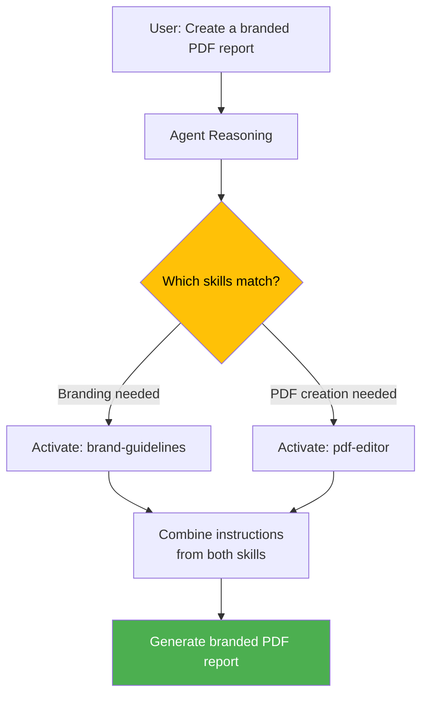

## 4.6 Skill Activation and the Prompt Window Over Time

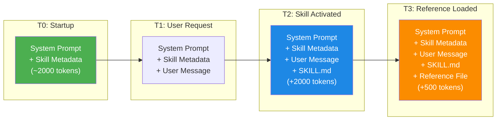

---

# Part 5: What is NOT Allowed in SKILL.md

## 5.1 Security Restrictions

The SKILL.md format is designed to be safe by default. Because skills are loaded and executed by AI agents, certain patterns are explicitly disallowed or strongly discouraged to prevent security vulnerabilities, unintended behavior, and abuse.

### Disallowed Patterns

| Pattern | Why It's Disallowed | What To Do Instead |
|---------|-------------------|-------------------|
| **Hardcoded secrets or API keys** | Secrets in plaintext files are a security risk — they can be committed to version control, leaked in logs, or exposed to anyone with access to the skill repository | Use environment variables (`os.environ["API_KEY"]`), secret managers, or credential files outside the skill directory |
| **Commands that modify the system without consent** | Running `rm -rf`, `sudo`, or destructive operations without user confirmation can cause irreversible damage | Always prompt the user before destructive operations; use dry-run modes by default |
| **Network calls to unknown/untrusted endpoints** | Skills should not exfiltrate data or call arbitrary URLs, which could be a vector for data theft | Only call well-known, documented APIs; clearly state all external endpoints in the skill description |
| **Executing arbitrary user input as code** | `eval()`, `exec()`, or shell injection patterns where user input becomes executable code | Validate and sanitize all user input; use parameterized commands; never pass raw user input to shell execution |
| **Accessing files outside the skill or project scope** | Skills should not read sensitive system files (`/etc/passwd`, SSH keys, etc.) or files outside the intended scope | Restrict file access to the project directory and skill directory; document all file paths the skill accesses |
| **Infinite loops or resource exhaustion** | Scripts that run indefinitely or consume unbounded memory/CPU can lock up the agent's execution environment | Add timeouts, iteration limits, and resource caps to all scripts |
| **Obfuscated or minified code** | Code that is intentionally difficult to read prevents security review and auditing | Always include readable, commented source code; never obfuscate |

### Restricted by Convention

| Pattern | Concern | Best Practice |
|---------|---------|--------------|
| **Auto-running scripts on skill load** | Unexpected side effects when the skill is activated | Scripts should only run when explicitly invoked during the Execution stage, never on Discovery or Activation |
| **Dependency installation without consent** | Installing packages can introduce vulnerabilities or break environments | Document all dependencies; ask the user before installing; use virtual environments |
| **Writing to system directories** | Modifying system configuration can break the agent's environment | Only write to the project directory or a designated output directory |
| **Phoning home / telemetry** | Sending data about the user's environment or activity to external servers | Never include telemetry or tracking code; if analytics are needed, make them opt-in and transparent |

## 5.2 Content Restrictions

### What NOT to Put in SKILL.md

1. **Overly long instructions**: SKILL.md files should be focused and actionable. If your instructions exceed 5,000 words, break them into multiple reference files and link to them from the main SKILL.md. The agent will load the core instructions during Activation and reference files only when needed.

2. **Ambiguous or conflicting instructions**: The agent follows instructions literally. If Step 2 says "always validate the schema" but Step 4 says "skip validation for quick checks," the agent will be confused. Resolve conflicts explicitly with conditional logic: "Always validate the schema. However, if the user explicitly requests a quick check with `--quick`, you may skip validation after warning the user."

3. **Instructions that override safety guardrails**: Skills should not instruct the agent to ignore its safety training, bypass content filters, or produce harmful output. Such instructions will be ignored by the model and may cause the skill to be flagged or removed.

4. **Proprietary code without license**: If you include code in your skill, clearly state the license. The Agent Skills standard encourages open-source licensing (Apache 2.0 is the default for the standard itself), but you may use any license as long as it is clearly documented.

5. **Large binary files**: Do not include large binary files (images, datasets, compiled binaries) directly in the skill directory. Instead, host them externally and reference them by URL, or include scripts that download them on first use.

## 5.3 Security Review Checklist

Before publishing or deploying a skill, run through this checklist:

- [ ] No hardcoded secrets, API keys, or credentials in any file
- [ ] No destructive commands without user confirmation
- [ ] All external API calls are to documented, trusted endpoints
- [ ] No `eval()`, `exec()`, or shell injection vulnerabilities
- [ ] File access is limited to the project and skill directories
- [ ] All scripts have timeouts and resource limits
- [ ] Code is readable, commented, and not obfuscated
- [ ] Dependencies are documented and minimal
- [ ] No auto-execution on skill load
- [ ] No telemetry or data exfiltration
- [ ] License is clearly stated
- [ ] Instructions are unambiguous and non-conflicting

---

# Part 6: Building Skills — Step by Step

## 6.1 Step 1: Define the Skill's Purpose

Before writing any code or markdown, clearly define what the skill does and when it should be used. Ask yourself:

- What specific task does this skill enable the agent to perform?
- What kinds of user requests should trigger this skill?
- What domain expertise does the agent need that it does not already have?
- What are the inputs and expected outputs?

## 6.2 Step 2: Create the Directory Structure

```bash
mkdir -p my-skill/{scripts,references,assets,examples}
touch my-skill/SKILL.md
```

## 6.3 Step 3: Write the SKILL.md

Start with the template and fill in each section:

```markdown
---
name: my-skill-name
description: A clear, specific description of what this skill does and when the agent should use it.
---

# My Skill Name

## Overview
[2-4 sentences describing the skill's purpose and capabilities]

## When to Use
- [Specific trigger condition 1]
- [Specific trigger condition 2]
- [Specific trigger condition 3]

## Instructions

### Step 1: [First Step]
1. [Detailed action]
2. [Detailed action]
3. [Detailed action]

### Step 2: [Second Step]
1. [Detailed action]
2. [Detailed action]

### Step 3: [Third Step]
1. [Detailed action]
2. [Detailed action]

## Examples

### Example 1: [Scenario]
**User**: "[Sample user request]"
**Agent**: [Expected agent behavior]

### Example 2: [Scenario]
**User**: "[Sample user request]"
**Agent**: [Expected agent behavior]

## Reference Files
- `references/file1.md` — [Description of what this file contains]

## Scripts
- `scripts/script1.py` — [Description of what this script does and its arguments]

## Guidelines
- [Rule or constraint 1]
- [Rule or constraint 2]
- [Rule or constraint 3]
```

## 6.4 Step 4: Add Supporting Files

### Writing Scripts

Scripts extend the agent's capabilities with deterministic, reliable code execution. Write scripts that:

- Accept command-line arguments (the agent will invoke them via shell)
- Return structured output (JSON is preferred)
- Handle errors gracefully with clear error messages
- Include `--help` documentation
- Have reasonable timeouts

### Writing Reference Files

Reference files provide additional context that the agent loads on demand. Write them as Markdown documents that:

- Are self-contained (can be understood without reading other files)
- Use clear headings and structure
- Focus on a specific topic or sub-procedure
- Are concise (reference files should not be longer than necessary)

## 6.5 Step 5: Test the Skill

Test your skill by:

1. Installing it in a skills-compatible agent
2. Making requests that should trigger the skill
3. Verifying the agent follows the instructions correctly
4. Testing edge cases and error scenarios
5. Checking that reference files are loaded only when needed
6. Confirming scripts produce the expected output

## 6.6 Complete Example: Code Review Skill

```markdown
---
name: code-reviewer
description: Reviews code changes following the team's code review standards, checking for bugs, security issues, performance problems, and style violations. Use this skill when the user asks to review code, check a pull request, or audit source code.
---

# Code Reviewer

## Overview

This skill performs systematic code reviews based on the team's established standards. It checks for bugs, security vulnerabilities, performance issues, maintainability problems, and style violations. It produces structured review feedback with severity ratings and specific remediation suggestions.

## When to Use

- User asks to review code or a pull request
- User wants feedback on code quality
- User asks to check for security issues in code
- User mentions code review, PR review, or code audit

## Instructions

### Step 1: Identify the Scope

1. Determine what code the user wants reviewed
2. If a file path is given, read the file(s)
3. If a PR/diff is given, focus on the changed lines
4. Identify the programming language(s) involved

### Step 2: Load the Review Checklist

Read `references/review_checklist.md` for the team's full review standards.

### Step 3: Perform the Review

For each code section, check for:

1. **Bugs**: Logic errors, off-by-one errors, null pointer risks, unhandled edge cases
2. **Security**: Injection vulnerabilities, authentication issues, data exposure, insecure defaults
3. **Performance**: Inefficient algorithms, unnecessary allocations, N+1 queries, missing caching
4. **Maintainability**: Unclear naming, complex logic, missing documentation, code duplication
5. **Style**: Naming convention violations, inconsistent formatting, missing type hints

### Step 4: Run Automated Checks

Execute the static analysis script if the language is supported:
```bash
python scripts/static_analysis.py --path <code_path> --language <lang>
```

### Step 5: Generate Review Report

Format the review as:

## Review Summary
- **Files Reviewed**: [list]
- **Issues Found**: [count by severity]

## Critical Issues
- [CRITICAL] File:Line — Description and remediation

## Warnings
- [WARNING] File:Line — Description and remediation

## Suggestions
- [SUGGESTION] File:Line — Description and improvement

## Positive Observations
- [GOOD] File:Line — What was done well

## Examples

### Example 1: Review a Python File
**User**: "Review src/auth/login.py"
**Agent**: Reads the file, loads the review checklist, performs systematic review, runs static analysis, and generates a structured review report highlighting a SQL injection vulnerability and 3 style issues.

### Example 2: Quick Security Audit
**User**: "Check this code for security issues"
**Agent**: Focuses the review on the security category from the checklist, performs targeted analysis, and reports only security-related findings.

## Reference Files

- `references/review_checklist.md` — Complete code review checklist with severity ratings
- `references/security_patterns.md` — Common security vulnerability patterns by language

## Scripts

- `scripts/static_analysis.py` — Runs language-specific static analysis tools
  - Arguments: `--path` (code path), `--language` (python/javascript/go/rust)
  - Output: JSON with findings array

## Guidelines

- Always prioritize security findings over style issues
- Provide specific, actionable remediation for every issue
- Include positive observations to balance the review
- Never dismiss a potential security issue without verification
- When uncertain about a finding, flag it as "NEEDS MANUAL REVIEW" rather than dismissing it
```

---

# Part 7: Real-World Use-Cases with Python Code

## 7.1 Use-Case 1: Automated Document Generation

### Scenario

A marketing team needs the AI agent to generate branded documents (proposals, reports, letters) that conform to the company's brand guidelines — specific colors, fonts, formatting, and document structure.

### Skill Structure

```
doc-generator/
├── SKILL.md
├── scripts/
│   ├── generate_docx.py
│   └── validate_brand.py
├── references/
│   ├── brand_guidelines.md
│   └── document_templates.md
└── assets/
    └── template.docx
```

### SKILL.md

```markdown
---
name: doc-generator
description: Generates branded documents (proposals, reports, letters) conforming to the company's brand guidelines including colors, fonts, and formatting standards. Use when the user asks to create, draft, or generate a document.
---
```

### Python Script: generate_docx.py

```python
#!/usr/bin/env python3
"""
Generate a branded DOCX document from structured content.

Usage:
    python generate_docx.py --type proposal --title "Q4 Strategy" --content content.json --output output.docx

Arguments:
    --type      Document type: proposal, report, letter
    --title     Document title
    --content   Path to JSON file with document content
    --output    Output file path
"""

import argparse
import json
import sys
from pathlib import Path

try:
    from docx import Document
    from docx.shared import Pt, Inches, RGBColor
    from docx.enum.text import WD_ALIGN_PARAGRAPH
except ImportError:
    print(json.dumps({"error": "python-docx not installed. Run: pip install python-docx"}))
    sys.exit(1)

# Brand colors
BRAND_COLORS = {
    "primary": RGBColor(0x1A, 0x3C, 0x6E),      # Deep Navy
    "secondary": RGBColor(0x4A, 0x90, 0xD9),     # Sky Blue
    "accent": RGBColor(0xE8, 0x6C, 0x00),        # Warm Orange
    "text": RGBColor(0x33, 0x33, 0x33),           # Dark Gray
    "light_text": RGBColor(0x66, 0x66, 0x66),     # Medium Gray
}

# Brand fonts
HEADING_FONT = "Calibri"
BODY_FONT = "Calibri"

DOCUMENT_MARGINS = {
    "top": Inches(1.0),
    "bottom": Inches(0.8),
    "left": Inches(1.0),
    "right": Inches(1.0),
}


def create_document(doc_type: str, title: str, content: dict) -> Document:
    """Create a branded document with the given type and content."""
    doc = Document()

    # Set margins
    for section in doc.sections:
        section.top_margin = DOCUMENT_MARGINS["top"]
        section.bottom_margin = DOCUMENT_MARGINS["bottom"]
        section.left_margin = DOCUMENT_MARGINS["left"]
        section.right_margin = DOCUMENT_MARGINS["right"]

    # Add header with brand color
    header = doc.sections[0].header
    header_para = header.paragraphs[0]
    header_para.text = "ACME Corporation"
    header_para.style.font.color.rgb = BRAND_COLORS["primary"]
    header_para.style.font.size = Pt(9)

    # Title
    title_para = doc.add_heading(title, level=0)
    title_para.alignment = WD_ALIGN_PARAGRAPH.CENTER
    for run in title_para.runs:
        run.font.color.rgb = BRAND_COLORS["primary"]
        run.font.name = HEADING_FONT

    # Subtitle based on document type
    type_labels = {
        "proposal": "Business Proposal",
        "report": "Status Report",
        "letter": "Formal Letter",
    }
    subtitle = doc.add_paragraph(type_labels.get(doc_type, "Document"))
    subtitle.alignment = WD_ALIGN_PARAGRAPH.CENTER
    for run in subtitle.runs:
        run.font.color.rgb = BRAND_COLORS["secondary"]
        run.font.size = Pt(14)
        run.font.name = BODY_FONT

    # Horizontal rule
    doc.add_paragraph("─" * 80)

    # Add content sections
    sections = content.get("sections", [])
    for section_data in sections:
        section_title = section_data.get("title", "")
        section_body = section_data.get("body", "")

        if section_title:
            heading = doc.add_heading(section_title, level=1)
            for run in heading.runs:
                run.font.color.rgb = BRAND_COLORS["primary"]
                run.font.name = HEADING_FONT

        if section_body:
            body_para = doc.add_paragraph(section_body)
            for run in body_para.runs:
                run.font.color.rgb = BRAND_COLORS["text"]
                run.font.name = BODY_FONT
                run.font.size = Pt(11)

    # Add bullet points if present
    bullets = content.get("bullets", [])
    if bullets:
        doc.add_heading("Key Points", level=2)
        for bullet in bullets:
            bullet_para = doc.add_paragraph(bullet, style="List Bullet")
            for run in bullet_para.runs:
                run.font.color.rgb = BRAND_COLORS["text"]
                run.font.name = BODY_FONT

    # Footer
    footer = doc.sections[0].footer
    footer_para = footer.paragraphs[0]
    footer_para.text = "Confidential - ACME Corporation"
    footer_para.alignment = WD_ALIGN_PARAGRAPH.CENTER

    return doc


def main():
    parser = argparse.ArgumentParser(description="Generate branded DOCX documents")
    parser.add_argument("--type", required=True, choices=["proposal", "report", "letter"])
    parser.add_argument("--title", required=True, help="Document title")
    parser.add_argument("--content", required=True, help="Path to JSON content file")
    parser.add_argument("--output", required=True, help="Output DOCX file path")

    args = parser.parse_args()

    # Load content
    content_path = Path(args.content)
    if not content_path.exists():
        print(json.dumps({"error": f"Content file not found: {args.content}"}))
        sys.exit(1)

    with open(content_path, "r") as f:
        content = json.load(f)

    # Generate document
    doc = create_document(args.type, args.title, content)
    doc.save(args.output)

    result = {
        "status": "success",
        "output_path": args.output,
        "document_type": args.type,
        "title": args.title,
        "sections_count": len(content.get("sections", [])),
    }
    print(json.dumps(result, indent=2))


if __name__ == "__main__":
    main()
```

### Python Script: validate_brand.py

```python
#!/usr/bin/env python3
"""
Validate a DOCX file against brand guidelines.

Usage:
    python validate_brand.py --input document.docx

Returns JSON with validation results.
"""

import argparse
import json
import sys

try:
    from docx import Document
except ImportError:
    print(json.dumps({"error": "python-docx not installed. Run: pip install python-docx"}))
    sys.exit(1)

BRAND_HEX_COLORS = {"1A3C6E", "4A90D9", "E86C00", "333333", "666666"}
REQUIRED_HEADING_FONT = "Calibri"
REQUIRED_BODY_FONT = "Calibri"


def validate_document(file_path: str) -> dict:
    """Validate a document against brand guidelines."""
    issues = []
    good_points = []

    doc = Document(file_path)

    # Check fonts
    font_issues = 0
    font_checks = 0
    for paragraph in doc.paragraphs:
        for run in paragraph.runs:
            if run.font.name:
                font_checks += 1
                font_lower = run.font.name.lower()
                if font_lower not in (REQUIRED_HEADING_FONT.lower(), REQUIRED_BODY_FONT.lower()):
                    font_issues += 1
                    if font_issues <= 3:
                        issues.append({
                            "type": "font_violation",
                            "severity": "warning",
                            "message": f"Non-brand font detected: '{run.font.name}' "
                                       f"in text: '{run.text[:50]}...'",
                        })

    if font_issues == 0 and font_checks > 0:
        good_points.append("All fonts conform to brand guidelines (Calibri)")

    # Check colors
    color_issues = 0
    for paragraph in doc.paragraphs:
        for run in paragraph.runs:
            if run.font.color and run.font.color.rgb:
                color_hex = str(run.font.color.rgb).upper()
                if color_hex not in BRAND_HEX_COLORS:
                    color_issues += 1
                    if color_issues <= 3:
                        issues.append({
                            "type": "color_violation",
                            "severity": "warning",
                            "message": f"Non-brand color detected: #{color_hex}",
                        })

    if color_issues == 0:
        good_points.append("All colors conform to brand palette")

    result = {
        "valid": len([i for i in issues if i["severity"] == "critical"]) == 0,
        "total_issues": len(issues),
        "critical_issues": len([i for i in issues if i["severity"] == "critical"]),
        "warnings": len([i for i in issues if i["severity"] == "warning"]),
        "issues": issues,
        "good_points": good_points,
    }
    return result


def main():
    parser = argparse.ArgumentParser(description="Validate document brand compliance")
    parser.add_argument("--input", required=True, help="Path to DOCX file to validate")
    args = parser.parse_args()

    result = validate_document(args.input)
    print(json.dumps(result, indent=2))


if __name__ == "__main__":
    main()
```

---

## 7.2 Use-Case 2: Data Quality Monitoring Agent

### Scenario

A data engineering team needs an AI agent that can validate data quality across multiple data sources, detect anomalies, and generate quality reports. The agent should be able to run custom validation scripts and follow specific escalation procedures when quality drops below thresholds.

### Skill Structure

```
data-quality-monitor/
├── SKILL.md
├── scripts/
│   ├── validate_schema.py
│   ├── check_freshness.py
│   └── detect_anomalies.py
├── references/
│   ├── quality_thresholds.md
│   └── escalation_procedures.md
└── assets/
    └── quality_report_template.json
```

### SKILL.md

```markdown
---
name: data-quality-monitor
description: Monitors and validates data quality across data sources by checking schema conformity, data freshness, completeness, and anomaly detection. Use when the user asks about data quality, data validation, anomaly detection, or data pipeline health.
---
```

### Python Script: validate_schema.py

```python
#!/usr/bin/env python3
"""
Validate a data source against its expected schema.

Usage:
    python validate_schema.py --source <source_name> --config <config_path>

Returns JSON with validation results.
"""

import argparse
import json
import sys
from datetime import datetime
from pathlib import Path


def load_schema_config(config_path: str) -> dict:
    """Load schema configuration from a JSON file."""
    with open(config_path, "r") as f:
        return json.load(f)


def validate_table_data(table_name: str, expected_schema: dict, sample_data: list) -> dict:
    """Validate sample data rows against the expected schema."""
    issues = []
    rows_checked = len(sample_data)
    rows_valid = 0

    required_columns = expected_schema.get("required_columns", [])
    column_types = expected_schema.get("column_types", {})
    nullable_columns = expected_schema.get("nullable_columns", [])

    for i, row in enumerate(sample_data):
        row_issues = []

        # Check required columns exist
        for col in required_columns:
            if col not in row:
                row_issues.append(f"Missing required column: {col}")
            elif row[col] is None and col not in nullable_columns:
                row_issues.append(f"Null value in non-nullable column: {col}")

        # Check column types
        for col, expected_type in column_types.items():
            if col in row and row[col] is not None:
                actual_type = type(row[col]).__name__
                if actual_type != expected_type:
                    row_issues.append(
                        f"Type mismatch in column '{col}': "
                        f"expected {expected_type}, got {actual_type}"
                    )

        if row_issues:
            issues.extend([f"Row {i}: {issue}" for issue in row_issues])
        else:
            rows_valid += 1

    return {
        "table": table_name,
        "rows_checked": rows_checked,
        "rows_valid": rows_valid,
        "validity_rate": round(rows_valid / rows_checked, 4) if rows_checked > 0 else 0,
        "issues": issues[:20],  # Limit to first 20 issues
        "total_issues": len(issues),
    }


def main():
    parser = argparse.ArgumentParser(description="Validate data source schema")
    parser.add_argument("--source", required=True, help="Data source name")
    parser.add_argument("--config", required=True, help="Path to schema config JSON")
    parser.add_argument("--sample-size", type=int, default=100, help="Rows to validate")
    args = parser.parse_args()

    config = load_schema_config(args.config)

    # Simulate validation (in production, connect to actual data source)
    results = {
        "source": args.source,
        "timestamp": datetime.utcnow().isoformat() + "Z",
        "status": "completed",
        "tables": [],
    }

    for table_name, schema in config.get("tables", {}).items():
        # In production: fetch actual sample data from the data source
        # Here we simulate with empty data for the template
        sample_data = []
        table_result = validate_table_data(table_name, schema, sample_data)
        results["tables"].append(table_result)

    overall_valid = all(
        t["validity_rate"] >= 0.95 for t in results["tables"]
    )
    results["overall_status"] = "PASS" if overall_valid else "FAIL"

    print(json.dumps(results, indent=2))


if __name__ == "__main__":
    main()
```

### Python Script: detect_anomalies.py

```python
#!/usr/bin/env python3
"""
Detect anomalies in numerical data using statistical methods.

Usage:
    python detect_anomalies.py --data <data_path> --column <column_name> [--method zscore|iqr] [--threshold 3.0]

Returns JSON with detected anomalies.
"""

import argparse
import json
import sys
import statistics
from typing import List, Tuple


def zscore_detect(values: List[float], threshold: float = 3.0) -> List[Tuple[int, float]]:
    """Detect anomalies using Z-score method."""
    if len(values) < 3:
        return []

    mean = statistics.mean(values)
    stdev = statistics.stdev(values)

    if stdev == 0:
        return []

    anomalies = []
    for i, val in enumerate(values):
        z_score = abs(val - mean) / stdev
        if z_score > threshold:
            anomalies.append((i, val))

    return anomalies


def iqr_detect(values: List[float], multiplier: float = 1.5) -> List[Tuple[int, float]]:
    """Detect anomalies using IQR method."""
    if len(values) < 4:
        return []

    sorted_vals = sorted(values)
    n = len(sorted_vals)
    q1_idx = n // 4
    q3_idx = (3 * n) // 4

    q1 = sorted_vals[q1_idx]
    q3 = sorted_vals[q3_idx]
    iqr = q3 - q1

    lower_bound = q1 - multiplier * iqr
    upper_bound = q3 + multiplier * iqr

    anomalies = []
    for i, val in enumerate(values):
        if val < lower_bound or val > upper_bound:
            anomalies.append((i, val))

    return anomalies


def main():
    parser = argparse.ArgumentParser(description="Detect data anomalies")
    parser.add_argument("--data", required=True, help="Path to JSON data file")
    parser.add_argument("--column", required=True, help="Column to analyze")
    parser.add_argument(
        "--method",
        choices=["zscore", "iqr"],
        default="zscore",
        help="Detection method",
    )
    parser.add_argument(
        "--threshold",
        type=float,
        default=3.0,
        help="Anomaly threshold (z-score) or IQR multiplier",
    )
    args = parser.parse_args()

    # Load data
    with open(args.data, "r") as f:
        data = json.load(f)

    # Extract values for the specified column
    values = []
    for row in data:
        if args.column in row and isinstance(row[args.column], (int, float)):
            values.append(float(row[args.column]))

    if not values:
        print(json.dumps({"error": f"No numerical data found for column: {args.column}"}))
        sys.exit(1)

    # Detect anomalies
    if args.method == "zscore":
        anomalies = zscore_detect(values, args.threshold)
    else:
        anomalies = iqr_detect(values, args.threshold)

    result = {
        "column": args.column,
        "method": args.method,
        "total_values": len(values),
        "anomaly_count": len(anomalies),
        "anomaly_rate": round(len(anomalies) / len(values), 4),
        "anomalies": [
            {"index": idx, "value": val} for idx, val in anomalies[:50]
        ],
        "statistics": {
            "mean": round(statistics.mean(values), 4),
            "median": round(statistics.median(values), 4),
            "stdev": round(statistics.stdev(values), 4) if len(values) > 1 else 0,
            "min": min(values),
            "max": max(values),
        },
    }

    print(json.dumps(result, indent=2))


if __name__ == "__main__":
    main()
```

---

## 7.3 Use-Case 3: API Integration Testing Skill

### Scenario

A development team needs an AI agent that can automatically test REST API endpoints, validate responses against OpenAPI specifications, and generate test reports.

### Skill Structure

```
api-tester/
├── SKILL.md
├── scripts/
│   ├── run_api_tests.py
│   └── validate_openapi.py
├── references/
│   └── test_patterns.md
└── assets/
    └── test_config_template.json
```

### SKILL.md

```markdown
---
name: api-tester
description: Tests REST API endpoints by sending requests, validating responses against OpenAPI specifications, checking status codes, and verifying response schemas. Use when the user asks to test an API, validate an endpoint, or check API compliance.
---

# API Integration Tester

## Overview

This skill performs automated testing of REST API endpoints. It validates response codes, response schemas, latency, and compliance with OpenAPI specifications. It generates detailed test reports with pass/fail status for each test case.

## When to Use

- User asks to test an API endpoint
- User wants to validate API responses against a spec
- User needs to check API health or uptime
- User mentions API testing, endpoint validation, or integration testing

## Instructions

### Step 1: Load the API Specification

1. If the user provides an OpenAPI/Swagger spec file, read it
2. Extract all endpoints, methods, expected status codes, and response schemas
3. If no spec is provided, ask the user for the base URL and endpoints to test

### Step 2: Configure Test Parameters

Run the test configuration:
```bash
python scripts/run_api_tests.py --spec <spec_path> --base-url <url> --output results.json
```

### Step 3: Review Results

1. Parse the JSON test results
2. Summarize pass/fail rates
3. Highlight any failing tests with details
4. Check response times against thresholds

### Step 4: Report

Generate a test report including:
- Total endpoints tested
- Pass/fail counts
- Response time statistics
- Specific failures with request/response details
- Recommendations for fixing failures

## Guidelines

- Always test with non-destructive methods first (GET before POST/PUT/DELETE)
- Never test against production without explicit user confirmation
- Include authentication details in test configuration, never in the skill itself
- Respect rate limits; add delays between requests if needed
```

### Python Script: run_api_tests.py

```python
#!/usr/bin/env python3
"""
Run automated API tests against an OpenAPI specification.

Usage:
    python run_api_tests.py --spec openapi.json --base-url https://api.example.com --output results.json

Returns JSON with test results.
"""

import argparse
import json
import sys
import time
from datetime import datetime
from typing import Any, Dict, List, Optional

try:
    import requests
except ImportError:
    print(json.dumps({"error": "requests not installed. Run: pip install requests"}))
    sys.exit(1)


class APITester:
    """Test API endpoints against an OpenAPI specification."""

    def __init__(self, base_url: str, spec: dict, timeout: int = 30):
        self.base_url = base_url.rstrip("/")
        self.spec = spec
        self.timeout = timeout
        self.session = requests.Session()
        self.results: List[Dict[str, Any]] = []

    def extract_endpoints(self) -> List[Dict[str, Any]]:
        """Extract testable endpoints from the OpenAPI spec."""
        endpoints = []
        paths = self.spec.get("paths", {})

        for path, methods in paths.items():
            for method, details in methods.items():
                if method.lower() in ("get", "post", "put", "patch", "delete"):
                    endpoint = {
                        "path": path,
                        "method": method.upper(),
                        "operation_id": details.get("operationId", ""),
                        "summary": details.get("summary", ""),
                        "parameters": details.get("parameters", []),
                        "responses": details.get("responses", {}),
                    }
                    endpoints.append(endpoint)

        return endpoints

    def test_endpoint(self, endpoint: dict) -> Dict[str, Any]:
        """Test a single API endpoint."""
        path = endpoint["path"]
        method = endpoint["method"]
        expected_responses = endpoint.get("responses", {})

        url = f"{self.base_url}{path}"

        # Replace path parameters with test values
        for param in endpoint.get("parameters", []):
            if param.get("in") == "path":
                test_value = "1"  # Default test value
                url = url.replace(f"{{{param['name']}}}", test_value)

        test_result = {
            "endpoint": f"{method} {path}",
            "url": url,
            "method": method,
            "timestamp": datetime.utcnow().isoformat() + "Z",
            "status": "unknown",
            "status_code": None,
            "response_time_ms": None,
            "expected_status_codes": list(expected_responses.keys()),
            "issues": [],
        }

        try:
            start_time = time.time()

            if method == "GET":
                response = self.session.get(url, timeout=self.timeout)
            elif method == "POST":
                response = self.session.post(url, json={}, timeout=self.timeout)
            elif method == "PUT":
                response = self.session.put(url, json={}, timeout=self.timeout)
            elif method == "PATCH":
                response = self.session.patch(url, json={}, timeout=self.timeout)
            elif method == "DELETE":
                response = self.session.delete(url, timeout=self.timeout)
            else:
                test_result["status"] = "skipped"
                test_result["issues"].append(f"Unsupported method: {method}")
                return test_result

            elapsed_ms = (time.time() - start_time) * 1000

            test_result["status_code"] = response.status_code
            test_result["response_time_ms"] = round(elapsed_ms, 2)

            # Check if status code is expected
            if str(response.status_code) in expected_responses:
                test_result["status"] = "pass"
            elif 200 <= response.status_code < 300:
                test_result["status"] = "pass"
                test_result["issues"].append(
                    f"Status {response.status_code} not documented in spec"
                )
            else:
                test_result["status"] = "fail"
                test_result["issues"].append(
                    f"Unexpected status code: {response.status_code}"
                )

            # Check response time
            if elapsed_ms > 5000:
                test_result["issues"].append(
                    f"Slow response: {elapsed_ms:.0f}ms (threshold: 5000ms)"
                )

        except requests.exceptions.Timeout:
            test_result["status"] = "fail"
            test_result["issues"].append(f"Request timed out after {self.timeout}s")
        except requests.exceptions.ConnectionError:
            test_result["status"] = "fail"
            test_result["issues"].append("Connection error - endpoint unreachable")
        except Exception as e:
            test_result["status"] = "error"
            test_result["issues"].append(f"Unexpected error: {str(e)}")

        return test_result

    def run_all_tests(self) -> Dict[str, Any]:
        """Run tests for all endpoints in the spec."""
        endpoints = self.extract_endpoints()

        for endpoint in endpoints:
            result = self.test_endpoint(endpoint)
            self.results.append(result)
            time.sleep(0.1)  # Small delay between requests

        total = len(self.results)
        passed = len([r for r in self.results if r["status"] == "pass"])
        failed = len([r for r in self.results if r["status"] == "fail"])
        errors = len([r for r in self.results if r["status"] == "error"])

        return {
            "summary": {
                "total_tests": total,
                "passed": passed,
                "failed": failed,
                "errors": errors,
                "pass_rate": round(passed / total, 4) if total > 0 else 0,
                "base_url": self.base_url,
                "timestamp": datetime.utcnow().isoformat() + "Z",
            },
            "results": self.results,
        }


def main():
    parser = argparse.ArgumentParser(description="Run API integration tests")
    parser.add_argument("--spec", required=True, help="Path to OpenAPI spec JSON")
    parser.add_argument("--base-url", required=True, help="Base URL of the API")
    parser.add_argument("--output", required=True, help="Output file path for results")
    parser.add_argument("--timeout", type=int, default=30, help="Request timeout in seconds")
    args = parser.parse_args()

    # Load spec
    with open(args.spec, "r") as f:
        spec = json.load(f)

    # Run tests
    tester = APITester(base_url=args.base_url, spec=spec, timeout=args.timeout)
    results = tester.run_all_tests()

    # Save results
    with open(args.output, "w") as f:
        json.dump(results, f, indent=2)

    # Print summary
    summary = results["summary"]
    print(f"Tests: {summary['total_tests']} | "
          f"Passed: {summary['passed']} | "
          f"Failed: {summary['failed']} | "
          f"Errors: {summary['errors']} | "
          f"Pass Rate: {summary['pass_rate']:.1%}")


if __name__ == "__main__":
    main()
```

---

## 7.4 Use-Case 4: Automated Incident Response Skill

### Scenario

A DevOps team needs an AI agent that can follow incident response procedures when a service goes down — checking dashboards, running diagnostics, escalating to the right team, and generating incident reports.

### Skill Structure

```
incident-responder/
├── SKILL.md
├── scripts/
│   ├── check_service_health.py
│   ├── collect_diagnostics.py
│   └── generate_incident_report.py
├── references/
│   ├── runbook_database.md
│   ├── runbook_api_gateway.md
│   └── escalation_matrix.md
└── assets/
    └── incident_template.json
```

### SKILL.md

```markdown
---
name: incident-responder
description: Follows incident response procedures when services are down or degraded. Performs health checks, collects diagnostics, follows runbooks, and generates incident reports. Use when the user reports an outage, service degradation, or asks for incident response.
---

# Incident Responder

## Overview

This skill guides the agent through a structured incident response process. When a service issue is reported, the agent follows established procedures to assess the situation, run diagnostics, apply runbook fixes, escalate when needed, and document the incident.

## When to Use

- User reports a service outage or degradation
- User asks to check service health or status
- User mentions an incident, alert, or monitoring alarm
- User asks for a post-incident report

## Instructions

### Step 1: Triage and Severity Assessment

1. Identify the affected service(s)
2. Determine the scope: single service, multiple services, or system-wide
3. Assess severity based on user impact:
   - SEV1: Complete outage, all users affected
   - SEV2: Major degradation, significant user impact
   - SEV3: Minor degradation, limited user impact
   - SEV4: Minimal impact, cosmetic issues

### Step 2: Run Health Checks

```bash
python scripts/check_service_health.py --service <service_name> --detailed
```

### Step 3: Load Appropriate Runbook

Based on the affected service, read the corresponding runbook:
- Database issues: `references/runbook_database.md`
- API Gateway issues: `references/runbook_api_gateway.md`
- For other services, read the escalation matrix: `references/escalation_matrix.md`

### Step 4: Collect Diagnostics

```bash
python scripts/collect_diagnostics.py --service <service_name> --window 30m
```

### Step 5: Apply Runbook Fixes

Follow the runbook instructions for the identified issue type. Common actions:
1. Restart the affected service
2. Scale up resources
3. Failover to a backup
4. Roll back a recent deployment

**CRITICAL**: For SEV1 and SEV2 incidents, always confirm destructive actions with the user before executing.

### Step 6: Escalate if Needed

If the runbook does not resolve the issue:
1. Read `references/escalation_matrix.md`
2. Identify the correct team for this service
3. Suggest the user contact the on-call engineer

### Step 7: Generate Incident Report

```bash
python scripts/generate_incident_report.py --service <service_name> --severity <level> --timeline <events_json>
```

## Guidelines

- Always start with triage — do not jump to fixing without understanding the scope
- For SEV1/SEV2: Communicate status updates every 15 minutes
- Never restart production services without user confirmation
- Document every action taken with timestamps
- After resolution, always generate an incident report
```

### Python Script: check_service_health.py

```python
#!/usr/bin/env python3
"""
Check the health of a service by pinging its health endpoint.

Usage:
    python check_service_health.py --service <name> [--detailed] [--timeout 10]

Returns JSON with health status.
"""

import argparse
import json
import sys
import time
from datetime import datetime

try:
    import requests
except ImportError:
    print(json.dumps({"error": "requests not installed. Run: pip install requests"}))
    sys.exit(1)

# Service registry: maps service names to their health endpoints
SERVICE_REGISTRY = {
    "api-gateway": {
        "health_url": "http://localhost:8080/health",
        "type": "http",
    },
    "database": {
        "health_url": "http://localhost:5432/health",
        "type": "http",
    },
    "auth-service": {
        "health_url": "http://localhost:8081/health",
        "type": "http",
    },
    "cache": {
        "health_url": "http://localhost:6379/health",
        "type": "http",
    },
}


def check_http_health(url: str, timeout: int = 10) -> dict:
    """Check an HTTP health endpoint."""
    start = time.time()
    try:
        response = requests.get(url, timeout=timeout)
        elapsed_ms = (time.time() - start) * 1000

        return {
            "status": "healthy" if response.status_code == 200 else "unhealthy",
            "status_code": response.status_code,
            "response_time_ms": round(elapsed_ms, 2),
            "url": url,
        }
    except requests.exceptions.Timeout:
        return {"status": "unhealthy", "error": "timeout", "url": url}
    except requests.exceptions.ConnectionError:
        return {"status": "unhealthy", "error": "connection_refused", "url": url}
    except Exception as e:
        return {"status": "unhealthy", "error": str(e), "url": url}


def main():
    parser = argparse.ArgumentParser(description="Check service health")
    parser.add_argument("--service", required=True, help="Service name to check")
    parser.add_argument("--detailed", action="store_true", help="Include detailed info")
    parser.add_argument("--timeout", type=int, default=10, help="Request timeout")
    args = parser.parse_args()

    service_name = args.service.lower()

    if service_name not in SERVICE_REGISTRY:
        # Return a generic check result for unknown services
        result = {
            "service": service_name,
            "status": "unknown",
            "message": f"Service '{service_name}' not in registry. "
                       f"Available: {', '.join(SERVICE_REGISTRY.keys())}",
            "timestamp": datetime.utcnow().isoformat() + "Z",
        }
    else:
        service_info = SERVICE_REGISTRY[service_name]
        health_result = check_http_health(service_info["health_url"], args.timeout)

        result = {
            "service": service_name,
            **health_result,
            "timestamp": datetime.utcnow().isoformat() + "Z",
        }

        if args.detailed and health_result.get("status") == "healthy":
            # In production, fetch additional metrics here
            result["details"] = {
                "uptime": "99.9%",
                "last_restart": "2025-12-01T08:00:00Z",
                "active_connections": 42,
            }

    print(json.dumps(result, indent=2))


if __name__ == "__main__":
    main()
```

### Python Script: generate_incident_report.py

```python
#!/usr/bin/env python3
"""
Generate a structured incident report.

Usage:
    python generate_incident_report.py \
        --service api-gateway \
        --severity SEV2 \
        --timeline events.json \
        --output incident_report.json

Returns JSON incident report.
"""

import argparse
import json
import sys
from datetime import datetime


def generate_report(
    service: str,
    severity: str,
    timeline: list,
    resolution: str = "",
    root_cause: str = "",
    action_items: list = None,
) -> dict:
    """Generate a structured incident report."""
    started_at = timeline[0]["timestamp"] if timeline else None
    resolved_at = timeline[-1]["timestamp"] if timeline else None

    # Calculate duration
    duration_minutes = 0
    if started_at and resolved_at:
        try:
            start_dt = datetime.fromisoformat(started_at.replace("Z", "+00:00"))
            end_dt = datetime.fromisoformat(resolved_at.replace("Z", "+00:00"))
            duration_minutes = round((end_dt - start_dt).total_seconds() / 60, 1)
        except (ValueError, TypeError):
            duration_minutes = 0

    report = {
        "incident_id": f"INC-{datetime.utcnow().strftime('%Y%m%d')}-{hash(service) % 10000:04d}",
        "service": service,
        "severity": severity,
        "status": "resolved" if resolution else "open",
        "started_at": started_at,
        "resolved_at": resolved_at,
        "duration_minutes": duration_minutes,
        "timeline": timeline,
        "resolution": resolution,
        "root_cause": root_cause,
        "action_items": action_items or [],
        "generated_at": datetime.utcnow().isoformat() + "Z",
    }

    return report


def main():
    parser = argparse.ArgumentParser(description="Generate incident report")
    parser.add_argument("--service", required=True, help="Affected service name")
    parser.add_argument("--severity", required=True, choices=["SEV1", "SEV2", "SEV3", "SEV4"])
    parser.add_argument("--timeline", required=True, help="Path to timeline JSON")
    parser.add_argument("--resolution", default="", help="Resolution description")
    parser.add_argument("--root-cause", default="", help="Root cause analysis")
    parser.add_argument("--output", required=True, help="Output file path")
    args = parser.parse_args()

    # Load timeline
    with open(args.timeline, "r") as f:
        timeline = json.load(f)

    report = generate_report(
        service=args.service,
        severity=args.severity,
        timeline=timeline,
        resolution=args.resolution,
        root_cause=args.root_cause,
    )

    # Save report
    with open(args.output, "w") as f:
        json.dump(report, f, indent=2)

    print(f"Incident Report: {report['incident_id']}")
    print(f"Severity: {report['severity']}")
    print(f"Duration: {report['duration_minutes']} minutes")
    print(f"Status: {report['status']}")


if __name__ == "__main__":
    main()
```

---

# Part 8: Advanced Patterns and Best Practices

## 8.1 Skill Composition Patterns

### Pattern 1: The Specialized Skill

A focused, single-purpose skill that does one thing well. This is the most common and recommended pattern. Keep skills small and focused — a `pdf-form-filler` skill is better than a generic `document-handler` skill that tries to do everything.

```
pdf-form-filler/
├── SKILL.md              # Focused on filling PDF forms only
├── scripts/
│   └── fill_form.py      # Single, focused script
└── references/
    └── field_types.md     # Form field type reference
```

### Pattern 2: The Orchestrator Skill

A skill that coordinates multiple sub-skills or multi-step workflows. The SKILL.md acts as a workflow definition, directing the agent through a sequence of steps that may invoke other skills.

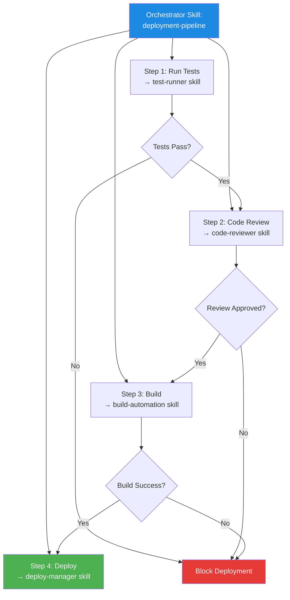

### Pattern 3: The Reference Skill

A skill that primarily provides domain knowledge rather than procedural instructions. The agent loads reference material to inform its responses without following a rigid step-by-step process.

```
legal-compliance/
├── SKILL.md                    # Overview and when to load
└── references/
    ├── gdpr_guidelines.md      # GDPR compliance details
    ├── hipaa_requirements.md   # HIPAA requirements
    ├── ccpa_summary.md         # CCPA summary
    └── data_classification.md  # Data classification framework
```

## 8.2 Writing Effective Skill Descriptions

The `description` field is the most important part of your skill because it determines when the agent activates it. Here are proven patterns:

### Pattern: Problem-Action-Trigger

```yaml
description: >
  [Problem it solves] by [action it takes].
  Use when [trigger conditions].
```

Example:
```yaml
description: >
  Validates database migration scripts by running them against a test
  database and checking for schema drift, data loss risks, and performance
  regressions. Use when the user asks to validate, test, or review a
  database migration.
```

### Pattern: Capability List with Triggers

```yaml
description: >
  [Capability 1], [Capability 2], and [Capability 3].
  Use when [trigger 1], [trigger 2], or [trigger 3].
```

Example:
```yaml
description: >
  Generates PDF reports, fills PDF forms, and extracts text from PDFs.
  Use when the user asks to create, edit, read, or manipulate PDF files.
```

## 8.3 Progressive Disclosure Best Practices

1. **Keep SKILL.md focused**: The main SKILL.md should contain only the core procedure — the steps the agent will follow most of the time. Move detailed reference material, edge case handling, and rarely-needed information into referenced files.

2. **Use clear references**: When referencing a file, state what it contains and when the agent should load it. For example: "Read `references/error_codes.md` when you encounter an unfamiliar error code" is better than just "See error_codes.md."

3. **Structure reference files for quick lookup**: Use clear headings and a table of contents in reference files so the agent can quickly find the relevant section without reading the entire file.

4. **Avoid deep nesting**: Keep the disclosure depth to 3 levels (metadata → SKILL.md → reference files). If you find yourself needing 4+ levels, consider reorganizing the skill.

## 8.4 Script Best Practices

1. **Always use JSON output**: Scripts should return structured JSON that the agent can parse and reason about. Avoid plain text output that requires the agent to interpret free-form strings.

2. **Include a `--help` flag**: Every script should support `--help` so the agent can understand its usage without reading the source code.

3. **Handle missing dependencies gracefully**: If a required Python package is not installed, return a JSON error with installation instructions rather than crashing with a stack trace.

4. **Add timeouts and limits**: All scripts should have configurable timeouts and output size limits to prevent runaway execution.

5. **Make scripts idempotent**: Running the same script twice with the same inputs should produce the same results. This makes it safe for the agent to retry on failure.

6. **Validate inputs**: Scripts should validate their inputs and return clear error messages for invalid arguments rather than producing incorrect results.

## 8.5 Testing and Iterating Skills

### Testing Workflow

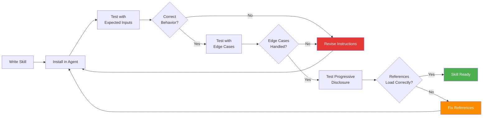

### Common Testing Scenarios

1. **Activation Test**: Does the agent activate the skill when expected? Try various phrasings of the trigger condition.
2. **Non-Activation Test**: Does the agent correctly NOT activate the skill for unrelated requests?
3. **Instruction Following Test**: Does the agent follow the steps in the correct order?
4. **Reference Loading Test**: Does the agent load reference files only when needed?
5. **Script Execution Test**: Do scripts run correctly and produce expected output?
6. **Error Handling Test**: How does the agent handle script failures or unexpected outputs?
7. **Multiple Skill Test**: Can the agent correctly activate and use multiple skills simultaneously?

---

# Part 9: Ecosystem, Clients, and Compatibility

## 9.1 The Agent Skills Open Standard

The Agent Skills format was originally developed by Anthropic and released as an open standard in December 2025. It is licensed under Apache 2.0 for code and CC-BY-4.0 for documentation. The standard is open to contributions from the broader ecosystem through the [agentskills GitHub repository](https://github.com/agentskills/agentskills).

Being an open standard means that any agent platform can implement support for Agent Skills, and any skill built for one platform will work on all compatible platforms. This portability is a key advantage over proprietary plugin systems.

## 9.2 Compatible Clients and Platforms

Agent Skills are supported by a growing number of AI tools and agentic clients. Key platforms include:

| Platform | Integration | Notes |
|----------|-------------|-------|
| **Claude Code** | Plugin marketplace via `/plugin` commands | First-class support; install skills as plugins |
| **Claude.ai** | Built-in skill support for paid plans | Upload custom skills or use pre-built ones |
| **Claude API** | Skills API for programmatic access | Upload and manage skills via API calls |
| **Other compatible agents** | File-system based skill loading | Load skills from local directories |

### Installing Skills in Claude Code

```bash
# Add the Anthropic skills marketplace
/plugin marketplace add anthropics/skills

# Install a specific skill set
/plugin install document-skills@anthropic-agent-skills
/plugin install example-skills@anthropic-agent-skills
```

## 9.3 The Skill Lifecycle

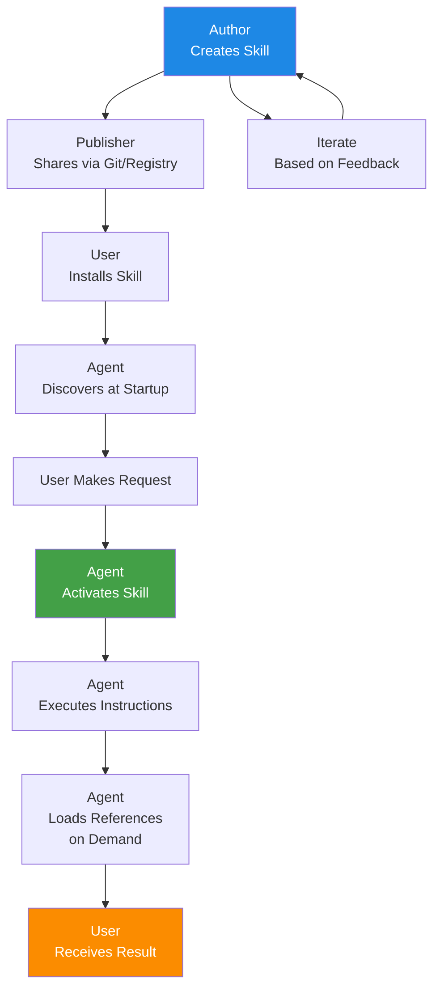

## 9.4 Publishing and Sharing Skills

Skills can be shared through several channels:

1. **Git Repositories**: The most common approach. Push your skill to a Git repository, and users can install it by cloning or referencing the repo URL. Claude Code's plugin system uses GitHub repositories as marketplaces.

2. **Skill Registries**: Platforms like [skills.sh](https://skills.sh) provide registries where you can publish and discover skills. These registries index skills from GitHub repositories and make them searchable.

3. **Direct File Sharing**: For internal or private skills, you can share the skill folder directly via file system paths, network shares, or internal Git repositories.

4. **API Upload**: For platforms with API access (like the Claude API), you can upload skills programmatically using the platform's skill management endpoints.

## 9.5 Building a Skill Registry

For organizations that want to manage internal skills, a skill registry provides a central catalog:

```python
#!/usr/bin/env python3
"""
A simple skill registry that indexes and serves skill metadata.

Usage:
    python skill_registry.py --registry-dir /path/to/skills --port 8080
"""

import argparse
import json
import os
import sys
from pathlib import Path
from http.server import HTTPServer, SimpleHTTPRequestHandler


class SkillRegistry:
    """Index and serve skill metadata from a directory of skills."""

    def __init__(self, registry_dir: str):
        self.registry_dir = Path(registry_dir)
        self.skills = {}
        self._index_skills()

    def _parse_frontmatter(self, skill_md_path: Path) -> dict:
        """Parse YAML frontmatter from a SKILL.md file."""
        content = skill_md_path.read_text(encoding="utf-8")

        if not content.startswith("---"):
            return {}

        # Extract frontmatter between --- markers
        parts = content.split("---", 2)
        if len(parts) < 3:
            return {}

        frontmatter_text = parts[1].strip()
        metadata = {}

        for line in frontmatter_text.split("\n"):
            if ":" in line:
                key, value = line.split(":", 1)
                metadata[key.strip()] = value.strip().strip('"').strip("'")

        return metadata

    def _index_skills(self):
        """Index all skills in the registry directory."""
        if not self.registry_dir.exists():
            print(f"Registry directory not found: {self.registry_dir}")
            return

        for skill_dir in self.registry_dir.iterdir():
            if not skill_dir.is_dir():
                continue

            skill_md = skill_dir / "SKILL.md"
            if not skill_md.exists():
                continue

            metadata = self._parse_frontmatter(skill_md)
            if "name" in metadata:
                self.skills[metadata["name"]] = {
                    "name": metadata.get("name", ""),
                    "description": metadata.get("description", ""),
                    "version": metadata.get("version", ""),
                    "path": str(skill_dir),
                    "skill_md_path": str(skill_md),
                }

        print(f"Indexed {len(self.skills)} skills")

    def get_all_metadata(self) -> list:
        """Get metadata for all skills (Discovery stage)."""
        return [
            {"name": s["name"], "description": s["description"]}
            for s in self.skills.values()
        ]

    def get_skill(self, name: str) -> dict:
        """Get full skill information including SKILL.md content."""
        if name not in self.skills:
            return None

        skill = self.skills[name]
        skill_md_path = Path(skill["skill_md_path"])
        skill["content"] = skill_md_path.read_text(encoding="utf-8")
        return skill

    def search_skills(self, query: str) -> list:
        """Search skills by keyword in name or description."""
        query_lower = query.lower()
        results = []
        for skill in self.skills.values():
            if (query_lower in skill["name"].lower() or
                    query_lower in skill["description"].lower()):
                results.append({"name": skill["name"], "description": skill["description"]})
        return results


def main():
    parser = argparse.ArgumentParser(description="Skill Registry")
    parser.add_argument("--registry-dir", required=True, help="Path to skills directory")
    parser.add_argument("--action", choices=["index", "search", "list"], default="list")
    parser.add_argument("--query", default="", help="Search query")
    args = parser.parse_args()

    registry = SkillRegistry(args.registry_dir)

    if args.action == "list":
        metadata = registry.get_all_metadata()
        print(json.dumps(metadata, indent=2))
    elif args.action == "search":
        results = registry.search_skills(args.query)
        print(json.dumps(results, indent=2))
    elif args.action == "index":
        print(f"Indexed {len(registry.skills)} skills:")
        for name, skill in registry.skills.items():
            print(f"  - {name}: {skill['description'][:60]}...")


if __name__ == "__main__":
    main()
```

## 9.6 Comparison with Related Approaches

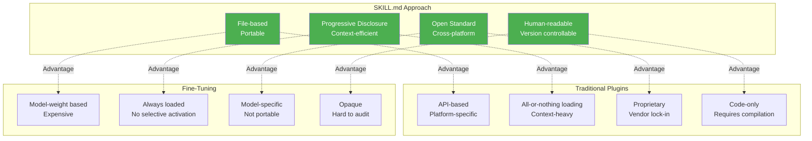

| Feature | SKILL.md | Traditional Plugins | Fine-Tuning | RAG |
|---------|----------|-------------------|-------------|-----|
| **Setup Complexity** | Low (create a folder) | High (write API code) | Very High (ML pipeline) | Medium (vector DB) |
| **Portability** | High (any compatible agent) | Low (platform-specific) | None (model-specific) | Medium (format-dependent) |
| **Context Efficiency** | High (progressive disclosure) | Low (all loaded) | N/A (baked in) | Medium (retrieval-based) |
| **Update Speed** | Instant (edit a file) | Slow (deploy new version) | Very Slow (retrain) | Medium (re-index) |
| **Procedural Knowledge** | Excellent (step-by-step) | Good (code logic) | Poor (implicit) | Poor (no procedure) |
| **Code Execution** | Supported (bundled scripts) | Core feature | Not applicable | Not applicable |
| **Cost** | Free (file-based) | Development cost | High (compute + data) | Medium (embedding + storage) |
| **Auditability** | High (human-readable MD) | Medium (read code) | Low (opaque weights) | Low (vector similarity) |

---

## Quick Reference: SKILL.md Cheat Sheet

```
┌──────────────────────────────────────────────────────────────┐
│                   SKILL.md CHEAT SHEET                       │
├──────────────────────────────────────────────────────────────┤
│ MINIMAL SKILL                                                │
│   my-skill/SKILL.md:                                         │
│     ---                                                      │
│     name: my-skill                                           │
│     description: What it does and when to use it             │
│     ---                                                      │
│     # Instructions for the agent...                          │
├──────────────────────────────────────────────────────────────┤
│ FRONTMATTER (Required)                                       │
│   name:        kebab-case identifier (e.g. pdf-editor)       │
│   description: Specific, includes trigger phrases            │
├──────────────────────────────────────────────────────────────┤
│ FRONTMATTER (Optional)                                       │
│   version: 1.0.0                                             │
│   author: Your Name                                          │
│   license: Apache-2.0                                        │
│   tags: [data, pipeline, validation]                         │
│   requires: [python>=3.9]                                    │
├──────────────────────────────────────────────────────────────┤
│ DIRECTORY STRUCTURE                                          │
│   my-skill/                                                  │
│   ├── SKILL.md           # Required                         │
│   ├── scripts/           # Optional: executable code        │
│   ├── references/        # Optional: docs loaded on demand  │
│   ├── assets/            # Optional: templates, configs     │
│   └── examples/          # Optional: sample I/O             │
├──────────────────────────────────────────────────────────────┤
│ PROGRESSIVE DISCLOSURE                                       │
│   Stage 1 Discovery:  name + description (~80 tokens)       │
│   Stage 2 Activation:  Full SKILL.md (~2K tokens)           │
│   Stage 3 Execution:   References + scripts on demand        │
├──────────────────────────────────────────────────────────────┤
│ WHAT NOT TO DO                                               │
│   ✗ Hardcoded secrets/API keys                               │
│   ✗ Destructive commands without confirmation                │
│   ✗ eval()/exec() with user input                            │
│   ✗ Auto-execution on skill load                             │
│   ✗ Obfuscated or minified code                              │
│   ✗ Accessing files outside project scope                    │
│   ✗ Infinite loops or resource exhaustion                    │
│   ✗ Telemetry or data exfiltration                           │
├──────────────────────────────────────────────────────────────┤
│ SCRIPT BEST PRACTICES                                        │
│   ✓ Return JSON output                                       │
│   ✓ Support --help flag                                      │
│   ✓ Handle missing dependencies gracefully                   │
│   ✓ Add timeouts and resource limits                         │
│   ✓ Make scripts idempotent                                  │
│   ✓ Validate all inputs                                      │
└──────────────────────────────────────────────────────────────┘
```

---

*This guide covers the complete SKILL.md-based automation approach, from foundational concepts to production-ready implementations. The Agent Skills ecosystem is growing rapidly — check [agentskills.io](https://agentskills.io) and the [GitHub repository](https://github.com/agentskills/agentskills) for the latest updates, community skills, and specification changes.*
