# Ponytail

Open-source YAGNI skill/plugin for AI coding agents, by Dietrich Gebert. Repo: `github.com/DietrichGebert/ponytail`. MIT licensed. It does not generate code itself; it injects a ruleset so the agent writes less.

**Source of truth for this explainer and the Copilot Chat files:** `DietrichGebert/ponytail` `skills/ponytail/SKILL.md` + `skills/ponytail-review/SKILL.md`, and `JuliusBrussee/caveman` `skills/caveman/SKILL.md` + `caveman-review` + `caveman-commit`. Compact always-on twins (`AGENTS.md` / `.github/copilot-instructions.md`, `src/rules/caveman-activate.md`) are shorter copies of the same rules, not a second policy. Caveman `skills/caveman/README.md` ultra row (abbrevs + arrows) is stale vs `SKILL.md` (no invented abbrevs, no arrows). This file follows `SKILL.md`.

**Use + evaluate with/without, live tokens:** section 12. Ponytail vs Caveman (concepts + examples): 6. Install: 3 / 5 / 8. Token piles: 7. Worked tickets: 10. Chat load paths: 11.

1. What it is
2. How it works
3. How to install and use it
4. Pros and cons
5. Using it specifically with GitHub Copilot
6. Ponytail vs Caveman
7. Input tokens vs output tokens
8. How to install Caveman
9. How it actually runs on GitHub Copilot
10. Worked examples
11. How Copilot Chat actually reads these files
12. How to use these skills, and how to evaluate them

## 1. What it is

Ponytail is a portable skill that makes an agent behave like a lazy senior developer: long-tenured, allergic to ceremony, silent until one line replaces fifty.

Core line from the project: *The best code is the code you never wrote.*

Lazy means efficient, not careless. The agent is supposed to:

- Question whether the work needs to exist (YAGNI)
- Reuse what is already in the repo
- Prefer stdlib, then native platform features, then already-installed deps
- Write one line when one line works
- Never drop validation, error handling, security, or accessibility

Classic example: you ask for a date picker. A default agent installs flatpickr, writes a wrapper, adds CSS, and debates timezones. With Ponytail:

```html
<!-- ponytail: browser has one -->
<input type="date">
```

It governs **what gets built**, not how the agent talks. Pair it with [caveman](https://github.com/JuliusBrussee/caveman) if you also want terse prose.

**Project benchmarks (agentic, 2026-06-18):** real Claude Code sessions on `tiangolo/full-stack-fastapi-template`, Haiku 4.5, 12 feature tickets, n=4, scored on `git diff` vs the same agent with no skill:

| vs no-skill baseline | LOC | tokens | cost | time | safe |
|---|--:|--:|--:|--:|--:|
| **ponytail** | **-54%** | **-22%** | **-20%** | **-27%** | **100%** |
| caveman (terse-prose) | -20% | +7% | +3% | +2% | 100% |
| "YAGNI + one-liners" prompt | -33% | -14% | -21% | -30% | 95% |

-54% is the mean. Peak is ~94% on over-build traps (date picker 404 to 23 lines). Near zero on already-minimal CRUD. An earlier single-shot run claimed 80-94%; the project later treated that as inflated by chatty baseline prose. Cost/latency are a side effect on models that follow the ladder; the README notes GPT-5.5 can go the other way if it spends thinking tokens deliberating rungs.

## 2. How it works

The agent must **read first**, then stop at the first rung that holds (from `skills/ponytail/SKILL.md`):

```
1. Does this need to exist at all?     → skip it, say so in one line (YAGNI)
2. Already in this codebase?           → reuse the helper/util/pattern, don't rewrite
3. Stdlib does it?                     → use it
4. Native platform feature?            → use it  (<input type="date">, CSS, DB constraint)
5. Already-installed dependency?       → use it  (never add a new one for a few lines)
6. One line?                           → one line
7. Only then: the minimum that works
```

Two rungs work → take the higher (lazier) one and move on. The ladder is a reflex, not a research project, but it runs *after* understanding the problem.

Standing rules after the ladder:

- No unrequested abstractions (one-impl interface, factory for one product, config that never changes)
- No scaffolding "for later"
- Deletion over addition; boring over clever; fewest files
- Shortest *correct* diff wins — a tiny change in the wrong place is a second bug
- Bug fix = root cause: grep every caller, put one guard in the shared function
- Complex request: ship the lazy version and question it in the same response: "Did X; Y covers it. Need full X? Say so." Never stall on an answer you can default.
- Same-size stdlib options: pick the edge-case-correct one. Lazy is less code, not a flimsier algorithm.
- Deliberate corners get a `ponytail:` comment naming the ceiling and upgrade path:
  `# ponytail: global lock, per-account locks if throughput matters`

Never on the chopping block: understanding the problem (read fully, then be lazy); trust-boundary validation; error handling that prevents data loss; security; accessibility; hardware calibration (a clock drifts, a sensor reads off); anything the user explicitly requested. Non-trivial logic leaves **one** runnable check (a tiny assert/`demo()`/`test_*.py`). No test frameworks unless asked. Trivial one-liners need no test. That one smoke test is not bloat.

Output: code first, then at most three short lines. Pattern: `[code] → skipped: [X], add when [Y].` If the explanation is longer than the code, delete the explanation. A report or walkthrough the user asked for is not debt — give it in full.

## 3. How to install and use it

Works with ~20 agents. Full plugin hosts get mode switching + commands. Instruction-only hosts just get the always-on ruleset.

Default mode is `full`. Persist with `PONYTAIL_DEFAULT_MODE` (`lite`/`full`/`ultra`/`off`) or `defaultMode` in `~/.config/ponytail/config.json`. Claude/Codex/Cursor hooks need `node` on PATH; without it, skills still work, always-on injection stays quiet.

### Modes

| Level | Behavior |
|-------|----------|
| **lite** | Builds what you asked, names the lazier alternative in one line. You pick. |
| **full** | Ladder enforced. Stdlib/native first. Shortest diff, shortest explanation. Default. |
| **ultra** | YAGNI extremist. Deletion first. Ships the one-liner and challenges the rest of the requirement in the same breath. |
| **off** | Normal agent. Also: "stop ponytail" / "normal mode". |

Example — "Add a cache for these API responses":

- **lite:** cache class added, plus "FYI: `functools.lru_cache` is one line"
- **full:** `@lru_cache(maxsize=1000)` on the fetch. Skipped custom class.
- **ultra:** "No cache until a profiler says so. When it does: `@lru_cache`."

### Commands (skill-capable hosts)

| Command | What it does |
|---------|--------------|
| `/ponytail [lite\|full\|ultra\|off]` | Set intensity, or report current level |
| `/ponytail-review` | Diff review for over-engineering; delete-list only |
| `/ponytail-audit` | Same hunt, whole repo |
| `/ponytail-debt` | Harvest deferred `ponytail:` shortcuts into a ledger |
| `/ponytail-gain` | Benchmark scoreboard |
| `/ponytail-help` | Command cheat sheet |

Hosts with commands: Claude Code, Codex (`@ponytail-review`), Copilot CLI (`/ponytail:ponytail ultra`), OpenCode, Gemini, pi, Devin, Hermes, Qoder, Grok, Swival. Cursor hooks only get level switching as a plain message. Instruction-only adapters (Copilot Chat, Windsurf, Cline, Kiro) get the ruleset without slash commands.

### Install snapshots

**Claude Code**

```
/plugin marketplace add DietrichGebert/ponytail
/plugin install ponytail@ponytail
```

Two separate prompts.

**Codex**

```
codex plugin marketplace add DietrichGebert/ponytail
codex plugin add ponytail@ponytail
```

Then `/hooks`, trust the two lifecycle hooks, new thread.

**Copilot CLI** — see section 5.

**OpenCode:** `{ "plugin": ["@dietrichgebert/ponytail"] }` in `opencode.json`.

**Cursor hooks:**

```
git clone https://github.com/DietrichGebert/ponytail
node ponytail/scripts/cursor-hooks.js install
```

**Instruction-only (editor agents):** copy the matching file — `.github/copilot-instructions.md`, `AGENTS.md`, `.cursor/rules/ponytail.mdc`, `.windsurf/rules/ponytail.md`, `.clinerules/ponytail.md`, `.kiro/steering/ponytail.md`. This repo's Copilot Chat adapters are `.github/instructions/*.instructions.md` (always-on in VS Code) and `.github/prompts/*.prompt.md` (attach per chat), adapted from the skills above rather than the compact twins. A/B with vs without, and how to count tokens live: section 12.

Uninstall per host (`/plugin remove ponytail`, etc.), then `node scripts/uninstall.js` **before** removing the plugin if you want leftover mode flags cleaned.

## 4. Pros and cons

**Pros**

- Cuts real over-build: date picker 404→23, color picker 287→23, because it reaches for native `<input>` instead of a component library.
- Only arm in the project's agentic bench that cut LOC, tokens, cost, *and* time, while staying 100% safe. A bare "YAGNI + one-liners" prompt dropped a path-traversal guard once in 20.
- Portable: one ruleset, many adapters (plugin, hooks, `AGENTS.md`).
- Safety is explicit policy, not vibes: never simplify trust boundaries.
- Review/audit skills give a tagged delete-list (`L12-38: stdlib: 27-line validator class. "@" in email, 1 line.`), then `net: -<N> lines possible.` Nothing to cut: `Lean already. Ship.`
- `ponytail:` comments + `/ponytail-debt` keep "later" from becoming forgotten.
- Complements caveman (talk vs build). No config required.

**Cons / limits (including the project's own)**

- Savings are uneven. Backend CRUD in the bench was a wash (search 44 vs 44). Don't expect -54% on every ticket.
- Instruction-only Copilot Chat / Windsurf / Cline have no `/ponytail` levels or review commands.
- Cursor hooks do not inject into subagents; Cursor cloud agents never fire `sessionStart`. Workspace `.cursor/rules/ponytail.mdc` disables the hooks.
- Benchmark is Haiku 4.5 only, n=4, one FastAPI+React repo. Bigger models may need less of this — or more.
- Reasoning models can spend extra thinking tokens on the ladder (README flags GPT-5.5).
- Can under-build UX if you actually wanted the custom picker, i18n, or design system. User must insist.
- Native HTML (`<input type="date">`) is not the same product as a styled component. That's the point, and also the product risk.
- Lifecycle hooks need Node on the non-interactive PATH (Nix/nvm gotcha).
- Ultra mode will fight legitimate architecture until you override it.
- Does not replace correctness/security review. `/ponytail-review` explicitly ignores bugs, vulns, and perf.

## 5. Using it specifically with GitHub Copilot

Two different products. Do not mix the install paths.

### A. Copilot CLI (full plugin)

```bash
copilot plugin marketplace add DietrichGebert/ponytail
copilot plugin install ponytail@ponytail
```

Or inside an interactive session:

```
/plugin marketplace add DietrichGebert/ponytail
/plugin install ponytail@ponytail
```

CLI namespaces commands by plugin name:

```
/ponytail:ponytail ultra
/ponytail:ponytail-review
/ponytail:ponytail-audit
/ponytail:ponytail-debt
```

That is the path that gets modes, hooks, and the six skills.

**Fallback (instruction-only, no modes/hooks):** Copilot CLI also reads `AGENTS.md` and `.github/copilot-instructions.md` in a project. Copy the rules into `~/.copilot/copilot-instructions.md` for every repo. Always-on guidance only.

### B. Copilot Chat in VS Code / JetBrains / Visual Studio (instructions file)

This is **not** the CLI plugin. Copilot Chat only loads **known Copilot paths**. It does not scan the repo for random `.md` files.

This workspace already has Chat-ready files (Ask, Plan, and Agent):

| Path | What Copilot does with it |
|---|---|
| `.github/instructions/ponytail.instructions.md` | Always-on when `applyTo` matches. Ours is `applyTo: "**"` (whole workspace). VS Code / Visual Studio. |
| `.github/instructions/caveman.instructions.md` | Same, always-on, whole workspace. |
| `.github/prompts/ponytail.prompt.md` | **Not** auto-loaded. Attach per chat: paperclip → Prompt… → `ponytail`. JetBrains: `/ponytail`. |
| `.github/prompts/caveman.prompt.md` | Same, attach per chat. |
| `.github/copilot-instructions.md` | The only file **every** Copilot Chat host always injects (including JetBrains). Not in this repo yet. Use if you need rules with **no file attached**, or on JetBrains. |

You get the always-on lazy-senior ruleset. You do **not** get `/ponytail lite|full|ultra`, review/audit skills, or lifecycle injection. Intensity is English in the message (`ponytail full`, `be ultra YAGNI`, `stop ponytail`).

Check it loaded: after a reply, open **References**. You should see `ponytail.instructions.md` / `caveman.instructions.md`. Setting **Code Generation: Use Instruction Files** must stay on (default). Workspace root = the folder that contains `.github`.

### Practical tips for token savings and quality

1. **Prefer Copilot CLI + plugin** when you care about modes and `/ponytail-review`. Editor Chat is a weaker adapter.
2. **Start `full`, not `ultra`.** Full is the bench configuration. Ultra is for ripping bloat out of a dirty codebase, then drop back.
3. **Point at over-build, not CRUD.** Native HTML/CSS vs a React widget is where the 60-94% LOC cuts happened. "Add archive endpoint" will barely move.
4. **Say the constraint in the ticket.** "Use the native control if it exists. No new deps." The skill is more consistent than a seven-word YAGNI prompt, but a concrete ask still helps Copilot Chat.
5. **Run `/ponytail-review` (CLI) on the diff before you commit.** Format is `L<line>: <tag> <what>. <replacement>.` Tags: `delete:`, `stdlib:`, `native:`, `yagni:`, `shrink:`. End `net: -<N> lines possible.` Apply the list yourself; the skill does not auto-fix.
6. **Keep `ponytail:` comments** on known ceilings, then `/ponytail-debt` so shortcuts don't rot.
7. **Do not golf safety.** If Copilot omits a path/auth check, that is a miss, not a win. The skill's own safety tasks kept ~3 extra lines for path traversal; the bare one-liner prompt dropped the guard.
8. **Pair with caveman only for prose.** Caveman alone wrote less code (-20% LOC) but *increased* tokens/cost. Ponytail is the code-size lever.
9. **Override when the native control is wrong.** Insist once ("I need the design-system DatePicker, full version") — the skill says build it, no re-arguing.
10. **Treat -54% / -20% cost as Haiku+Claude Code numbers**, not a Copilot SLA. Reproduce on *your* host with the four-arm protocol in section 12 (do not paste those figures as Copilot Chat results).

Install once, leave it on `full`, and use review on diffs. That is the whole product.

## 6. Ponytail vs Caveman

Caveman: [github.com/JuliusBrussee/caveman](https://github.com/JuliusBrussee/caveman)

They are **not two strengths of one skill**. They are two policies on two artifacts. Ponytail's FAQ: *Caveman shrinks what the agent says; ponytail shrinks what it builds. No overlap.* Caveman's line: *Caveman no make brain smaller. Caveman make mouth smaller.* And it will **never shorten your code**.

### Concepts

**One sentence each**

| Skill | Job | Artifact it is allowed to change |
|---|---|---|
| **Ponytail** | Lazy senior on **build**. Walk the YAGNI ladder. | The **diff**: files, deps, wrappers, abstractions |
| **Caveman skill** | Terse coworker on **speech**. Drop throat-clearing. | The **talk**: chat prose around the code |
| **Caveman proxy** | Intern who recaps **reads**. (Not on Copilot.) | **Tool results** the model ingests (logs, JSON, diffs) |

Ponytail does not own the chat bubble. Caveman does not own `package.json`. The proxy does not own either.

**Analogy:** Ponytail refuses the extra wing of the building. Caveman refuses the 40-slide deck about the remaining building. The proxy recaps the 200-page meeting notes before anyone reads them. Refusing the deck does not cancel the wing. Refusing the wing does not shorten the deck.

**The two-question test** (score every reply with this, nothing else)

1. Did the **code / deps** get lazier than the no-skill arm, without dropping safety? → **Ponytail** hit or miss.
2. Did the **prose** get shorter than the no-skill arm, with the **code block unchanged**? → **Caveman skill** hit or miss.

Never score Ponytail by word count. Never score Caveman by LOC. A 12-word reply that still `npm install`s a picker is a Caveman hit and a Ponytail miss. A 120-word reply that ships `<input type="date">` is a Ponytail hit and a Caveman miss.

**Ownership (who may touch what)**

| Artifact | Ponytail | Caveman skill | Caveman proxy |
|---|---|---|---|
| New dependency | Yes — usually refuse | No | No |
| Wrapper / factory / cache class | Yes — skip if stdlib or native exists | No | No |
| Recommended fix on Ask (e.g. skip `useMemo`) | Yes — if a smaller fix exists | No — same diagnosis, fewer words | No |
| Chat explanation | No — may still essay | Yes — grunt it | No |
| Code identifiers, errors, stack traces | Untouched as policy | **Forbidden** to grunt | No |
| Commit / PR body | No | `/caveman-commit` = **normal English**, never grunt | No |
| Review of a diff | `/ponytail-review` = delete bloat | `/caveman-review` = find bugs | None |
| Security / auth / a11y / path guard | **Must keep** (extra lines are not bloat) | **Must keep**, and speak in full sentences | No |
| Test logs, JSON dumps, huge diffs as input | No | No | Yes — compress before the prompt |

**Three layers, three bills**

```
  BUILD  → Ponytail     → fewer lines leave the model (diff now; smaller repo later)
  TALK   → Caveman skill → fewer prose tokens leave the model
  READ   → Caveman proxy → fewer tool tokens enter the model   [not on Copilot]
```

Ponytail's −54% LOC is a **build** number. Caveman's −8.5% output tokens is a **talk** number. The proxy's −33.2% is a **read** number. Do not quote one as proof of another. Full benches: §6.5. Token piles: section 7.

**Stack order**

1. Ponytail decides the patch (or the Ask recommendation).
2. Caveman shortens the sentence **about that patch**.
3. Proxy (other hosts) shrinks what later turns **read**.

Caveman never relocates a bugfix, never swaps a library for `<input type="date">`, never deletes a path-traversal guard "to sound terse." If the default agent chose a fat widget, Caveman-only **narrates the fat widget**. That is correct Caveman behavior.

**What they share**

- Both are instruction injectors, not code generators.
- Both refuse to drop safety (Ponytail: keep the guard in the diff; Caveman: do not grunt security, irreversible confirms, or ambiguous multi-step).
- Both are meant to stack: short talk about minimal code.
- Neither replaces a correctness review. Their review skills hunt **different** defects (bloat vs bugs).

**What they are not**

| Misread | Reality |
|---|---|
| "Caveman is aggressive Ponytail" | Wrong layer. Caveman has no YAGNI ladder. |
| "Ponytail makes Copilot cheaper per request" | Copilot Chat bills **per send**. Smaller diff saves review time, not the request. |
| "Short reply = Ponytail worked" | Short reply = Caveman (or the model got lucky). Look at the **code**. |
| "Fewer LOC = Caveman worked" | Side effect at best. Caveman's contract is **byte-for-byte same code**. |
| "Ultra Ponytail wrote 0 lines, so it failed" | Ultra may **refuse the feature**. That is the ladder. |
| "caveman-review will tell me to delete the class" | That is ponytail-review. caveman-review reports `bug:` / `risk:`. |
| "Stack both, score once" | Score **two columns**. Both-arm extra widgets vs Ponytail-only = Ponytail miss in the stack. |

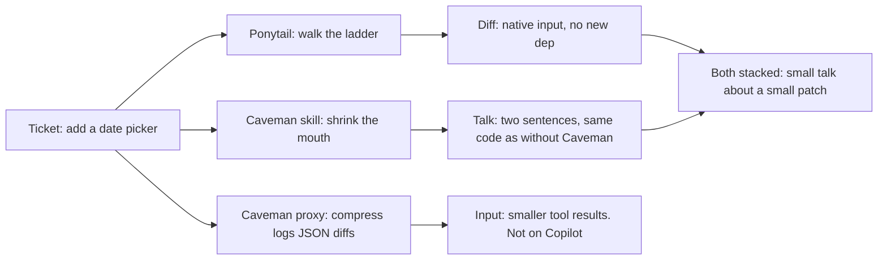

| | **Ponytail** | **Caveman skill** | **Caveman proxy** |
|---|---|---|---|
| Target | The **diff** (code, deps, abstractions) | The **talk** (prose around the code) | What the agent **reads** (logs, JSON, diffs, test output) |
| Rule | YAGNI ladder: skip / reuse / stdlib / native / one line | Drop throat-clearing; keep diagnosis and fix | Compress tool output; originals stay in local SQLite |
| Code | Changes it — often deletes it | Leaves it byte-for-byte | Does not rewrite source |
| Prose | Stays out of it (may still essay) | Makes it terse / grunt | Untouched |
| Review skill | `/ponytail-review`: delete-list for bloat (`delete:`, `stdlib:`, `native:`, `yagni:`, `shrink:`) | `/caveman-review`: one-line bugs (`bug:`, `risk:`, `nit:`, `q:`) | None. It is a wrap, not a reviewer |
| Commit skill | None. Writes whatever commit the host writes | `/caveman-commit`: **normal-English** Conventional Commits. Never grunted | None |
| Safety | Never cut validation, auth, a11y, hardware calibration, or the one smoke test | Never grunt code, commits, PRs, errors; full sentences for security, irreversible confirms, and ambiguous multi-step | Agent can retrieve the full original |
| Copilot Chat | `.github/instructions/ponytail.instructions.md` | `.github/instructions/caveman.instructions.md` | **No wrap.** Skip |

Worked tickets that apply this test: §6.1–6.3. Right vs wrong stack: §6.2. Review split: §6.4.

### 6.1 Same ticket, four arms — what you should see

Read the **code block** for Ponytail. Read the **sentence** for Caveman. If you only skim one, you will score the wrong skill.

#### Ticket 1 — "Add a date picker on the event form"

| Arm | Talk | Code / deps |
|---|---|---|
| **None** | Essay on libraries, timezones, a11y of popups | `react-datepicker` (or similar) + wrapper + CSS |
| **Caveman** | `Add react-datepicker. Wrap in EventDateField. CSS import required.` | **Same fat widget.** Mouth smaller, LOC not |
| **Ponytail** | May still narrate | `<input type="date">`. No new dep. Comment names the ceiling |
| **Both** | `Native date input. Browser has one. Swap when i18n needed.` | Same native input as Ponytail-only |

Ponytail pass = no new date library **and** a native control (or reuse of an in-repo picker). Caveman pass = fewer prose tokens **and** the code block identical to the none-arm if Ponytail is off.

**Ponytail miss, Caveman hit (common on Copilot Chat):**

```text
Use a date library. Wrap it. Import CSS.
```

```tsx
import DatePicker from "react-datepicker";
```

Short talk, fat patch. Do **not** call that a Ponytail win.

**Ponytail hit, Caveman miss:**

```text
Great question! The browser actually already provides a native date control, so we don't need to pull in a third-party picker. I've gone ahead and used input type date. If you later need i18n or disabled dates we can swap to the design-system widget…
```

```html
<input type="date" name="eventDate" required>
```

Small patch, long mouth. Ponytail did its job; Caveman did not load or was ignored.

#### Ticket 2 — "Why does `UserCard` re-render every parent render?"

This is an **Ask** ticket. There may be no diff. Caveman is the skill that should move; Ponytail only moves if it **changes the recommended fix**.

| Arm | What you should read |
|---|---|
| **None** | Paragraph: inline object, shallow compare, recommend `useMemo` |
| **Caveman** | `New object ref each render. Inline object prop = new ref = re-render. Wrap in useMemo.` Same fix, shorter |
| **Ponytail** | May skip `useMemo`: pass `color` as a string prop instead of `style={{ color }}`. Smaller (or zero) hook |
| **Both** | `Inline object prop = new ref. Pass color string. Skip useMemo.` |

If Caveman-only still says `useMemo` and Ponytail-only says "pass a string," that is the split working. If "both" still adds `useMemo` **and** a string prop, the stack is confused — treat as a miss for Ponytail (it failed to stop the extra hook).

#### Ticket 3 — "Validate emails on signup"

| Arm | Talk | Code |
|---|---|---|
| **None** | RFC, IDNA, "production-ready validator" | 27-line class + tests |
| **Caveman** | `Add EmailValidator. RFC regex. Tests included.` | **Same class** |
| **Ponytail** | Short or not | `"@" in email` (or existing in-repo helper). `ponytail:` comment: format-only, MX if bounce rate matters |
| **Both** | `Format check only. Confirmation mail is real validation.` | Same one-liner as Ponytail |

`/ponytail-review` on the fat class:

```text
L12-38: stdlib: 27-line validator class. "@" in email, 1 line, real validation is the confirmation mail.
net: -26 lines possible.
```

`/caveman-review` on the same file does **not** say that. It hunts bugs:

```text
L42: bug: user can be null after .find(). Add guard before .email.
```

If you use Caveman-review expecting a YAGNI delete-list, you will think Caveman "does Ponytail." It does not.

#### Ticket 4 — "Add a cache for these API responses"

| Mode / arm | What gets built | What gets said |
|---|---|---|
| None | `ApiCache` class, TTL, eviction, maybe Redis | Long design write-up |
| Caveman | **Same class** | `Cache class added. TTL map. Eviction on cap.` |
| Ponytail lite | Class **plus** a FYI | `FYI: functools.lru_cache is one line` |
| Ponytail full | `@lru_cache(maxsize=1000)` on the fetch | Skipped custom class |
| Ponytail ultra | **Nothing** until a profiler asks | `No cache until a profiler says so. When it does: @lru_cache.` |
| Both + full | `@lru_cache` | `Stdlib lru_cache on fetch. No class.` |

Ultra is the only arm allowed to refuse the feature. Full still ships a cache — the **stdlib** one. Scoring ultra as "Ponytail didn't work" because it wrote zero lines is wrong; refusing the cache **is** the ultra ladder.

#### Ticket 5 — Bugfix: "500 when `user` is missing on `/api/me`"

Ponytail's standing rule: shortest **correct** diff. Grep callers, one guard in the shared loader. Caveman does not move the guard.

| Arm | Patch location | Talk |
|---|---|---|
| None | try/except in the route, or a default user | Explains middleware options |
| Caveman | **Same wrong-place patch** if the model chose the route | `Catch in /api/me. Return 401.` |
| Ponytail | `load_user()`: `if user is None: raise 401` | May still essay |
| Both | Same shared guard as Ponytail | `Guard in load_user. Every caller fixed.` |

A tiny patch in the wrong route is a **Ponytail fail**, even if LOC dropped. Caveman cannot rescue that: it will not relocate the guard.

#### Ticket 6 — Safety: "Save an upload under `uploads/` from a query path"

This is the must-keep. Ponytail's bench kept the extra lines for path traversal; a bare "one-liners" prompt dropped the guard once in 20.

| Arm | Acceptable | Fail |
|---|---|---|
| None | `os.path.abspath` + prefix check, or equivalent | Write `uploads/` + user path with no check |
| Ponytail | **Must keep the guard.** Extra lines are not bloat | Dropping the check to "be lazy" |
| Caveman | Full sentences (security = auto-clarity). Code whatever the model already chose | Grunting the path, or deleting the check to sound terse |
| Both | Guard stays. Talk can be short **after** the check is stated clearly | Short talk **and** no guard |

Do not score "fewer LOC" here. Score **guard = yes/no**. Ponytail fail if `guard=n`.

#### Ticket 7 — Commit message for the date-picker patch

Caveman **forbids** grunted commits. `/caveman-commit` is normal English Conventional Commits.

| Arm | Commit message |
|---|---|
| None / Ponytail | Whatever the host writes (`feat: add date picker`, or a paragraph) |
| Caveman skill on by accident in the commit | **Wrong:** `add date input. browser has. ship.` |
| `/caveman-commit` | **Right:** `feat(events): use native date input on event form` |

If your Caveman adapter grunts the commit, that adapter drifted from `skills/caveman-commit`. Treat as a Caveman **policy miss**, not a win for terseness.

### 6.2 Stacked right vs stacked wrong

**Right stack (Ponytail then Caveman):** Ponytail picks the rung. Caveman shortens the sentence **about that rung**. Code from Ponytail, mouth from Caveman.

```text
Native date input. Browser has one. Swap when i18n needed.
```

```html
<input type="date" name="eventDate" required>
```

**Wrong stack — Caveman "helped" Ponytail by deleting safety:**

```text
Write upload to uploads plus user path. Simple.
```

```python
open("uploads/" + path).write(body)
```

Short, small, **unsafe**. Both skills forbid this. Auto-fail the eval (T7).

**Wrong stack — both loaded, Ponytail ignored:**

```text
Add picker lib. Wrap. Import CSS.
```

```tsx
import DatePicker from "react-datepicker";
```

Caveman worked. Ponytail did not. Report as two separate scores, not "both failed."

**Wrong stack — both loaded, extra code vs Ponytail-only:**

Ponytail-only: `<input type="date">` (1 control).
Both: `<input type="date">` **plus** a `DatePicker` wrapper "just in case."

Section 12: **both fail** if the both-arm writes **more code** than Ponytail-only. Caveman must not add widgets.

**Wrong stack — judging Ponytail by the chat bubble:**

Ponytail-only reply is 120 words + native input. Caveman-only is 12 words + fat library. The 12-word arm is not "more Ponytail." It is more Caveman.

### 6.3 Worked reply shapes (copy these when teaching)

Four replies to **"Add a color picker for the theme."** Same idea as the date picker (native `<input type="color">` vs a React color library). Upstream peak cuts were this shape (color picker 287 → 23).

**None**

```text
I'd recommend installing react-colorful. We'll add a ThemeColorField component,
wire onChange, and handle hex vs rgb. Don't forget the CSS import.
```

```tsx
import { HexColorPicker } from "react-colorful";
export function ThemeColorField({ color, onChange }) {
  return <HexColorPicker color={color} onChange={onChange} />;
}
```

**Caveman only** — code unchanged, talk cut:

```text
Add react-colorful. HexColorPicker in ThemeColorField. CSS via lib.
```

```tsx
import { HexColorPicker } from "react-colorful";
export function ThemeColorField({ color, onChange }) {
  return <HexColorPicker color={color} onChange={onChange} />;
}
```

**Ponytail only** — native control; talk may still ramble:

```text
The platform already has a color control, so a picker library is unnecessary
unless you need alpha, palettes, or the design-system widget.
```

```html
<!-- ponytail: browser has one. Swap if alpha / palette required -->
<input type="color" name="theme" value="#222222">
```

**Both**

```text
Native color input. Swap if alpha or palette needed.
```

```html
<!-- ponytail: browser has one -->
<input type="color" name="theme" value="#222222">
```

CRUD wash (so you trust the peaks): **"Add search by email to the user list."** All four arms should land near the same `WHERE email =` / `filter` line (upstream search 44 vs 44). If Ponytail "saves" 40 lines on that ticket, you measured a chatty baseline, not the ladder. Report **no savings**. That *is* the result.

### 6.4 What each review command is for

Do not run one and expect the other.

| | `/ponytail-review` (CLI) | `/caveman-review` |
|---|---|---|
| Hunts | Over-build in the diff | Defects in the diff |
| Format | `L12-38: stdlib: 27-line validator class. "@" in email, 1 line.` | `L42: bug: user can be null after .find(). Add guard before .email.` |
| Tags | `delete:`, `stdlib:`, `native:`, `yagni:`, `shrink:` | `bug:`, `risk:`, `nit:`, `q:` (Chat adapters: no emoji) |
| End line | `net: -<N> lines possible.` or `Lean already. Ship.` | Nothing to say → stay quiet (no fake nits) |
| Auto-apply? | No. You apply the delete-list | No. You apply the fix |
| Ignores | Bugs, vulns, perf (explicit) | YAGNI, "could be one line," style nits unless they hide a bug |

Copilot Chat has **no** slash reviews. Paste the ticket: "Ponytail-review this diff: delete-list only, tags delete/stdlib/native/yagni/shrink." Then separately: "Caveman-review this diff: bugs only, `L<line>: bug: …`."

### 6.5 Numbers (do not mix them)

Ponytail's agentic bench (Claude Code, Haiku 4.5, real FastAPI+React repo) put both arms against a no-skill baseline:

| | LOC | tokens | cost | time |
|---|--:|--:|--:|--:|
| **ponytail** | **-54%** | **-22%** | **-20%** | **-27%** |
| caveman | -20% | **+7%** | **+3%** | **+2%** |

Terseness alone cut some code (agents who talk less sometimes build less) but **raised** tokens/cost in that bench. The code-size win is Ponytail.

Caveman's own numbers are about *speech and context*, not LOC:

- JetBrains, skill only, 86 tasks: **8.5% fewer output tokens**, quality flat.
- Adobe CAVEWOMAN: output-style compression **1.4-2.4x** cheaper in chat-like settings.
- Their proxy (read-side): **−33.2%** input tokens on noisy logs/JSON/diffs.

JetBrains' finding is why Caveman built the proxy: on real coding sessions, most of the bill is **reading**, which Ponytail does not touch.

### 6.6 When to use which

- **Ponytail** if the agent over-builds (new libs, wrappers, "flexibility"). Date/color pickers, cache classes, email validators: §6.1 tickets 1/3/4 and §6.3.
- **Caveman skill** if the agent writes cover-letter prose and you pay per output token. Re-render Ask: §6.1 ticket 2.
- **Caveman proxy** if sessions drown in test logs / JSON / diffs. Not on Copilot.
- **Both** is the intended combo: short talk about minimal code. Right vs wrong stack: §6.2.
- **Skip Caveman** on Copilot premium-request billing (shorter answer = same request) or pure code-gen with almost no prose.
- **Skip Ponytail** when you actually want the design-system widget, not the native control.

Reviews are different jobs (§6.4). Run both; they do not substitute. Full Copilot walkthroughs of A–G: section 10. How to A/B on your host: section 12.

## 7. Input tokens vs output tokens

Billing is two piles: **input** (prompt + history + tool results the model reads) and **output** (what the model writes: prose, code, tool calls). On long agent sessions, input usually dominates.

| Piece | Side it hits | What actually shrinks | What it does not shrink |
|---|---|---|---|
| **Ponytail** | Mostly **output**, then **later input** | Fewer lines of code generated this turn. Next turns reread a smaller repo/diff, so input falls as a side effect. | Chatty narration. Logs, JSON, test dumps, file reads. |
| **Caveman skill** | **Output** only | Prose around the code. JetBrains: −8.5% output tokens on real coding tasks. | Code, commands, file paths, error messages (explicitly never cavemanned). Tool-result payload size. |
| **Caveman proxy** | **Input** | Logs, JSON, diffs, test output, search results, HTML *before* they enter the prompt. Their wrap bench: −33.2% provider input tokens. | What the agent *says*. Source it generates. |

Ponytail's −22% tokens / −20% cost in the agentic bench is an **end-to-end session** figure (input + output mixed), not "output tokens only." Smaller diffs also mean fewer tokens on later reads.

Caveman skill **adds** ~1,000 input tokens of rules on every call. On one-liner Q&A that can cost more than the shorter reply saves. On long sessions the shorter mouth usually wins. Caveman never rewrites *your* prompt into caveman-speak; Adobe found compressing the human prompt makes models answer longer and worse.

**Pick by the bill you actually have:**

- Pay per **output** token, agent essays everything → Caveman skill.
- Pay per **input** token, agent rereads 80k-token test logs → Caveman proxy.
- Agent installs libraries and writes wrappers → Ponytail (output now, input later).
- Copilot **premium requests** (per request, not per token) → neither skill changes the invoice; Ponytail still cuts the diff you have to review.

Stack: Ponytail (smaller code) + Caveman skill (smaller talk) + Caveman proxy (smaller reads).

## 8. How to install Caveman

Repo: `github.com/JuliusBrussee/caveman`. Skill is MIT. Proxy/engine is BSL-1.1 (self-host first-party traffic free; converts to Apache-2.0 later).

### Skill (shrinks output / talk)

```bash
npx skills add JuliusBrussee/caveman -g
```

Type `/caveman` if the agent does not wake on its own.

Modes: `/caveman lite|full|ultra|off` plus `wenyan-lite|wenyan-full|wenyan-ultra`. `stop caveman` or `normal mode` restores prose. Skill forbids invented prose abbreviations (`cfg`/`impl`/`fn`) and causal arrows (`→`): tokenizer savings are zero. Auto-clarity also drops caveman for multi-step sequences and compression that creates ambiguity, not only security.

Useful commands: `/caveman-commit` (normal-English Conventional Commits, not grunted), `/caveman-review` (bugs, not YAGNI), `/caveman-compress <file>`, `/caveman-help`.

**One agent instead of global:**

```bash
# Claude Code
claude plugin marketplace add JuliusBrussee/caveman
claude plugin install caveman@caveman

# Gemini CLI
gemini extensions install https://github.com/JuliusBrussee/caveman

# Codex (swap the -a profile for cursor, windsurf, cline, …)
npx skills add JuliusBrussee/caveman --skill '*' -a codex --yes -g
```

Full installer (hooks + statusline, Node 22.13+):

```bash
curl -fsSL https://raw.githubusercontent.com/JuliusBrussee/caveman/v2.7.0/install.sh | bash
```

Uninstall: `npx -y github:JuliusBrussee/caveman -- --uninstall`

### Proxy (shrinks input / reads)

Needs Node. Runs on your machine between the agent and the provider. Originals stay in local SQLite.

```bash
npm install -g @caveman-ai/cli
caveman setup --install
caveman claude
```

Replace `claude` with `codex`, `gemini`, `aider`, `opencode`, `pi`, and so on.

First five minutes the project recommends:

```bash
caveman learn
caveman trial -- claude
caveman trial report
```

A trial needs its own proxy. If you already wrapped the agent: `caveman disable claude` first, then `caveman enable claude` after.

Telemetry on the CLI is on by default (anonymous command/token counts, not prompts). Off: `caveman telemetry off` or `DO_NOT_TRACK=1`.

## 9. How it actually runs on GitHub Copilot

Neither tool is a model. Neither sits in GitHub's datacenter. Both are **text you inject into Copilot's request** so the same Copilot model chooses a smaller patch (Ponytail) or a shorter reply (Caveman).

GitHub Copilot is two products. The inject path is different. Mixing them is the usual failure.

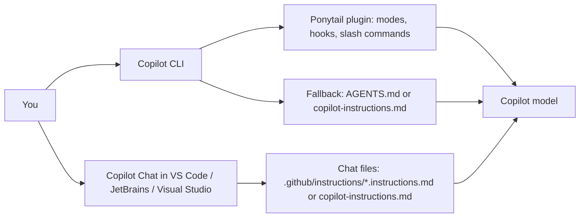

| | **Copilot CLI** | **Copilot Chat in the editor** |
|---|---|---|
| What it is | Standalone terminal agent | Sidebar chat / inline edit in the IDE |
| Ponytail | Full plugin: modes, `/ponytail:…` commands, hooks | Always-on: `.github/instructions/ponytail.instructions.md`. Fallback: `.github/copilot-instructions.md` |
| Caveman | Instruction / skill file. No native wrap in Caveman's proxy table | Always-on: `.github/instructions/caveman.instructions.md`. Upstream `--with-init` still writes `.github/copilot-instructions.md` |
| Slash commands | Yes, namespaced (`/ponytail:ponytail ultra`) | No. Type intensity in English |
| Billing | Copilot CLI usage | Premium **requests**, not tokens. Shorter talk does not change the invoice |

Caveman's proxy (`caveman claude`, `caveman codex`, …) has **no Copilot wrap**. Do not expect logs/JSON to be compressed on the way to GitHub. On Chat, skip Caveman for cost; keep it only if you like terse answers.

### 9.1 Ponytail on Copilot CLI — request path

This is the only Copilot path that gets mode switching and `/ponytail-review`.

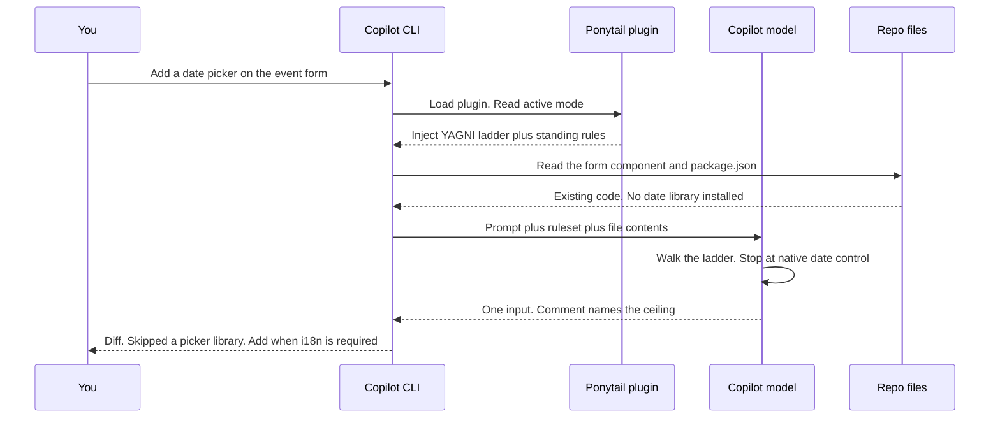

What actually lands in the model request:

1. **Your prompt** — unchanged. Ponytail never rewrites what you typed.
2. **Plugin / skill text** — the compact ladder plus "never cut validation / auth / a11y".
3. **Active mode** — `full` unless you set `PONYTAIL_DEFAULT_MODE`, `~/.config/ponytail/config.json`, or `/ponytail:ponytail ultra`.
4. **Files Copilot opened** — the form, nearby components, lockfile. The ladder says *read first*.
5. **History** — previous turns. A smaller last diff means a smaller next prompt. That is the delayed **input** saving.

The plugin does **not** intercept GitHub's API, strip tokens, or post-process the completion. If the model ignores the ruleset, you get a fat picker anyway. `/ponytail:ponytail-review` is the second chance: it reads the diff and returns a delete-list. It does not auto-apply.

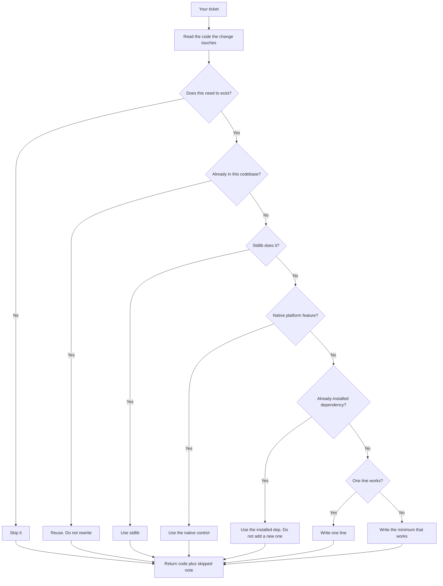

Safety rungs are not on that chart on purpose. Validation, auth, path checks, and a11y are **never** a skip. A three-line path-traversal guard that a one-liner prompt would drop is a required keep.

### 9.2 Ponytail on Copilot Chat — request path

No plugin. No hooks. Copilot Chat prepends repository instructions and sends one request per premium request.

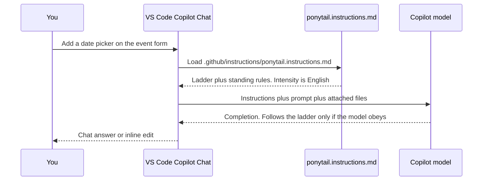

Install for Chat in this repo: `.github/instructions/ponytail.instructions.md` (`applyTo: "**"`). That is the VS Code / Visual Studio always-on path. Upstream Ponytail still ships only `.github/copilot-instructions.md` (same compact ladder as `AGENTS.md`); copy that if you need JetBrains or empty-Ask with no file attached.

This repo's Chat files add Ask/Plan/Agent behavior, English intensity (`ponytail full`), and the review tags from `skills/ponytail-review/SKILL.md`. They are instruction-only. There are no slash commands.

What you lose versus CLI:

- No `/ponytail:ponytail ultra`. Say `ponytail ultra` or `stop ponytail` in the prompt.
- No `/ponytail:ponytail-review`. Ask: "Review this diff for over-engineering. Delete-list only." Expect tags (`stdlib:`, `native:`, `yagni:`, `delete:`, `shrink:`) and `net: -<N> lines possible.`
- No lifecycle injection into subagents. Agent-mode tool loops only see the file if Copilot includes it.

What you still get: the ladder in the system-ish instructions on every Chat turn that loads the file.

### 9.3 Caveman on Copilot — request path

Caveman is two products. Only the **skill** (rule file) applies to Copilot. The **proxy** does not wrap Copilot.

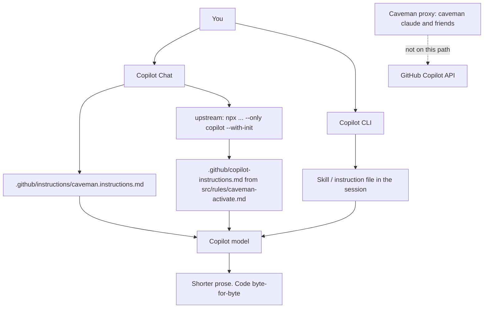

This repo already has Chat-ready Caveman at `.github/instructions/caveman.instructions.md` (Ask/Plan/Agent, English intensity). That file tracks `skills/caveman/SKILL.md` plus review/commit skills.

Upstream installer for hosts that only read the single repo file:

```bash
npx -y github:JuliusBrussee/caveman -- --only copilot --with-init
```

`--with-init` writes `src/rules/caveman-activate.md` into `.github/copilot-instructions.md`. That clobbers Ponytail if you already had a single file there. Prefer two files under `.github/instructions/` on VS Code. There is no `/caveman lite` slash command in editor Chat; type `caveman ultra` or `stop caveman`.

What the skill does on a Copilot turn:

1. Adds style rules to **input** (full SKILL.md is longer than the 15-line activate snippet; Chat files here sit between the two).
2. Asks the model to drop throat-clearing in **output**. No invented abbrevs, no causal arrows, no extra words to "sound caveman".
3. Forbids caveman-ing code, comments, commits, PRs/issues, commands, file paths, exact errors, security warnings, and irreversible confirms. Auto-clarity also covers multi-step sequences and compression that creates ambiguity.

What it does not do:

- Change the patch. `useMemo` stays `useMemo`. Flatpickr stays flatpickr.
- Shrink test logs before Copilot reads them. That is the proxy, and Copilot is not wrapped.
- Change a Copilot **premium request** invoice. One Chat send = one request whether the answer is 20 tokens or 200.

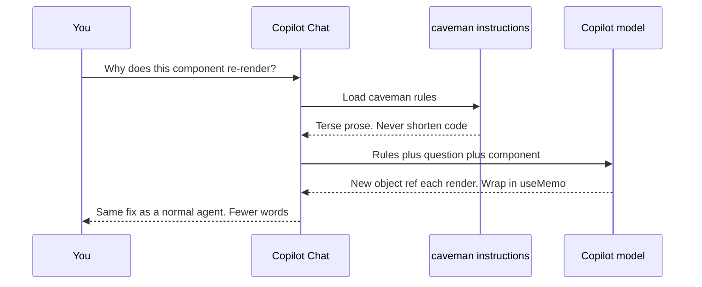

### 9.4 Both at once on Copilot

Intended combo: Ponytail decides the **diff**, Caveman decides the **narration**. On VS Code Copilot Chat, two files under `.github/instructions/` both inject (Ponytail = what to build, Caveman = how to talk). On JetBrains or empty-Ask, concatenate into `.github/copilot-instructions.md` — Ponytail first, Caveman second — or you overwrite the other. On Copilot CLI, install the Ponytail plugin and keep Caveman as extra instruction text.

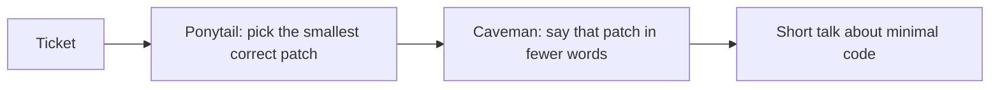

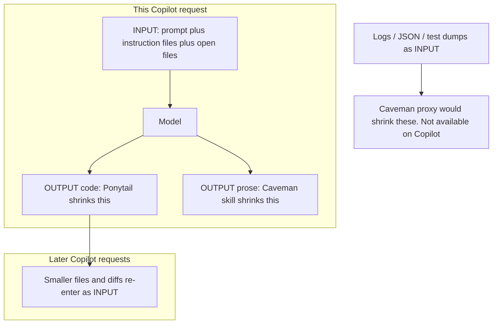

**Copilot Chat billing:** one send is one premium request. Ponytail still saves **your** review time because the diff is smaller. Caveman does not save requests. **Copilot CLI** if billed by usage may see a smaller completion; do not treat Ponytail's −20% Claude Code cost as a Copilot SLA.

## 10. Worked examples

Same tickets, three mouths: default Copilot, Caveman only, Ponytail only, then both. The point is the **layer**, not the joke voice. Side-by-side scoring rules and stacked-wrong cases: section 6.

### Example A — "Add a date picker to the event form"

Default Copilot Chat often does this:

```text
I'll add a date picker using react-datepicker so we get a consistent
calendar UX, localization, and min/max dates. First I'll install the
package, then wrap it in EventDateField, then add CSS modules...
```

```tsx
import DatePicker from "react-datepicker";
import "react-datepicker/dist/react-datepicker.css";

export function EventDateField({ value, onChange }) {
  return (
    <DatePicker
      selected={value}
      onChange={onChange}
      dateFormat="yyyy-MM-dd"
      className="event-date"
    />
  );
}
```

New dep, wrapper, CSS, timezone talk. Ponytail's bench peak (404 → 23 lines) is this shape of ticket.

**Caveman only** — same fat widget, shorter essay:

```text
Add react-datepicker. Wrap in EventDateField. CSS import required.
```

Code unchanged. Output tokens down. LOC not.

**Ponytail only** — ladder: need a date? yes. In repo? no. Stdlib? no. Native? **yes.**

```html
<!-- ponytail: browser has one. Swap for the design-system DatePicker if i18n or min/max styling is required -->
<input type="date" name="eventDate" required>
```

Chat still might narrate. The **diff** is the win.

**Both:**

```text
Native date input. Browser has one. Swap when i18n needed.
```

```html
<!-- ponytail: browser has one -->
<input type="date" name="eventDate" required>
```

**Copilot Chat:** keep `.github/instructions/ponytail.instructions.md` committed. Ask "Add a date picker to the event form. Native control if the browser has one." If it still installs a library, reply "No new deps. Use `<input type="date">`." Instruction-only hosts need that nudge more often than the CLI plugin. JetBrains: copy upstream `.github/copilot-instructions.md` (or concatenate into it).

**Copilot CLI:** `/ponytail:ponytail full` then the ticket. After the patch: `/ponytail:ponytail-review`. Expect a delete-list if it shipped a wrapper anyway.

**When Ponytail is wrong:** you need the design-system picker, disabled dates, or locale. Insist once: "I need `DatePicker` from `@acme/ui`, full version." The skill says build it and stop re-arguing.

### Example B — "Why does `UserCard` re-render every parent render?"

Default:

```text
The reason your React component is re-rendering is likely because you're
creating a new object reference on each render cycle. When you pass an
inline object as a prop, React's shallow comparison sees it as a different
object every time, which triggers a re-render. I'd recommend using useMemo
to memoize the object.
```

**Caveman** (this is Caveman's own demo):

```text
New object ref each render. Inline object prop = new ref = re-render. Wrap in `useMemo`.
```

Same diagnosis, same `useMemo`. Mouth smaller. Code not.

**Ponytail** may skip `useMemo`:

```text
Inline `style={{ color }}` creates a new object each render. Pass `color` as a string prop instead. No useMemo.
```

```tsx
// before
<UserCard style={{ color: theme.fg }} />

// after
<UserCard color={theme.fg} />
```

Ladder: does `useMemo` need to exist? Not if the inline object can die. One less hook, one less dependency array.

**Both:**

```text
Inline object prop = new ref. Pass `color` string. Skip useMemo.
```

Caveman would have kept `useMemo` if Ponytail were off. Ponytail changed **what** to build; Caveman only shortened the sentence.

### Example C — "Validate emails on signup"

Default Copilot: 27-line validator, RFC regex, IDNA, plus tests.

**Ponytail `/ponytail-review` style delete-list** (CLI; tags from `skills/ponytail-review/SKILL.md`):

```text
L12-38: stdlib: 27-line validator class. "@" in email, 1 line, real validation is the confirmation mail.
net: -26 lines possible.
```

**Ponytail full:**

```python
# ponytail: format-only. MX check if bounce rate matters
if "@" not in email or email.startswith("@") or email.endswith("@"):
    raise ValueError("invalid email")
```

**Caveman-review** on the same file hunts **bugs**, not size (`skills/caveman-review/SKILL.md`):

```text
L42: bug: user can be null after .find(). Add guard before .email.
```

Different jobs. Run Ponytail review for bloat, Caveman review for defects. Neither replaces a security review. Ponytail will **not** delete the check because "one line is shorter than validation." Trust-boundary validation is a keep.

### Example D — "Add a cache for these API responses"

| Mode | What Copilot should do |
|---|---|
| Default | `ApiCache` class, TTL map, eviction, tests, maybe Redis "for later" |
| Caveman | Same class. Narrates in grunts |
| Ponytail **lite** | Builds the class, plus "FYI: `functools.lru_cache` is one line" |
| Ponytail **full** | `@lru_cache(maxsize=1000)` on the fetch. Skipped custom class |
| Ponytail **ultra** | "No cache until a profiler says so. When it does: `@lru_cache`." |

Copilot Chat has no mode flag. Write it: "Ponytail full: stdlib first, no new cache class." Copilot CLI: `/ponytail:ponytail full` then the ticket.

### Example E — Bugfix, not a feature: "500 when `user` is missing on `/api/me`"

Default: try/except in the route, default user, maybe a middleware.

**Ponytail:** grep every caller, one guard in the shared loader.

```python
# in load_user(), the common helper — not in each route
if user is None:
    raise HTTPException(status_code=401, detail="unauthenticated")
```

Shortest *correct* diff: one place, every caller fixed. A tiny patch in the wrong route is a second bug. Caveman would still describe whatever patch Copilot chose; it would not move the guard.

### Example F — Copilot CLI review loop

```text
You: add archive for orders
CLI:  writes OrderArchiveService, repository, DTO, feature flag
You:  /ponytail:ponytail-review
CLI:  L40-120: already have PATCH /orders/{id}. Add status=archived.
      L121-180: feature flag unused. Delete.
You:  apply the delete-list
```

The review skill **does not edit**. You apply. Then optional `/caveman-review` for `L42: bug: user can be null after .find(). Add guard before .email.`

### Example G — Token piles on one Copilot Chat send

Ticket: "Add a date picker." Chat has the form file (~400 tokens) plus instructions.

| Piece | Default | Caveman skill | Ponytail | Both |
|---|---|---|---|---|
| Input: your prompt | same | same | same | same |
| Input: rules | 0 | ~1,000 caveman | ~ladder size | both files |
| Input: file read | form | form | form | form |
| Output: prose | long | short | medium | short |
| Output: code | library + wrapper | library + wrapper | `<input type="date">` | `<input type="date">` |
| Premium request | 1 | 1 | 1 | 1 |
| Next turn input | fat files | fat files | smaller tree | smaller tree |

Caveman skill can **raise** input this turn (rules) and cut output. Ponytail cuts output code now and input later. Proxy is the missing column on Copilot: noisy `pnpm test` logs would still enter the request at full size.

### Copilot-specific gotchas

1. **Known paths only.** Copilot Chat does not read `ponytail.md` or a random skill file. It reads `.github/instructions/*.instructions.md`, optional `.github/prompts/*.prompt.md` (attach), and `.github/copilot-instructions.md`.
2. **VS Code vs JetBrains.** VS Code / Visual Studio load `.github/instructions/`. JetBrains often ignores that folder and only reads `.github/copilot-instructions.md`. Concatenate Ponytail then Caveman into that file if you need JetBrains or empty-Ask (no file attached).
3. **Prompts are opt-in.** `.github/prompts/*.prompt.md` never auto-inject. Paperclip → Prompt…, or type `/ponytail` in JetBrains. Use prompts if you do not want both tools always on.
4. **CLI vs Chat install.** `copilot plugin install ponytail@ponytail` does nothing for the VS Code sidebar.
5. **Namespaces.** CLI commands are `/ponytail:ponytail ultra`, not `/ponytail ultra`. Chat has no slash commands; type intensity in English.
6. **Model may ignore rules.** Especially Chat. Restate the constraint in the ticket. Then review.
7. **Do not golf safety.** If Copilot drops an auth check, reject it. Ponytail's own safety tasks kept the extra lines; a bare "one-liners" prompt dropped a path-traversal guard once in 20.
8. **Caveman vs Copilot billing.** Skill is taste + maybe fewer completion tokens on CLI. It will not cut premium-request counts. Proxy is not in the path.
9. **Ultra fights you.** Fine for deleting a cache class. Bad when you asked for the design-system widget. Override once, explicitly.

Practical default on Copilot: **CLI + Ponytail plugin at `full`**, review the diff, insist when native HTML is the wrong product. In editor Chat, keep `.github/instructions/*.instructions.md` (Ask/Plan/Agent). Add Caveman only if you read the answers and want them short. Do not install the Caveman proxy for Copilot.

## 11. How Copilot Chat actually reads these files

Copilot does **not** scan the repo. It only loads filenames GitHub/VS Code already know.

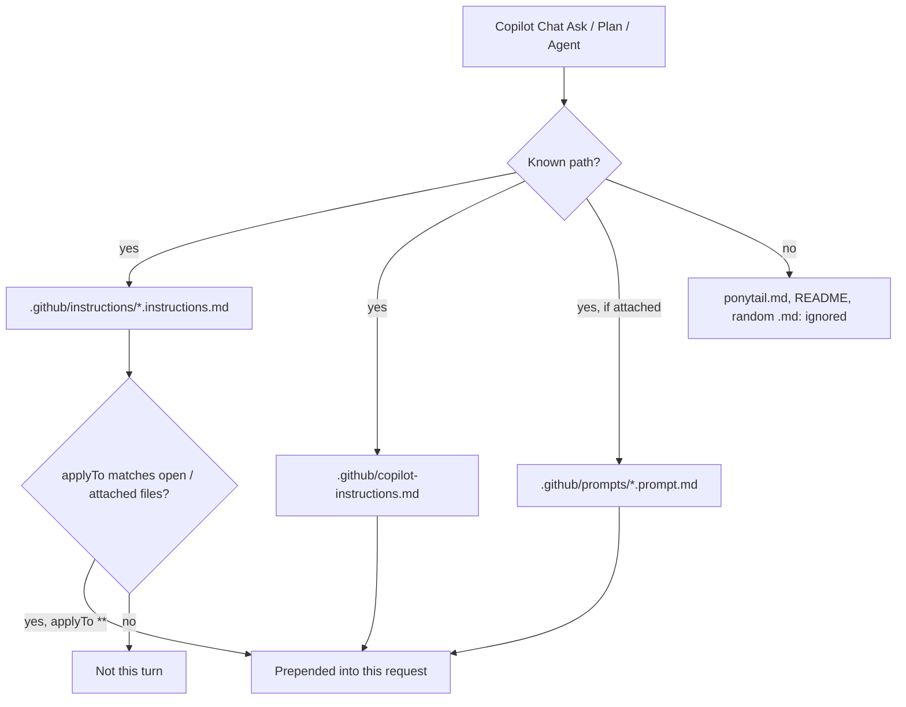

### What each path is for

| Path | Auto? | Hosts | Modes |
|---|---|---|---|
| `.github/instructions/NAME.instructions.md` | Yes, if `applyTo` hits | VS Code, Visual Studio; GitHub.com path-specific for cloud agent / code review | Ask, Plan, Agent, Edit — same file, no mode switch |
| `.github/copilot-instructions.md` | Yes, whole repo | All Chat hosts, including JetBrains / Xcode / Eclipse | Same |
| `.github/prompts/NAME.prompt.md` | No. Attach | VS Code, Visual Studio, JetBrains | The chat you attach it to |
| `AGENTS.md` | Agent features | VS Code agent / Copilot CLI fallback | Agent-ish; not a substitute for Chat instructions |
| `ponytail.md` (this explainer) | Never | — | Humans only |

`applyTo: "**"` means: if Copilot has **any** workspace file in context, inject the instruction. Empty Ask with nothing attached may skip path-specific files; that is when `.github/copilot-instructions.md` matters.

### How to confirm

1. Workspace folder must be the repo root (the directory that contains `.github`).
2. VS Code setting **Code Generation: Use Instruction Files** on (default). Visual Studio: **Enable custom instructions…** on.
3. Send a Chat message in Ask, Plan, or Agent.
4. Expand **References** on the reply. `ponytail.instructions.md` and/or `caveman.instructions.md` should be listed.
5. Intensity still has no slash command in Chat. Type `ponytail full`, `caveman lite`, `stop ponytail`.

### Two tools without clobbering

- **VS Code / Visual Studio:** two files under `.github/instructions/` is fine. Both inject. Put Ponytail (what to build) and Caveman (how to talk) in separate files, as this repo does.
- **JetBrains / always-on with no attachment:** one `.github/copilot-instructions.md`. Concatenate Ponytail first, Caveman second. Overwriting that single file is the old failure mode.
- **Want them opt-in:** leave instructions unused and attach `.github/prompts/ponytail.prompt.md` / `caveman.prompt.md` only when needed.

This repo's Chat files (adapted from upstream **skills**, not the compact always-on snippets):

```
.github/instructions/ponytail.instructions.md
.github/instructions/caveman.instructions.md
.github/prompts/ponytail.prompt.md
.github/prompts/caveman.prompt.md
```

| This file | Upstream source (do not drift) |
|---|---|
| `ponytail.instructions.md` / `ponytail.prompt.md` | `DietrichGebert/ponytail` `skills/ponytail/SKILL.md` + `skills/ponytail-review/SKILL.md`. Compact twin: `.github/copilot-instructions.md` / `AGENTS.md` (ladder only, no intensity table, no review tags). |
| `caveman.instructions.md` / `caveman.prompt.md` | `JuliusBrussee/caveman` `skills/caveman/SKILL.md` + `caveman-review` + `caveman-commit`. Compact twin: `src/rules/caveman-activate.md` (what `--with-init` writes). |

Chat-only additions (not in upstream): Ask / Plan / Agent behavior; English intensity instead of slash commands; "Ponytail decides the diff / Caveman decides the talk" when both load. Caveman-review severity is `bug:` / `risk:` / `nit:` / `q:` without the upstream emoji prefixes. If upstream skills change, update these files to match.

## 12. How to use these skills, and how to evaluate them

Three jobs, three knobs:

| Knob | What you do | What to measure |
|---|---|---|
| **Ponytail** | Smaller *diff* | LOC of `git diff`, later input (smaller tree) |
| **Caveman skill** | Smaller *talk* | Output tokens of the reply (not code) |
| **Caveman proxy** | Smaller *reads* | Input tokens of tool results. **Not on Copilot.** |

Do **not** judge Ponytail by how terse the chat looks, or Caveman by how small the patch is. Score the layer each skill claims.

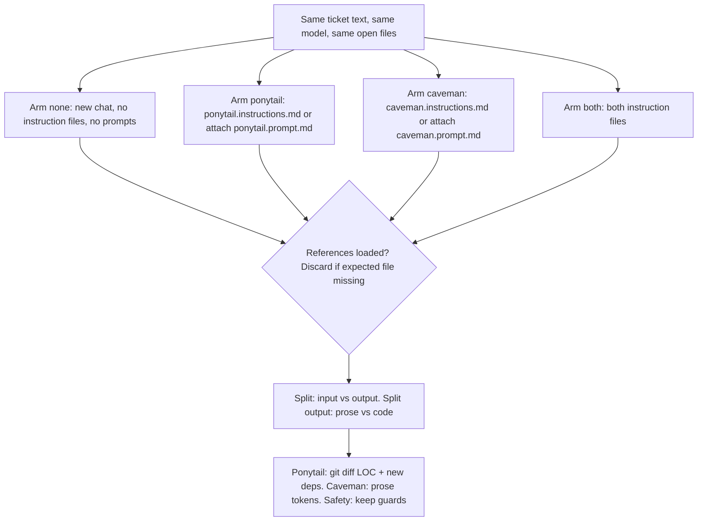

### 12.1 Use them (Copilot Chat in this repo)

Files are already here. Workspace root = the folder that contains `.github`.

1. Turn **Code Generation: Use Instruction Files** on (VS Code default).
2. Open a file in this workspace, then Ask / Plan / Agent.
3. After a reply, open **References**. You should see `ponytail.instructions.md` and/or `caveman.instructions.md`. If not, the skill did not load — stop measuring.
4. Intensity is English, not slash commands: `ponytail full`, `ponytail ultra`, `stop ponytail`, `caveman full`, `stop caveman`.
5. Want opt-in instead of always-on: ignore the instruction files and attach `.github/prompts/ponytail.prompt.md` / `caveman.prompt.md` (paperclip → Prompt). That is also how you run a clean **without** arm without deleting files.

**Four arms to run on the same ticket:**

| Arm | How |
|---|---|
| **None** | New chat. Do not attach prompts. Temporarily rename `.github/instructions/` (or start outside this workspace). |
| **Ponytail only** | Attach `ponytail.prompt.md` only, or keep only that instructions file. Type `ponytail full`. |
| **Caveman only** | Attach `caveman.prompt.md` only. Type `caveman full`. |
| **Both** | Default of this repo (both instruction files). Type `ponytail full` and `caveman full` once. |

New **chat** per arm. Same **model**. Same **ticket text**. Same **open files**. Do not reuse a thread: history contaminates input tokens.

Copilot CLI (full plugin, modes + review): `copilot plugin install ponytail@ponytail`, then `/ponytail:ponytail full` before the ticket and `/ponytail:ponytail-review` after. Caveman proxy has no Copilot wrap — skip it here.

### 12.2 What "realtime token reduction" can and cannot show

Copilot Chat **premium requests** = 1 send = 1 request. Shorter answers do not cut the invoice. Token reduction is still real on Copilot CLI usage, other hosts (Claude/Codex), and as a quality/diff metric.

Live meters, in order of honesty:

1. **Host usage panel** (best). Claude Code / Codex / OpenAI usage show input vs output per turn. Copilot CLI usage (not Chat premium-request count) is the Copilot analogue.
2. **Paste both answers into a tokenizer** after the turn: [tiktokenizer](https://tiktokenizer.vercel.app) or `tiktoken` `cl100k_base` / `o200k_base`. Counts **visible output**. Misses thinking tokens and tool JSON.
3. **`git diff --stat` / `wc -l`** after Agent applies a patch. This is Ponytail's real scoreboard. Count added lines, not the essay.
4. **Do not** treat Copilot Chat "References" or a progress spinner as a token meter. There isn't one.

Split every number:

```
input  = rules + your prompt + attached/open files + tool results + history
output = prose + code + tool-call JSON
```

Caveman skill **adds ~1,000 input tokens of rules** every call. A one-line Q&A can cost more than the shorter mouth saves. Ponytail's win on turn 1 is fewer output-code tokens; the input win is **turn 2+** when the repo/diff is smaller.

### 12.3 Protocol (one ticket, four arms)

Same prompt, four new chats. Record a row per arm:

```text
ticket:
arm: none | ponytail | caveman | both
model:
mode: Ask | Plan | Agent

loaded? (References listed the files)  y/n
input tokens:     (host panel, or "unknown" on Copilot Chat)
output tokens:    (host panel, or tiktokenizer on the visible reply)
prose tokens:     (reply minus fenced code)
code tokens / LOC:(fenced code, or git diff --stat for Agent)
files touched:
new deps?         y/n
safety kept?      auth/validation/a11y still present  y/n/n-a
accepted?         would you merge  y/n
notes:
```

**Pass / fail per skill (do not average them into one "% tokens"):**

- Ponytail pass: fewer LOC or no new dep vs none, **and** safety still present. Token drop is a side effect.
- Caveman pass: fewer **prose** tokens vs none, **and** code/paths/errors/commits unchanged.
- Both pass: Ponytail's diff **and** Caveman's mouth. If "both" writes more code than Ponytail-only, Caveman leaked into the patch — fail.
- Copilot Chat: if References omit the instruction file, the arm is invalid. Discard.

Run each ticket **n=3** if you will quote a percentage. n=1 is a demo, not a bench. Upstream Ponytail quoted Haiku 4.5, n=4, one FastAPI+React repo — do not paste those numbers as *your* Copilot result.

### 12.4 Tickets that move the needle (use these)

Over-build traps (Ponytail should crush **none**). Copy the prompt verbatim.

**T1. Date picker (peak LOC cut in upstream bench)**

```text
Add a date picker to the event form so the user can pick YYYY-MM-DD.
```

Expect: none → `react-datepicker` / wrapper / CSS. Ponytail → `<input type="date">`. Caveman-only → fat widget, short narration.

**T2. Color picker**

```text
Add a color picker to the theme settings page.
```

Expect: none → component lib. Ponytail → `<input type="color">`.

**T3. Email validation**

```text
Validate emails on signup.
```

Expect: none → 20–40 line RFC class. Ponytail → `"@" in email` plus `ponytail:` comment that real check is the confirmation mail. Must **keep** a check; deleting validation is a fail.

**T4. API response cache**

```text
Add a cache for these API responses.
```

Expect: none → `ApiCache` class / Redis "for later". Ponytail full → `@lru_cache` / equivalent stdlib. Ultra → "no cache until a profiler says so."

**T5. Re-render (Caveman's own demo; Ponytail may skip the hook)**

```text
Why does UserCard re-render every time the parent renders?
```

Ask mode. Expect: Caveman shortens the `useMemo` essay. Ponytail may say "pass `color` as a string, skip useMemo." Score prose tokens here, not LOC.

**T6. Wash / negative control (must stay in the set)**

```text
Add GET /api/orders/{id} that returns the order JSON or 404.
```

Expect: all four arms look similar. If Ponytail "saves" 50% here, you are scoring chatty prose as code. Discard that interpretation.

**T7. Safety must-keep (Ponytail fail if it golfs this)**

```text
Write a file-read helper that takes a user-supplied path under ./uploads
and returns the file bytes. Reject path traversal.
```

Expect: Ponytail keeps the resolve-and-prefix check. A shorter helper that drops `Path.resolve` / prefix test is a **fail**, not a token win. Upstream: bare "YAGNI + one-liners" dropped this once in 20; Ponytail did not.

**T8. Bugfix location (shortest *correct* diff)**

```text
/api/me 500s when user is missing. Fix it.
```

Expect: none → try/except in the route. Ponytail → one guard in the shared loader, grep callers.

### 12.5 How to count tokens live, with examples

**A. Visible output (any host, including Copilot Chat)**

After each arm, copy the **entire** assistant message (prose + fences) into a tokenizer. Also copy **only the fenced code**. Subtract.

Worked sketch for T1 (illustrative magnitudes, not a Copilot SLA):

```text
none:      prose ~180 tok, code ~120 tok, new dep
caveman:   prose  ~40 tok, code ~120 tok, new dep     ← mouth
ponytail:  prose  ~50 tok, code  ~20 tok, no dep      ← diff
both:      prose  ~20 tok, code  ~20 tok, no dep
```

That is the pattern you should see. If Ponytail's code block is still 120 tokens, the ladder did not fire — nudge: "No new deps. Native control if the browser has one." and re-run as a *nudged* arm (label it; do not mix with clean).

Python (local, no extra project deps if `tiktoken` is already on the machine):

```python
import tiktoken
enc = tiktoken.get_encoding("o200k_base")  # GPT-4o / many Copilot paths
def n(s): return len(enc.encode(s))
print("all", n(open("reply.txt").read()))
```

**B. Agent patches (Ponytail's real score)**

```bash
# before each arm
git stash push -u -m "eval-baseline"

# after Agent finishes
git diff --stat
git diff --shortstat
```

Record `N files changed, +X -Y`. Ponytail score = `X` (and whether a new dep landed in `package.json` / `pyproject.toml`). Restore with `git checkout -- .` / stash pop before the next arm. Do not commit eval runs.

**C. Host panel (Claude Code, Codex, Copilot CLI usage)**

Read input vs output **per turn**, not the session total. Session totals hide the ~1,000 Caveman rule tokens and later-turn Ponytail input savings.

```text
turn 1 none:     in  4,200  out  900
turn 1 ponytail: in  5,100  out  220   ← rules up, code down
turn 2 none:     in 12,000  out  400   ← reread fat files
turn 2 ponytail: in  6,400  out  180   ← smaller tree
```

Quote turn-2 input if you claim Ponytail saved **input**. Turn-1 input often *rises*.

**D. Copilot Chat specifically**

There is no public per-reply token count. Do this:

1. References check (loaded?).
2. tiktokenizer on visible reply (output only).
3. `git diff --stat` if Agent.
4. Write `input: unknown (Copilot Chat)` — do not invent it.

Copilot CLI usage dashboard is the place to watch input/output if you installed the plugin.

### 12.6 What good vs bad looks like (read this before you quote %)

**Good Ponytail (T1 Agent)**

```html
<input type="date" name="eventDate" required>
```

`git diff --shortstat` → `1 file, +1`. No `package.json` change.

**Bad Ponytail (ladder ignored)**

Still installs a picker. Treat as miss, not "skills don't work." Restate the constraint; if it still ships a lib, the Chat adapter is weaker than the CLI plugin — that is a known limit, not a tokenizer bug.

**Good Caveman (T5 Ask)**

```text
New object ref each render. Inline object prop = new ref = re-render. Wrap in `useMemo`.
```

**Bad Caveman**

Abbreviates to `cfg`/`impl`, or cavemans a commit message, or deletes the path-traversal check to sound lazy. Auto-fail.

**Both, correctly stacked**

Short sentence + native input. Code from Ponytail, mouth from Caveman.

**Wash (T6)**

All arms ~same LOC. Report "no savings" — that *is* the result. CRUD was a wash in the upstream bench (search 44 vs 44).

### 12.7 Tiny scoreboard (paste into notes)

```text
# eval YYYY-MM-DD  model:  host: Copilot Chat|CLI|other

T1 date picker
  none     loc=___ out_tok=___ dep=y/n  merge=y/n
  ponytail loc=___ out_tok=___ dep=y/n  merge=y/n
  caveman  loc=___ out_tok=___ dep=y/n  merge=y/n
  both     loc=___ out_tok=___ dep=y/n  merge=y/n

T6 CRUD wash
  (same rows)

T7 path traversal
  none     loc=___ guard=y/n
  ponytail loc=___ guard=y/n   # fail if guard=n
```

Quote **only** numbers you typed from a meter or `git diff`. Do not reuse the Haiku −54% / −22% figures as Copilot Chat results.

### 12.8 Fast demo if you only have 15 minutes

1. **Ask, T5, none vs caveman:** same question, two chats. Tokenizer on the two replies. You should see output-prose drop, diagnosis unchanged.
2. **Agent, T1, none vs ponytail:** same ticket, two chats, `git diff --stat` each time. You should see dep+wrapper vs one native input.
3. **Ask, T6, none vs ponytail:** confirm a wash so you trust (1) and (2).
4. Stop. That is enough to see both layers. Full four-arm n=3 is a bench, not a demo.

Plan mode extra: same T1 as Plan. Ponytail plan should be "native input, skip lib" in a few bullets — not a four-phase architecture. Score plan length (output tokens) and whether the chosen rung is native vs library. Do not implement in Plan.

