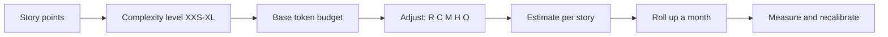
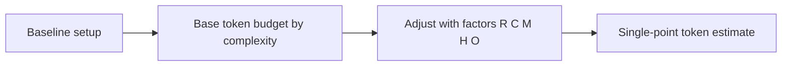
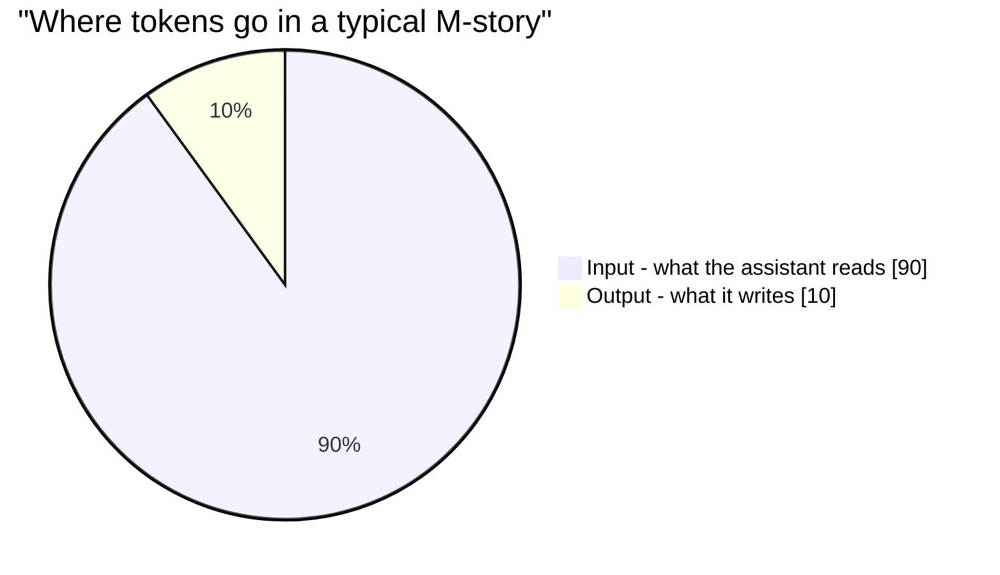
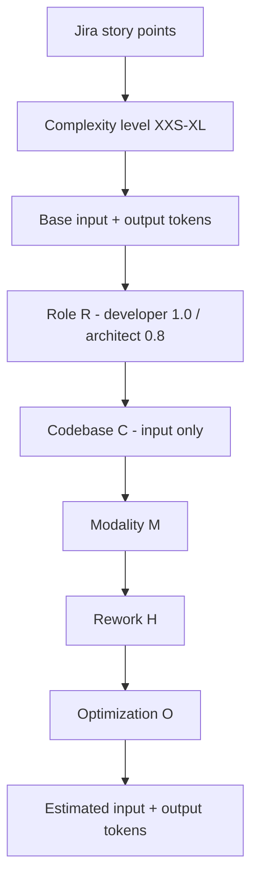
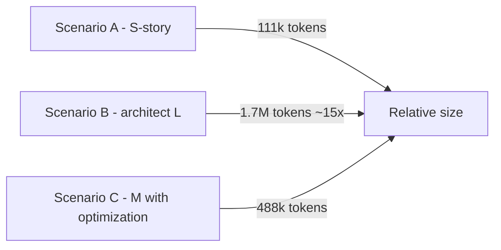
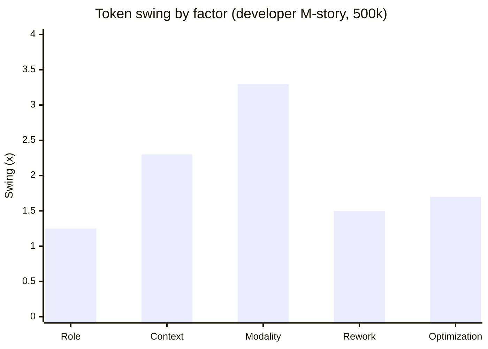
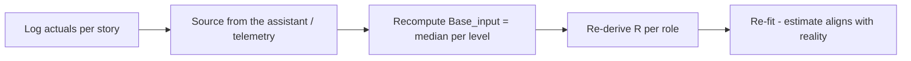
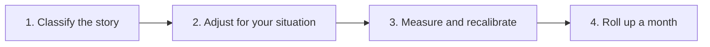

# AI Coding Assistant Token Demand Framework

> **Version 6.1 · Updated 2026-08-02 · Owner: Engineering Platform · Status: Draft for review**
>
> A shared, team-readable model for estimating **how many tokens an AI coding assistant
> consumes on a Jira story — before you start it** — and for budgeting sprints and months on
> that basis. This page is **token-only**: token demand is a property of the work (how much
> the assistant reads and writes), not of what a token costs. No pricing, no credits.
>
> Companion artifacts: CLI calculator `token-demand-estimator.py` · calibration form
> `token-usage-data-form.html` · full spec `token-demand-analysis-report.md` ·
> concept guide `token-demand-estimation-framework.md`.

---

## 1. Overview

**Every engineer should be able to answer in 60 seconds: "how many tokens will this story
cost the AI coding assistant?"**

The model is deliberately simple:

- **Story size → base budget.** A Jira story's points map to a complexity level (XXS → XL),
  and each level has a base input/output token budget.
- **Five multipliers adjust it.** Role, codebase, modality, rework, and optimization scale
  the base budget up or down for how the work actually runs.
- **Roll up, measure, refine.** Per-story estimates roll into a monthly forecast, real
  session numbers are logged, and the base table is re-fit to our own data over time.

Everything on this page is **token-only**. Token demand is a property of the work, not of a
price list — so the model survives any pricing change. Pricing is handled by the CLI and the
full spec, never here.



---

## 2. Objectives

We want three outcomes:

1. **Predict before work starts** — a single, story-sized estimate you can produce in
   under a minute.
2. **Budget sprints and months** — roll individual estimates up into a team-level forecast.
3. **Reduce waste with evidence** — know which lever (complexity, modality, optimization)
   actually moves the number, and calibrate the model to our own data over time.

---

## 3. Scope

| | |
|---|---|
| **Primary audience** | Developers, architects, tech leads, engineering managers |
| **Unit of analysis** | One Jira user story, sized by story points |
| **Workload covered** | Agentic coding with an AI coding assistant: agent mode and CLI |
| **Roles modeled** | Developer and architect — the two calibration roles (§5) |
| **In scope** | Estimation, budgeting, calibration, and token-reduction guidance |
| **Out of scope** | Pricing, billing, and credit conversion (deliberately — see §6) |

---

## 4. Terminology

| Term | Meaning |
|---|---|
| **Token** | Smallest unit of text a model processes. ~4 characters ≈ 1 token. The model's "cost per word". |
| **Input tokens** | Everything the assistant **reads**: system prompt, instructions, retrieved files, tool output, history |
| **Output tokens** | Everything the assistant **writes**: replies, code edits, design docs |
| **Turn** | One prompt → response model call. A session is many turns. |
| **Session** | One continuous agent conversation (e.g. one assistant chat) |
| **SP** | Story points (Jira sizing). 1–2 = S, 3–5 = M, 8 = L, 13+ = XL |
| **XXS / S / M / L / XL** | Complexity levels. Each maps to a base token budget (§7.1) |
| **M5** | Shorthand for "an **M**-level story sized at **5** story points" (the top of the M range, 3–5 SP). E.g. "an M5 feature" = the largest typical M story. Not a separate level — M with 5 SP |
| **Single-point estimate** | One number per story (e.g. 500k tokens). The model reports a single expected value, not a range — simpler to use and audit |
| **k / M** | Thousands / millions of tokens. 450k = 450,000; 24M = 24,000,000 |
| **R** | Role factor: developer 1.0 · architect 0.8 (§7.3) |
| **C** | Codebase / context factor, input only: small 0.8 → huge 2.0 (§7.4) |
| **M** | Modality factor: chat 0.3 → agent 1.0 (§7.5). *Not to be confused with the M complexity level* |
| **H** | Rework / ambiguity factor: 1.0 base, cap 1.5 (§7.6) |
| **O** | Optimization factor: `O = 1 − 0.01 × points`, floor 0.50 (§7.7) |
| **Baseline model** | Claude Sonnet 4 — the model the budgets are calibrated to (§5) |
| **90/10 rule** | ~90% of tokens are input; total ≈ input × 1.1 (§6) |

---

## 5. Assumptions & baseline

The model starts from one fixed, deliberately simple baseline. Everything else is a
multiplier on top of it.

| Baseline parameter | Default | In plain words |
|---|---|---|
| **Model** | Claude Sonnet 4 | The specific assistant model the budgets are calibrated to |
| **Role** | Developer (R = 1.0) | Person implementing + testing the story. Architect (R = 0.8) is the second modeled role — see below |
| **Repo** | Medium, familiar (C = 1.0) | A normal single repository the engineer knows well |
| **How the assistant runs** | Agent mode (M = 1.0) | The assistant can read files and run tools by itself |
| **Optimization** | None (O = 1.0) | No efficiency techniques applied yet — a "plain" session |
| **Rework / ambiguity** | Clean story (H = 1.0) | Requirements are clear and stable, so work is done in one pass; nothing gets redone |
| **Output format** | A single estimate (e.g. 500k tokens) | One number per story — no ranges, no percentiles. Simple to use, easy to audit |

### 5.1 The two roles are assumptions, not outputs

Which role factor you use depends on who does the story:

| Role | R | When it applies | What the assistant does |
|---|---|---|---|
| **Developer** | 1.0 | Implementing features, fixing bugs, adding tests within existing patterns | Reads the relevant files, writes code + tests, iterates locally |
| **Architect** | 0.8 | Designing systems, cross-service changes, migrations, technical research | More reading per turn, but far fewer turns and less trial-and-error — an architect knows the answer, so the session is shorter overall |

**Why an architect is *cheaper*, not more expensive:** tokens = read × write × round-trips.
An architect compensates for heavier reading with far fewer round-trips — they know the
answer before they ask, so the session ends sooner. A developer implementing the same story
iterates more (re-reads, tests, fixes), which multiplies tokens. The 0.8 factor captures
that real-world effect; on the same story, an architect session is shorter.

**Why "baseline" matters:** the base budgets (§7.1) are calibrated to this exact setup. If a
story is done by an architect on a huge monorepo, every estimate changes — that is what the
factors in §7 are for.



---

## 6. Model

### 6.1 Core principle — why tokens, not price

**Token demand = read × write × round-trips.**

Reading volume (input), writing volume (output), and the number of prompt → response turns
drive everything. Two consequences shape the whole model:

1. **~90% of tokens are input.** Every turn re-sends the system prompt, instructions,
   retrieved files, tool output, and history. Only the reply is output.
2. **Everything is a multiplier.** Doubling rework doubles every phase's tokens; switching
   chat → agent mode multiplies a session ~3×.

**A practical look at the 90/10 rule.** Take a typical M-story in agent mode, ~500k tokens
total (see §7.1):

```
Session total       500k tokens
  ├─ Input  ~450k   (90%)  system prompt + instructions + every file the
  │                     assistant reads + each tool's output + the whole
  │                     conversation history, resent on EVERY turn
  └─ Output  ~50k   (10%)  the code and text the assistant actually writes
```

The input bucket is rebuilt from scratch on every single turn, so it compounds fast: a
25-turn M-story re-reads context ~25 times. That is why **input-side optimization (compact
files, symbol-level retrieval, history pruning) is worth more than any output-style tweak** —
90% of the tokens live there.



### 6.2 The estimation formula

```
Input_tokens   = Base_input(complexity) × R × C × M × H × O
Output_tokens  = Base_output(complexity) × R × M × H × O
```

| Part | Meaning |
|---|---|
| `Base_input / Base_output(complexity)` | The starting budget for the story's size — XXS to XL (§7.1). The only place "how big is the story" enters |
| **R** (Role) | Developer = 1.0, Architect = 0.8. Architects do fewer, more decisive turns, so a story is cheaper for them (§7.3) |
| **C** (Codebase) | Small → huge repo. **Input only**: reading grows with repo size, writing doesn't (§7.4) |
| **M** (Modality) | Chat = 0.3 → Agent = 1.0. How much tool use the session has (§7.5) |
| **H** (Rework) | 1.0 → 1.5. Extra attempts from ambiguity, flaky tests, slow feedback (§7.6) |
| **O** (Optimization) | 1.0 → 0.50 floor. Efficiency techniques that shrink the session (§7.7) |

**Structural facts to remember:**

1. **Multiplicative, not additive.** Each factor scales the whole estimate. This makes the
   model transparent and trivial to audit.
2. **C applies to input only.** Writing doesn't grow with repo size; reading does.
3. **R, M, H, O apply to both** input and output.
4. **O has a floor of 0.50** — optimization can at most halve the estimate. It never takes
   you to zero, because the assistant must still read the story and write the answer.
5. **`total ≈ input × 1.1`** (output ~= 10% of input). If a session shows input × 1.5+, the
   assistant is pasting huge files or echoing context — a health signal.
6. **One number per story.** The model outputs a single estimate (e.g. 500k tokens) — no
   ranges, no percentiles. Real sessions vary, so treat the estimate as the expected value
   and allow a little slack when budgeting (see §11).



---

## 7. Parameters

### 7.1 Step 1 — Story complexity → base token budget

Story points are the primary driver. Each level has a base input/output budget.

| Level | SP | Files | Turns | Base input (k) | Base output (k) | Total (k) | Typical examples |
|---|---|---|---|---|---|---|---|
| **XXS** | 0.5 | 1 | 2 | 10 | 2 | **12** | fix a typo, flip a config toggle, one-line hotfix, add a log line, bump a dependency version |
| **S** | 1–2 | 1–2 | 9 | 100 | 11 | **111** | single-file bug fix, small validation check, one new endpoint, fix a CSS/layout issue |
| **M** | 3–5 | 2–4 | 38 | 450 | 50 | **500** | new feature in 1–2 files with edge cases, new REST endpoint + tests, DB migration + updated queries |
| **L** | 8 | 4–8 | 90 | 1,350 | 145 | **1,495** | new module, multi-file integration, data model change across call sites, cross-cutting feature |
| **XL** | 13+ | 8+ / services | 275 | 5,000 | 550 | **5,550** | epic, cross-service architecture, monorepo-wide refactor, auth/platform migration |

**Why these numbers are realistic:** the budgets come from measured sessions — an S-story
runs roughly 6–12 assistant turns, each turn re-reading its context; an XL epic spans
hundreds of turns and touches dozens of files. The values were calibrated against real
telemetry (see the footer of §13) and are re-fit to our own data via the calibration loop
(§9.2).

Estimates (developer vs architect), baseline model, agent mode:

| Level | Total (k) | **Developer (k)** | Architect (k) |
|---|--:|--:|--:|
| XXS | 12 | **12** | 10 |
| S | 111 | **111** | 89 |
| M | 500 | **500** | 400 |
| L | 1,495 | **1,495** | 1,196 |
| XL | 5,550 | **5,550** | 4,440 |

```mermaid
xychart-beta
    title "Tokens by complexity (developer vs architect)"
    x-axis ["XXS","S","M","L","XL"]
    y-axis "Tokens (k)" 0 --> 8000
    bar [12,111,500,1495,5550]
    bar [10,89,400,1196,4440]
    legend ["Developer","Architect"]
```

**Two rules of thumb:**

- **`total ≈ input × 1.1`** (output ~= 10% of input). If a session shows input × 1.5+, the
  assistant is pasting huge files or echoing context — a health signal.
- **Tokens are super-linear in story points.** An XL epic is ~11× an M story, so getting
  "M vs L" wrong changes your estimate ~3×. **Complexity misclassification is the #1
  estimation error** — size conservatively.

**Architect reads the developer curve but sits below it.** On the same complexity level an
architect takes ~20% fewer tokens (fewer turns), yet their L/XL work is still the biggest
line item because the stories themselves are larger. Role moves the number; complexity sets
the scale.

> **Where optimization can impact (§7.7):** every number above assumes O = 1.0 (no
> optimization). A "good" optimization stack (O = 0.75) would shrink these totals ~25%, and
> the full stack (O = 0.60) ~40%. Apply O **after** you have picked the right level — it
> adjusts the number, it never fixes a wrong-size estimate.

### 7.2 Step 2 — The five factors

Each factor starts at its baseline (1.0) and changes only when your situation differs. The
reference scenario is §8.2.

#### 7.3 R — Role

| Role | Factor | When to use it | What the assistant does differently |
|---|---|:---:|---|
| **Developer** | **1.0** | Implementing features, fixing bugs, writing tests within existing patterns (baseline) | Reads the handful of relevant files, writes code + tests, iterates locally |
| **Architect** | **0.8** | Design work, cross-service changes, migrations, technical research | Reads more per turn (ADRs, schemas, many services), but does **fewer turns** and far less trial-and-error. Net: the same story costs ~20% **fewer** tokens for an architect |

**How to align the two roles (no ambiguity):**
- A story that produces code within one module, following existing patterns → **Developer**.
- A story that produces a decision, a design, or touches many services → **Architect**.
- Same person on both? Classify by the **type of work**, not the title. A staff engineer
  doing a single-module bug fix is a Developer for that story (R = 1.0).

#### 7.4 C — Codebase / context (input only)

**What "codebase/context" means here:** how much code the assistant has to read to answer
each question. A small focused module needs few reads per question; a huge unfamiliar
monorepo drags in cross-module context every time.

| Codebase | Factor | What it looks like |
|---|:---:|---|
| Small | 0.8 | <10 files, single module; the assistant stays inside a handful of files |
| Medium | 1.0 | Single repo, familiar to the engineer (baseline) |
| Large | 1.5 | Monorepo / many services; greps and reads pull in cross-module context |
| Huge / unfamiliar | 2.0 | New codebase or enormous repo; orientation dominates and every query is bigger |

> **Example:** the same L-story reads 1,080k input on a 5-file module but 2,025k on a
> monorepo — nearly double, purely because the assistant reaches across more code per
> question. **C is input-only**: you don't write more code just because the repo is bigger.

#### 7.5 M — Modality

| Mode | Factor | What it looks like |
|---|:---:|---|
| Chat only (no tool execution) | 0.3 | You paste code and ask; one prompt, one reply, no tool dumps |
| Editor completions + light agent | 0.6 | Inline completions and short-lived context while you type |
| Agent mode (full tool use) | 1.0 | The assistant reads files and runs tools by itself (baseline) |

> **Example:** the same bug fix is ~30k input in chat, ~100k in agent mode. **The same code
> change costs ~3× more tokens in agent mode than chat** — the single most common way
> estimates drift. Agent mode is the baseline because it is how most of our work actually
> runs; treat chat as the exception.

#### 7.6 H — Rework / ambiguity (start at 1.0, add)

**What "rework" means:** the assistant does the work more than once because the target kept
moving. Every failed attempt and retry re-reads the same context — so extra rework multiplies
the whole session, not just the retried part. **"Ambiguity" is the most common trigger**: a
story with vague acceptance criteria gets interpreted wrong, then corrected, then re-checked.

| Signal | Add | Real example |
|---|---|:---:|
| >6 acceptance criteria | +0.2 | "As a user I can filter, sort, export, and get notified" — the agent must keep all branches in context |
| Ambiguous requirements / novel domain | +0.2 | "Handle errors gracefully" without saying what "gracefully" means; the agent guesses, you correct it |
| Flaky tests / cross-team dependencies | +0.3 | A test suite that fails randomly makes the agent chase phantom regressions and re-run repeatedly |
| Long feedback loops (deploy-heavy) | +0.3 | A 15-minute deploy per check means every wrong guess costs a long wait, so the agent over-explores to compensate |
| **Cap** | **1.5** | Even the worst story adds at most 0.5 — above that, re-estimate the story instead |

> **Mini-example:** an M-story that is well-specified (H = 1.0) costs ~500k. The same story
> with vague requirements **and** flaky tests (H = 1.0 + 0.2 + 0.3 = 1.5) costs ~750k —
> a 50% surcharge from rework alone, before any other factor.

#### 7.7 O — Optimization

**What this factor does:** O shrinks the whole session by making the assistant's context
cheaper — fewer redundant tokens per turn, less re-reading, tighter outputs. Each installed
technique earns **points**; more points = smaller factor.

```
O = 1 − 0.01 × points      (floor 0.50)
```

| Configuration | Points | O | Effective reduction | What you actually install |
|---|:---:|:---:|:---:|---|
| None | 0 | 1.00 | 0% | Nothing — a plain session |
| Basic | 5 | 0.95 | 5% | AGENTS.md (project rules) + ignore files so the assistant stops re-reading what it shouldn't |
| Standard | 13 | 0.87 | 13% | Basic + skills/commands + context compaction (prune old turns) |
| Good | 25 | 0.75 | 25% | Standard + output hooks (capture tool output instead of pasting it) + style/format skill |
| Full stack | 40 | 0.60 | 40% | Good + symbol-level retrieval (indexes instead of whole-file reads) + persistent memory |

**Why the floor is 0.50:** even a perfect setup must still read the story and write the
answer — the irreducible core. Optimization halves, never eliminates.

> **Where optimization can impact (and how much):**
> - It reduces **every session in this model** — the O factor sits on both input and output.
> - The biggest wins are on **input-heavy, turn-heavy work** (L and XL stories, big repos,
>   agent mode), because that is where the redundant context is. A chat-style S-story has
>   little to reclaim.
> - It does **not** change the story's complexity level. Moving M → L multiplies tokens ~3×;
>   optimization at best halves. **Right-sizing the story always beats optimizing it.**

> **Honest framing:** the full stack removes 40% of tokens, while a wrong complexity level
> changes the estimate ~3×. Optimization is the final adjustment, never a substitute for
> sizing the story correctly.

---

## 8. Worked examples

### 8.1 Isolating one factor — the base story

A developer on a medium repo, in agent mode, clean story, no optimization — **all factors
are 1.0**, so the formula collapses to the base budgets:

```
Story = M-level (Base input 450k, Base output 50k)

Input   = 450 × 1.0 × 1.0 × 1.0 × 1.0 × 1.0 = 450k
Output  =  50 × 1.0 × 1.0 × 1.0 × 1.0 × 1.0 =  50k
Total   ≈ 500k tokens
```

Now change just the role — the same M-story done by an **architect** (R = 0.8):

```
Input   = 450 × 0.8 = 360k     (other factors still 1.0)
Output  =  50 × 0.8 =  40k
Total   ≈ 400k tokens           (~0.8× the developer version)
```

An architect on the same story consumes **fewer** tokens — they take fewer, more decisive
turns. Role R is the one factor that can move the estimate below its baseline.

### 8.2 Combined example — all five factors, step by step

M-story (Base input 450k, Base output 50k), architect (R=0.8), large monorepo (C=1.5),
agent mode (M=1.0), ambiguous requirements (H=1.2), good optimization stack (O=0.75):

```
Step 0 — start from the base budgets (M-story):
          Input = 450k   Output = 50k

Step 1 — apply R (architect, fewer turns):
          Input = 450 × 0.8         = 360k     Output = 50 × 0.8 = 40k
Step 2 — apply C (large repo, input only):
          Input = 360 × 1.5         = 540k     Output = 40 × 1.0 = 40k   ← C skipped on output
Step 3 — apply M (agent mode):
          Input = 540 × 1.0         = 540k     Output = 40 × 1.0 = 40k   ← M already baseline
Step 4 — apply H (ambiguous, +0.2):
          Input = 540 × 1.2         = 648k     Output = 40 × 1.2 = 48k
Step 5 — apply O (good stack, 0.75):
          Input = 648 × 0.75        = 486k     Output = 48 × 0.75 = 36k

Final:  Input 486k + Output 36k ≈ 522k tokens
```

**The apples-to-apples comparison is what matters.** The same M-story on a **medium repo,
clean requirements, agent mode, good stack** — only the role differs:

```
Developer:  Input 450 × 0.75 = 338k     Output 50 × 0.75 = 38k     Total ≈ 375k
Architect:  Input 360 × 0.75 = 270k     Output 40 × 0.75 = 30k     Total ≈ 300k
```

So on the *same story, same everything else*, the architect is **20% cheaper** (300k vs
375k). The 522k example above is larger because it also adds a **large monorepo (C=1.5)**
and **ambiguous requirements (H=1.2)** — not because of role. Never compare an architect on
a big repo against a developer on a small one and blame the role.

**And a second, cheaper combination:** the same M-story, developer (R=1.0), medium repo
(C=1.0), agent mode (M=1.0), clean story (H=1.0), good stack (O=0.75):

```
Input  = 450 × 0.75 = 338k
Output =  50 × 0.75 =  38k
Total  ≈ 375k       ← pure optimization, no other changes
```

This is the pair to internalize: **optimization is worth ~25% when everything else stays
baseline — but repo size and rework can add ~40% on top of a correct size.** Fix the story
and the factors first; optimization is the final polish.

### 8.3 End-to-end scenarios

**Scenario A — Developer, S story (bug fix, 2 SP), medium repo, agent mode**

```
Base in 100k, out 11k          R=1.0 C=1.0 M=1.0 H=1.0 O=1.0
Input  100k
Output 11k
Total ~= 111k tokens
```

**Scenario B — Architect, L story (new service, 8 SP), large repo, agent mode**

```
Base in 1,350k, out 145k       R=0.8 C=1.5 M=1.0 H=1.0 O=1.0
Input  1,350 × 0.8 × 1.5 = 1,620k
Output 145 × 0.8 = 116k
Total ~= 1.7M tokens
```

Architect + L story + large repo is ~15× a developer + S story in tokens. Note the driver is
**complexity (L) and repo size (C=1.5)**, not the architect role — R=0.8 actually reduces
the number. This is the profile that justifies architectural-level optimization.

**Scenario C — Developer, M story, ambiguous (+0.3 H), good optimization (25 pts)**

```
Base in 450k, out 50k          R=1.0 C=1.0 M=1.0 H=1.3 O=0.75
Input  450 × 1.3 × 0.75 = 439k
Output 50 × 1.3 × 0.75 = 49k
Total ~= 488k tokens
vs the plain M-story (500k): only ~2% fewer tokens
```

**Scenario C teaches the important lesson:** optimization alone looks weak in raw tokens
because rework (+30%) nearly cancels it (−25%). Optimize *and then measure*, don't assume.



### 8.4 Roll up a month — the forecasting step

The monthly number is just the story estimates summed up, so it is only as trustworthy as
the factors you fed in. Do the estimation steps first.

Bottom-up: estimate each story, sum per level. `Monthly_tokens = sum(tokens_per_story × count)`.

**Worked example** (developer, medium repo, agent mode, baseline model, no optimization):

| Level | Stories | Tokens/story | Line tokens |
|---|--:|--:|--:|
| S | 10 | 111k | 1.1M |
| M | 20 | 500k | 10.0M |
| L | 5 | 1,495k | 7.5M |
| XL | 1 | 5,550k | 5.6M |
| **Month total** | **36** | | **~24.1M** |

**Top-down cross-check:** a heavy developer-day ≈ 4M tokens.
`monthly_tokens ≈ active_days × 4M × users`. If bottom-up and top-down disagree by more than
~2×, your story mix or factor assumptions are off.

**5-developer team at the same mix:** ~**120M tokens/month**.

**What optimization changes here:** if the same team ran the good stack (O = 0.75) on every
story, the 24.1M month becomes ~18.1M — a ~6M monthly saving from one factor. That is the
practical payoff of §7.7, and exactly why it sits inside the model rather than outside it.

> Run it live: `python3 token-demand-estimator.py --monthly "S=10,M=20,L=5,XL=1"` (add
> `--role architect`, `--mode agent` to match your profile). The calibration form's monthly
> panel does the same in the browser.

---

## 9. Validation

### 9.1 Sensitivity — what actually moves the number

One factor moved at a time, on a developer M-story (500k tokens):

| Factor | Low | High | Tokens low | Tokens high | Swing |
|---|---|---|--:|--:|:---:|
| Role R | architect 0.8 | developer 1.0 | 400k | 500k | 1.25× |
| Context C | small 0.8 | huge 2.0 | 410k | 950k | 2.3× |
| **Modality M** | chat 0.3 | agent 1.0 | 150k | 500k | **3.3×** |
| Rework H | 1.0 | 1.5 | 500k | 750k | 1.5× |
| Optimization O | none 1.0 | full 0.60 | 500k | 300k | 1.7× |



**Reading:** modality is the biggest swinger (3.3×) — the same code change costs ~3× more
tokens in agent mode than chat. Rework and optimization sit in the middle: each can
move the number ~1.5–1.7×. **Optimization (O) can offset rework (H)** — a good stack cuts
the same ambiguous session roughly back down to its clean baseline. Any estimate is
dominated by (a) whether the story is really the level you think, and (b) how the assistant
actually runs.

### 9.2 Calibration loop — what makes it accurate

The base table and role factors are **starting priors**. Fit them to our reality every 5–10
stories per cell.



1. **Log per story:** `story_id | points | level | role | mode | opt | H | actual_in |
   actual_out`. (The calibration form logs this live and exports CSV.)
2. **Source actuals from the assistant:** the session context-window control for session
   token totals; hover a chat response for per-turn usage; use session telemetry tools
   (rtk / snip / claude-mem) for saved-input and session observability (§9.3).
3. **Re-fit base budgets:** `Base_input(level) = median(actual input)` per level.
4. **Re-derive role factors:** `R(role) = median(role input) / median(developer input)` —
   compare like with like (same complexity level), or the ratio mixes complexity with role.
5. **Fit on tokens, always.** Tokens are the durable measure.

**Worked example — re-fitting the S row.** Say we log **8 real S-stories** (developer, agent
mode, medium repo):

```
Actual inputs (k):  95, 130, 88, 142, 105, 118, 97, 122
Sorted:             88, 95, 97, 105, 118, 122, 130, 142
Median = (105 + 118) / 2 = 111.5k    → the default was 100k
```

So we update the S base input from 100k to ~112k. Small drift — the prior was decent. Now
say we also logged **4 architect S-stories**:

```
Actual inputs (k):  95, 80, 110, 72
Sorted:             72, 80, 95, 110
Median = (80 + 95) / 2 = 87.5k
Re-derived R(architect) = 87.5 / 111.5 = 0.78   → the default was 0.8
```

With only 4 samples, 0.78 is close to the 0.8 prior, but noisy — **that is exactly why the
rule is 5–10 stories minimum**. With 4 samples you adjust cautiously; with 10 you commit. The
loop is deliberately slow: it trades short-term noise for a model that matches our actual
work.

> **Why fit on medians, not averages:** a single monster session (one huge generated file)
> can inflate an average by 2×; the median ignores the outlier and tracks the typical story.

### 9.3 Ground truth — where to get the real numbers

| What you want | Where to find it |
|---|---|
| Session token totals | Session context-window control in the agent |
| Per-turn token usage | Hover a chat response |
| Saved bash output | rtk: `rtk gain --all --format json` |
| Saved input tokens | snip: `/snip-gain` |
| Session observations | claude-mem: `ctx-stats` |

---

## 10. Usage

### 10.1 Workflow

Four steps, run in order:



| Step | What you do | Where |
|---|---|---|
| **1. Classify** | Map story points → complexity level (XXS–XL) → base token budget | §7.1 |
| **2. Adjust** | Apply the five factors R / C / M / H / O for how the work actually runs | §7.2 |
| **3. Recalibrate** | Log real actuals every 5–10 stories per level; re-fit the base table | §9.2 |
| **4. Roll up** | Sum per-level estimates into a sprint or month forecast | §8.4 |

Steps 1–3 are the "concepts and criteria" — understand them before you roll anything up.
The monthly roll-up is deliberately the **last** step: it is only as good as the factors you
feed into it.

### 10.2 Savings & governance playbook

Ranked by return on effort (token-focused):

1. **Compress the input side first (~90% of tokens live there).** Output hooks (rtk/squeez)
   on test runs, symbol-level retrieval instead of whole-file reads, semantic codebase index
   instead of full-text grep.
2. **Match modality to the job.** Chat runs at 0.3×, agent mode at 1.0× — the biggest single
   lever in the model. Prefer chat/editor for simple asks, agent mode for what needs tool use.
3. **Classify stories honestly.** Complexity is the dominant driver; an M mis-sized as L
   triples the estimate. Size conservatively, and add a small buffer when budgeting.
4. **Apply optimization where it pays.** Point-for-point, optimization reclaims the most on
   turn-heavy agent sessions (L/XL, big repos) and almost nothing on short chat sessions.
   Buy the stack for the heavy work first.
5. **Measure before assuming.** Run the calibration loop; log real actuals. Optimizing then
   measuring beats assuming — Scenario C shows why.
6. **Route architect-heavy work deliberately.** Architects are ~20% cheaper per same-size
   story (R=0.8) — so assign the big L/XL design work to them on purpose: they produce the
   design for fewer tokens than a developer would. (Their absolute totals are still the
   largest because the stories are largest.)
7. **Avoid one giant read.** A single 5,000-line generated file ≈ 200k tokens can exceed a
   whole phase's budget; split it or read symbols only.

> **Watch-out:** aggressive brevity can trade correctness — a style skill that cuts output
> 65% may cause a 3-turn fix loop that costs more. Net loss.

---

## 11. Limitations (honest)

1. **A single number, not a guarantee.** Estimates are expected values. Real sessions vary —
   a giant file read or verbose test output can exceed the estimate. Add a buffer (e.g.
   20–30%) when budgeting capacity.
2. **Sessions are lumpy.** One giant file read or verbose test output can exceed a phase's
   budget; optimization factors exist to cap these spikes.
3. **Factors are behavioral.** Modality, rework, and optimization depend on discipline;
   measure them, don't assume.
4. **Baseline-dependent.** Budgets are calibrated for Claude Sonnet 4. Token demand is
   similar on other models, but the docs make no claim about pricing.
5. **Two calibration roles only.** For PM or QA-heavy work, use developer factors and a
   slightly larger buffer rather than inventing a new role factor.
6. **Telemetry mix.** Some source numbers are vendor benchmarks used as compression ceilings
   (ratios), not absolute workloads.
7. **Optimization gains are conditional.** The O floor is 0.50, and achieving the advertised
   reduction requires actually installing the techniques — points that exist only on paper
   do nothing.

---

## 12. FAQ

**Why is ~90% of it input?** Every turn re-sends the system prompt, instructions, retrieved
files, tool output, and history. Only the reply is output. That is why input-side
optimization (compression, symbol retrieval, memory) matters most.

**Is the estimate a single number?** Yes. Each story gets one expected-value estimate (e.g.
500k tokens) — no ranges or percentiles. Real sessions vary, so keep a small buffer when
budgeting capacity.

**What is an "M5 story"?** An M-level story sized at 5 story points (the top of the 3–5 SP
M range). It uses the same M base budget; only story-point precision within the level.

**The estimate is way off my real session — is the model wrong?** Probably not. Check the
ratio of total to input (should be ~1.1×), the actual story complexity, and the modality you
used (chat vs agent). Then log it in the calibration loop — the model is designed to be
re-fit to you.

**Why is agent mode so much more expensive in tokens?** Each agent turn re-reads context and
tool output. The same code change costs ~3× more tokens in agent mode than chat (0.3× vs
1.0× factor).

**Why is an architect's L-story still so much bigger than a developer's S-story?** Because
complexity (level) and repo (C) compound: developer S-story ≈ 111k tokens vs architect
L-story on a large repo ≈ 1.7M (~15×). The architect role itself is *cheaper* (R=0.8) — on
the same-size story an architect uses ~20% fewer tokens. The gap comes from story size and
repo scale, not the person.

**What does the optimization factor actually save me?** O = 1 − 0.01 × points, floor 0.50.
The good stack (25 pts) cuts sessions ~25%; the full stack (40 pts) ~40%. The same M-story
drops from 500k to 375k with a good stack alone. But rework (H) can eat most of that saving
— see Scenario C.

**What about pricing?** Not on this page. The token model is deliberately price-agnostic; the
CLI estimator and full spec add pricing on top of the same factors.

---

## 13. References

| Tool | What it does | Run it |
|---|---|---|
| **CLI calculator** | Runs the model on the command line (single story or monthly projection) | `python3 token-demand-estimator.py --level M --role developer` · `--monthly "S=10,M=20,L=5,XL=1"` · `--points 25` · `--json` |
| **Calibration form** | Browser tool: auto-generated estimates, logs actuals, monthly projection, CSV export | Open `token-usage-data-form.html` |
| **Full spec** | All factors, data sources, calibration math | `token-demand-analysis-report.md` (v3.2) |
| **Concept guide** | Readable "first idea" version | `token-demand-estimation-framework.md` |

*Baseline model: Claude Sonnet 4. Calibrated against real telemetry from AI coding assistant
usage: enterprise daily sessions (~4M tokens / heavy developer-day), repo-orientation
studies (~20k tokens / 40-file repo), and tool-measured compression ceilings (99.6%
symbol-level reads, up to 90% bash-output reduction).*
